`Automatically generated documentation`

# Location
* [zip](Location_zip.md)
* [location_source_value](Location_location_source_value.md)
* [nhs_number](Location_nhs_number.md)
* [address_1](Location_address_1.md)
* [address_2](Location_address_2.md)
* [city](Location_city.md)
* [county](Location_county.md)
## SactLocation

[Comment or raise an issue for this mapping.](https://github.com/answerdigital/oxford-omop-data-mapper/issues/new?title=SactLocation%20mapping)
## RtdsLocation

[Comment or raise an issue for this mapping.](https://github.com/answerdigital/oxford-omop-data-mapper/issues/new?title=RtdsLocation%20mapping)
## CosdLocation

[Comment or raise an issue for this mapping.](https://github.com/answerdigital/oxford-omop-data-mapper/issues/new?title=CosdLocation%20mapping)
## CdsStructuredLocation

[Comment or raise an issue for this mapping.](https://github.com/answerdigital/oxford-omop-data-mapper/issues/new?title=CdsStructuredLocation%20mapping)
## CdsUnstructuredLocation

[Comment or raise an issue for this mapping.](https://github.com/answerdigital/oxford-omop-data-mapper/issues/new?title=CdsUnstructuredLocation%20mapping)
# Person
* [person_source_value](Person_person_source_value.md)
* [year_of_birth](Person_year_of_birth.md)
* [month_of_birth](Person_month_of_birth.md)
* [day_of_birth](Person_day_of_birth.md)
* [birth_datetime](Person_birth_datetime.md)
* [ethnicity_concept_id](Person_ethnicity_concept_id.md)
* [gender_concept_id](Person_gender_concept_id.md)
* [gender_source_value](Person_gender_source_value.md)
* [race_concept_id](Person_race_concept_id.md)
* [race_source_value](Person_race_source_value.md)
* [race_source_concept_id](Person_race_source_concept_id.md)
## SactPerson
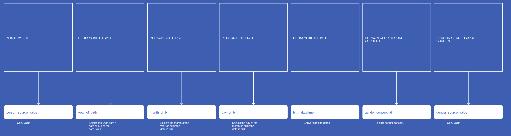

[Comment or raise an issue for this mapping.](https://github.com/answerdigital/oxford-omop-data-mapper/issues/new?title=SactPerson%20mapping)
## RtdsPerson

[Comment or raise an issue for this mapping.](https://github.com/answerdigital/oxford-omop-data-mapper/issues/new?title=RtdsPerson%20mapping)
## CosdPerson

[Comment or raise an issue for this mapping.](https://github.com/answerdigital/oxford-omop-data-mapper/issues/new?title=CosdPerson%20mapping)
## CdsPerson

[Comment or raise an issue for this mapping.](https://github.com/answerdigital/oxford-omop-data-mapper/issues/new?title=CdsPerson%20mapping)
# VisitOccurrence
* [NhsNumber](VisitOccurrence_NhsNumber.md)
* [HospitalProviderSpellNumber](VisitOccurrence_HospitalProviderSpellNumber.md)
* [visit_start_date](VisitOccurrence_visit_start_date.md)
* [visit_start_datetime](VisitOccurrence_visit_start_datetime.md)
* [visit_end_date](VisitOccurrence_visit_end_date.md)
* [visit_end_datetime](VisitOccurrence_visit_end_datetime.md)
* [visit_concept_id](VisitOccurrence_visit_concept_id.md)
* [visit_type_concept_id](VisitOccurrence_visit_type_concept_id.md)
* [admitted_from_concept_id](VisitOccurrence_admitted_from_concept_id.md)
* [admitted_from_source_value](VisitOccurrence_admitted_from_source_value.md)
* [discharged_to_concept_id](VisitOccurrence_discharged_to_concept_id.md)
* [discharged_to_source_value](VisitOccurrence_discharged_to_source_value.md)
* [RecordConnectionIdentifier](VisitOccurrence_RecordConnectionIdentifier.md)
## CdsVisitOccurrenceWithSpell

[Comment or raise an issue for this mapping.](https://github.com/answerdigital/oxford-omop-data-mapper/issues/new?title=CdsVisitOccurrenceWithSpell%20mapping)
## CdsVisitOccurrenceWithoutSpell
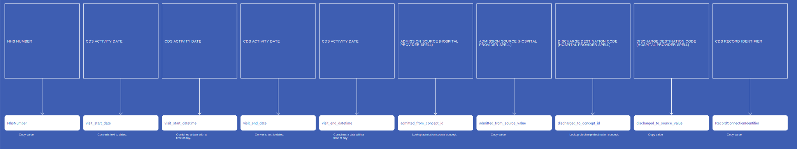

[Comment or raise an issue for this mapping.](https://github.com/answerdigital/oxford-omop-data-mapper/issues/new?title=CdsVisitOccurrenceWithoutSpell%20mapping)
# VisitDetail
* [nhs_number](VisitDetail_nhs_number.md)
* [RecordConnectionIdentifier](VisitDetail_RecordConnectionIdentifier.md)
* [HospitalProviderSpellNumber](VisitDetail_HospitalProviderSpellNumber.md)
* [visit_detail_start_date](VisitDetail_visit_detail_start_date.md)
* [visit_detail_start_datetime](VisitDetail_visit_detail_start_datetime.md)
* [visit_detail_end_date](VisitDetail_visit_detail_end_date.md)
* [visit_detail_end_datetime](VisitDetail_visit_detail_end_datetime.md)
* [visit_detail_concept_id](VisitDetail_visit_detail_concept_id.md)
* [visit_detail_type_concept_id](VisitDetail_visit_detail_type_concept_id.md)
* [admitted_from_concept_id](VisitDetail_admitted_from_concept_id.md)
* [admitted_from_source_value](VisitDetail_admitted_from_source_value.md)
* [discharged_to_concept_id](VisitDetail_discharged_to_concept_id.md)
* [discharged_to_source_value](VisitDetail_discharged_to_source_value.md)
## CdsVisitDetail
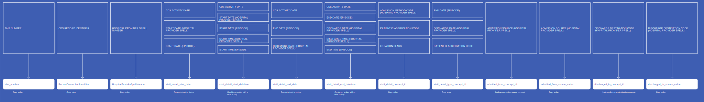

[Comment or raise an issue for this mapping.](https://github.com/answerdigital/oxford-omop-data-mapper/issues/new?title=CdsVisitDetail%20mapping)
# ProcedureOccurrence
* [nhs_number](ProcedureOccurrence_nhs_number.md)
* [procedure_concept_id](ProcedureOccurrence_procedure_concept_id.md)
* [procedure_date](ProcedureOccurrence_procedure_date.md)
* [procedure_datetime](ProcedureOccurrence_procedure_datetime.md)
* [procedure_type_concept_id](ProcedureOccurrence_procedure_type_concept_id.md)
* [procedure_source_value](ProcedureOccurrence_procedure_source_value.md)
* [procedure_source_concept_id](ProcedureOccurrence_procedure_source_concept_id.md)
* [RecordConnectionIdentifier](ProcedureOccurrence_RecordConnectionIdentifier.md)
## CdsProcedureOccurrence
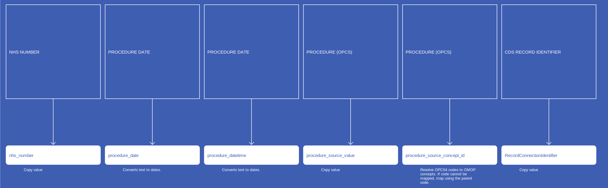

[Comment or raise an issue for this mapping.](https://github.com/answerdigital/oxford-omop-data-mapper/issues/new?title=CdsProcedureOccurrence%20mapping)
# Observation
* [nhs_number](Observation_nhs_number.md)
* [RecordConnectionIdentifier](Observation_RecordConnectionIdentifier.md)
* [HospitalProviderSpellNumber](Observation_HospitalProviderSpellNumber.md)
* [observation_concept_id](Observation_observation_concept_id.md)
* [observation_date](Observation_observation_date.md)
* [observation_datetime](Observation_observation_datetime.md)
* [observation_type_concept_id](Observation_observation_type_concept_id.md)
* [value_as_number](Observation_value_as_number.md)
* [value_as_string](Observation_value_as_string.md)
* [unit_concept_id](Observation_unit_concept_id.md)
* [observation_source_concept_id](Observation_observation_source_concept_id.md)
## CdsTotalPreviousPregnancies
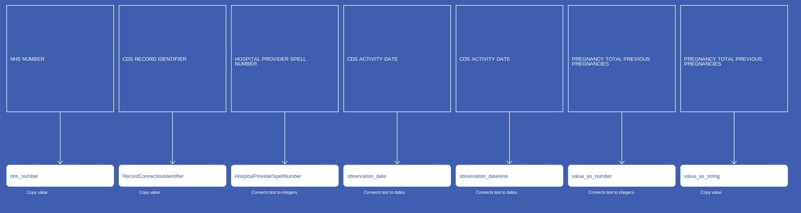

[Comment or raise an issue for this mapping.](https://github.com/answerdigital/oxford-omop-data-mapper/issues/new?title=CdsTotalPreviousPregnancies%20mapping)
## CdsSourceOfReferralForOutpatients
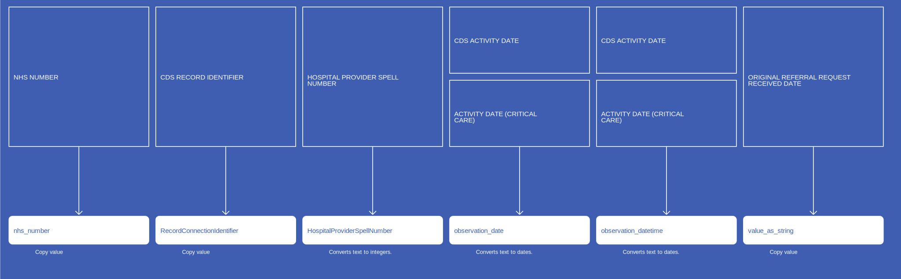

[Comment or raise an issue for this mapping.](https://github.com/answerdigital/oxford-omop-data-mapper/issues/new?title=CdsSourceOfReferralForOutpatients%20mapping)
## CdsPersonWeight
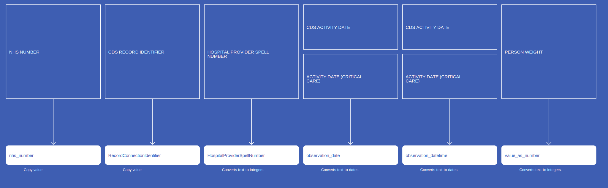

[Comment or raise an issue for this mapping.](https://github.com/answerdigital/oxford-omop-data-mapper/issues/new?title=CdsPersonWeight%20mapping)
## CdsNumberOfBabies

[Comment or raise an issue for this mapping.](https://github.com/answerdigital/oxford-omop-data-mapper/issues/new?title=CdsNumberOfBabies%20mapping)
## CdsGestationLengthLabourOnset
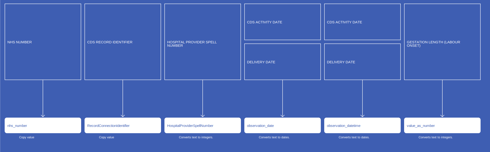

[Comment or raise an issue for this mapping.](https://github.com/answerdigital/oxford-omop-data-mapper/issues/new?title=CdsGestationLengthLabourOnset%20mapping)
## CdsCarerSupportIndicator
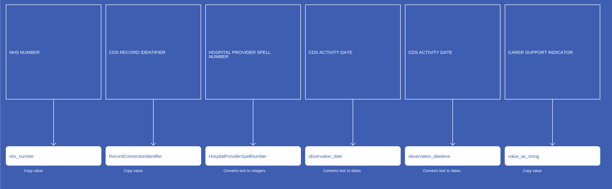

[Comment or raise an issue for this mapping.](https://github.com/answerdigital/oxford-omop-data-mapper/issues/new?title=CdsCarerSupportIndicator%20mapping)
## CdsBirthWeight
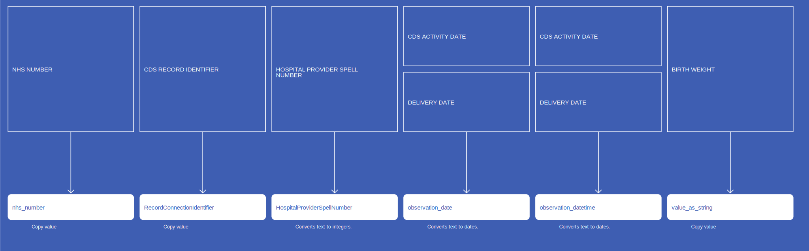

[Comment or raise an issue for this mapping.](https://github.com/answerdigital/oxford-omop-data-mapper/issues/new?title=CdsBirthWeight%20mapping)
## CdsAnaestheticGivenPostLabourDelivery
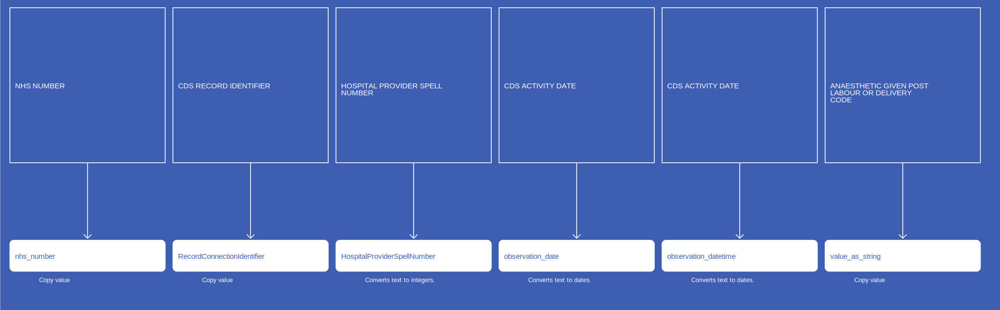

[Comment or raise an issue for this mapping.](https://github.com/answerdigital/oxford-omop-data-mapper/issues/new?title=CdsAnaestheticGivenPostLabourDelivery%20mapping)
## CdsAnaestheticDuringLabourDelivery
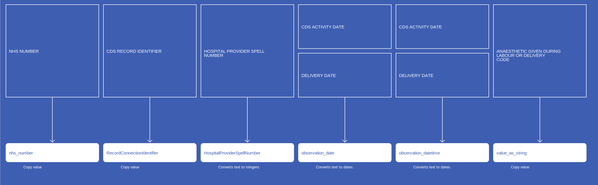

[Comment or raise an issue for this mapping.](https://github.com/answerdigital/oxford-omop-data-mapper/issues/new?title=CdsAnaestheticDuringLabourDelivery%20mapping)
# DrugExposure
* [nhs_number](DrugExposure_nhs_number.md)
* [drug_concept_id](DrugExposure_drug_concept_id.md)
* [drug_exposure_start_date](DrugExposure_drug_exposure_start_date.md)
* [drug_exposure_end_date](DrugExposure_drug_exposure_end_date.md)
* [drug_type_concept_id](DrugExposure_drug_type_concept_id.md)
* [drug_source_value](DrugExposure_drug_source_value.md)
* [drug_source_concept_id](DrugExposure_drug_source_concept_id.md)
* [RecordConnectionIdentifier](DrugExposure_RecordConnectionIdentifier.md)
## CdsDrugExposure
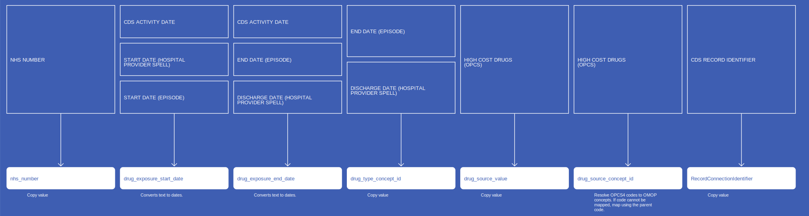

[Comment or raise an issue for this mapping.](https://github.com/answerdigital/oxford-omop-data-mapper/issues/new?title=CdsDrugExposure%20mapping)
# Death
* [NhsNumber](Death_NhsNumber.md)
* [death_date](Death_death_date.md)
* [death_datetime](Death_death_datetime.md)
* [death_type_concept_id](Death_death_type_concept_id.md)
* [cause_source_concept_id](Death_cause_source_concept_id.md)
## CdsDeath

[Comment or raise an issue for this mapping.](https://github.com/answerdigital/oxford-omop-data-mapper/issues/new?title=CdsDeath%20mapping)
# ConditionOccurrence
* [nhs_number](ConditionOccurrence_nhs_number.md)
* [condition_source_concept_id](ConditionOccurrence_condition_source_concept_id.md)
* [condition_concept_id](ConditionOccurrence_condition_concept_id.md)
* [condition_start_date](ConditionOccurrence_condition_start_date.md)
* [RecordConnectionIdentifier](ConditionOccurrence_RecordConnectionIdentifier.md)
* [condition_source_value](ConditionOccurrence_condition_source_value.md)
* [condition_type_concept_id](ConditionOccurrence_condition_type_concept_id.md)
## CdsConditionOccurrence

[Comment or raise an issue for this mapping.](https://github.com/answerdigital/oxford-omop-data-mapper/issues/new?title=CdsConditionOccurrence%20mapping)
