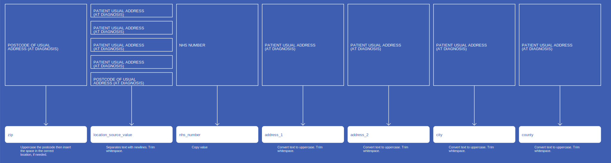
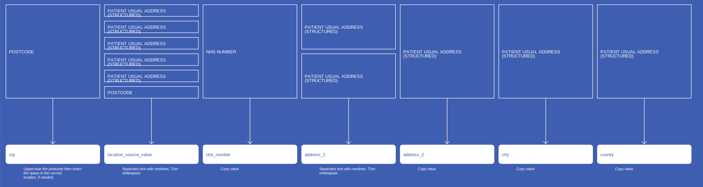
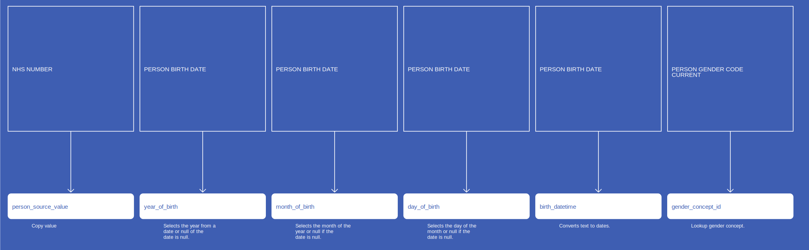
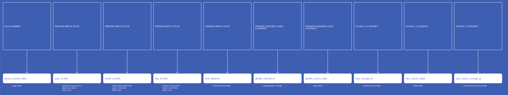
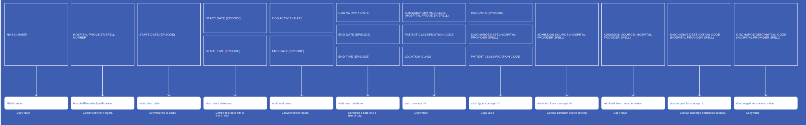

`Automatically generated documentation`

# Location
* [address_1](Location_address_1.md)
* [address_2](Location_address_2.md)
* [city](Location_city.md)
* [county](Location_county.md)
* [location_source_value](Location_location_source_value.md)
* [nhs_number](Location_nhs_number.md)
* [zip](Location_zip.md)
## SactLocation

## RtdsLocation

## CosdLocation

## CdsStructuredLocation

## CdsLocation

# Person
* [birth_datetime](Person_birth_datetime.md)
* [day_of_birth](Person_day_of_birth.md)
* [ethnicity_concept_id](Person_ethnicity_concept_id.md)
* [gender_concept_id](Person_gender_concept_id.md)
* [gender_source_concept_id](Person_gender_source_concept_id.md)
* [gender_source_value](Person_gender_source_value.md)
* [month_of_birth](Person_month_of_birth.md)
* [person_source_value](Person_person_source_value.md)
* [race_concept_id](Person_race_concept_id.md)
* [race_source_concept_id](Person_race_source_concept_id.md)
* [race_source_value](Person_race_source_value.md)
* [year_of_birth](Person_year_of_birth.md)
## SactPerson

## RtdsPerson

## CosdPerson

## CdsPerson

# VisitOccurrence
* [HospitalProviderSpellNumber](VisitOccurrence_HospitalProviderSpellNumber.md)
* [NhsNumber](VisitOccurrence_NhsNumber.md)
* [RecordConnectionIdentifier](VisitOccurrence_RecordConnectionIdentifier.md)
* [visit_concept_id](VisitOccurrence_visit_concept_id.md)
* [visit_end_date](VisitOccurrence_visit_end_date.md)
* [visit_end_datetime](VisitOccurrence_visit_end_datetime.md)
* [visit_start_date](VisitOccurrence_visit_start_date.md)
* [visit_start_datetime](VisitOccurrence_visit_start_datetime.md)
* [visit_type_concept_id](VisitOccurrence_visit_type_concept_id.md)
## CdsVisitOccurrenceWithSpell

## CdsVisitOccurrenceWithoutSpell

# ConditionOccurrence
* [cds_diagnosis_id](ConditionOccurrence_cds_diagnosis_id.md)
* [condition_concept_id](ConditionOccurrence_condition_concept_id.md)
* [condition_source_value](ConditionOccurrence_condition_source_value.md)
* [condition_start_date](ConditionOccurrence_condition_start_date.md)
* [condition_type_concept_id](ConditionOccurrence_condition_type_concept_id.md)
* [nhs_number](ConditionOccurrence_nhs_number.md)
## CdsConditionOccurrence

