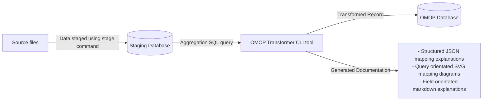

<details open markdown="block">
  <summary>
    Table of contents
  </summary>
  {: .text-delta }
- TOC
{:toc}
</details>

# Data Transformation

## Overview

This ETL tool has been designed to be documentation centric. This means that the same code is used to transform the data as is used to generate the documentation. They can never drift away from each other.

This tool extracts and transforms the data using a two step process.



## Data extract

At this stage of a data extract we simply run a SQL query. This query is to be used to handle any data aggregations, joins or any special cases.

The query is declared within a named XML file. The file format importantly includes an explanation of the query.

### Query file format

* `Sql` this element contains the query definition.
* `Query/Explanations/Explanation/@columnName` this attribute ties the explanation to one of the output fields of the query.
* `Query/Explanations/Explanation/Description` a human readable explanation of what the field output from the query is including a summary of any logic (markdown supported)
* `Query/Explanations/Explanation/Origin` an element that lists each NHS Data Dictionary element name that is used to produce the field. This element can occur many times per explanation.

Example

```xml
<Query>
    <Sql>
select
	distinct
		Patient_Postcode,
		NHS_Number,
		Date_Of_Birth,
		Person_Stated_Gender_Code
from omop_staging.sact_staging
	</Sql>

	<Explanations>
		<Explanation columnName="NHS_Number">
			<Description>Patient NHS Number</Description>
			<Origin>NHS NUMBER</Origin>
		</Explanation>

		<Explanation columnName="Patient_Postcode">
			<Description>Patient's Postcode.</Description>
			<Origin>POSTCODE</Origin>
		</Explanation>

		<Explanation columnName="Date_Of_Birth">
			<Description>Patient's date of birth.</Description>
			<Origin>PERSON BIRTH DATE</Origin>
		</Explanation>
		<Explanation columnName="Person_Stated_Gender_Code">
			<Description>The patient's Sex</Description>
			<Origin>PERSON GENDER CODE CURRENT</Origin>
		</Explanation>
	</Explanations>
</Query>
```

## Transformation

Results from the first stage aggregation are transformed to the OMOP format using C# annotations.

Transformations are strongly typed between the incoming query record and the target OMOP record. This is achieved through polymorphism and attributes.

A transformation can be declared by inherting a class that derrives from one of the base OMOP classes. Each class represents a table in the OMOP database.

Supported OMOP classes
* OmopConditionOccurrence
* OmopDeath
* OmopDrugExposure
* OmopLocation
* OmopObservation
* OmopPerson
* OmopProcedureOccurrence
* OmopVisitDetail
* OmopVisitOccurrence

When inherting from the base class, the source type must be specified as type `T`. The source type should represent a row of data from the incoming query.

### Example

Declare a class to represent a row of incoming Data that uses the `OmopDemographics.xml` query.

```csharp
[DataOrigin("COSD")]
[Description("COSD Demographics")]
[SourceQuery("OmopDemographics.xml")]
internal class CosdDemographics
{
    public string? StreetAddressLine1 { get; set; }
    public string? StreetAddressLine2 { get; set; }
    public string? StreetAddressLine3 { get; set; }
    public string? StreetAddressLine4 { get; set; }
    public string? Postcode { get; set; }
    public string? NhsNumber { get; set; }
    public string? PersonBirthDate { get; set; }
    public string? DateOfBirth { get; set; }
    public string? EthnicCategory { get; set; }
}
``` 

Declare a class to form a relationship between the `OmopLocation` type and the incoming `CosdDemographics` type.
`
-- two stage lift
-- transform annottaions
-- merge

```csharp
using OmopTransformer.Annotations;
using OmopTransformer.COSD.Demographics;
using OmopTransformer.Omop.Location;
using OmopTransformer.Transformation;

namespace OmopTransformer.COSD;

internal class CosdLocation : OmopLocation<CosdDemographics>
{
    [Transform(typeof(UppercaseAndTrimWhitespace), nameof(Source.StreetAddressLine1))]
    public override string? address_1 { get; set; }

    [Transform(typeof(UppercaseAndTrimWhitespace), nameof(Source.StreetAddressLine2))]
    public override string? address_2 { get; set; }

    [Transform(typeof(UppercaseAndTrimWhitespace), nameof(Source.StreetAddressLine3))]
    public override string? city { get; set; }

    [Transform(typeof(UppercaseAndTrimWhitespace), nameof(Source.StreetAddressLine4))]
    public override string? county { get; set; }

    [Transform(typeof(PostcodeFormatter), nameof(Source.Postcode))]
    public override string? zip { get; set; }

    [Transform(
        typeof(TextDeliminator),
        nameof(Source.StreetAddressLine1),
        nameof(Source.StreetAddressLine2),
        nameof(Source.StreetAddressLine3),
        nameof(Source.StreetAddressLine4),
        nameof(Source.Postcode))]
    public override string? location_source_value { get; set; }

    [CopyValue(nameof(Source.NhsNumber))]
    public override string? nhs_number { get; set; }
}
```

## Notes

*Note: JSON would be used instead of XML but it does not support strings that spans many lines. Multiline text can be stored, but only one a single line, which would have caused readability/review issues.*