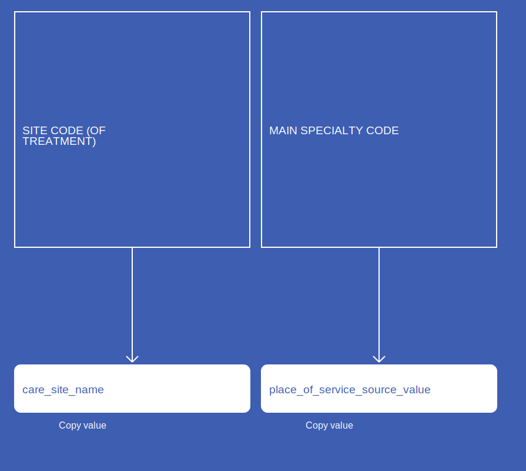
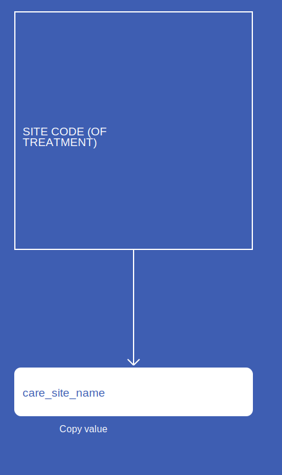
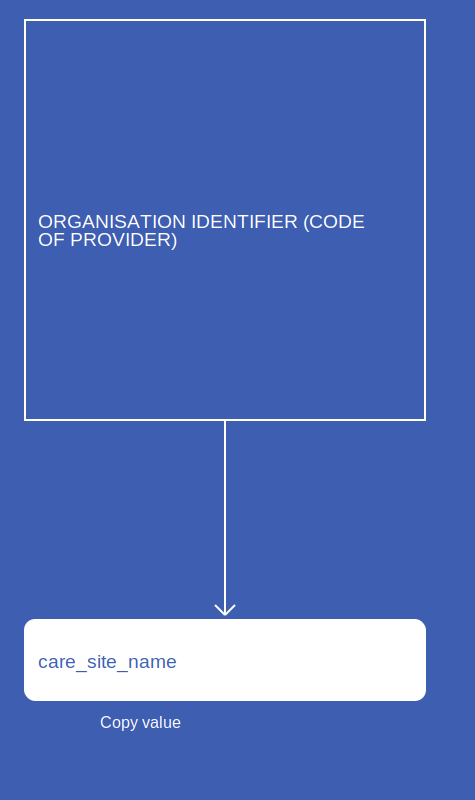

# CareSite
* [care_site_name]()
* [place_of_service_source_value]()
* [place_of_service_concept_id]()

## SusOPCareSite

[Comment or raise an issue for this mapping.](https://github.com/answerdigital/oxford-omop-data-mapper/issues/new?title=SusOPCareSite%20mapping){: .btn }
## SusAPCCareSite

[Comment or raise an issue for this mapping.](https://github.com/answerdigital/oxford-omop-data-mapper/issues/new?title=SusAPCCareSite%20mapping){: .btn }
## SusAECareSite

[Comment or raise an issue for this mapping.](https://github.com/answerdigital/oxford-omop-data-mapper/issues/new?title=SusAECareSite%20mapping){: .btn }
## SactCareSite

[Comment or raise an issue for this mapping.](https://github.com/answerdigital/oxford-omop-data-mapper/issues/new?title=SactCareSite%20mapping){: .btn }
