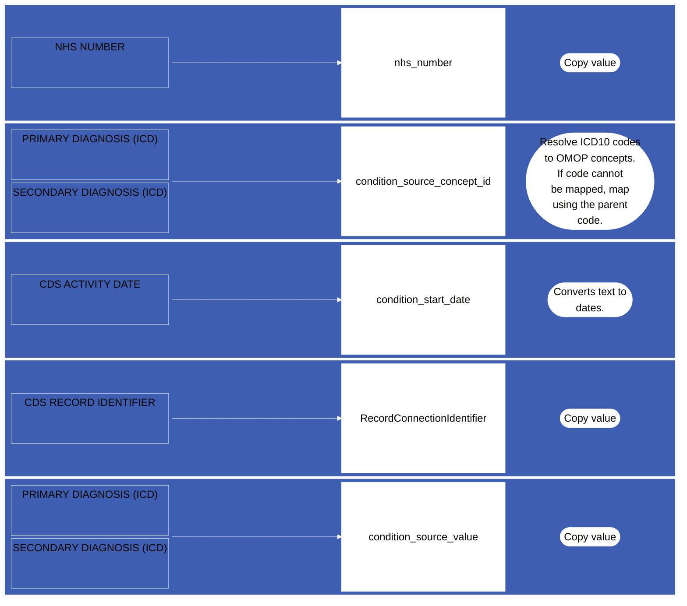

# ConditionOccurrence
* [nhs_number]()
* [condition_source_concept_id]()
* [condition_concept_id]()
* [condition_start_date]()
* [RecordConnectionIdentifier]()
* [condition_source_value]()
* [condition_type_concept_id]()

## CdsConditionOccurrence

```mermaid
%%{
  init: {
    'theme': 'base',
   'themeVariables': {
         'lineColor': '#Fff',
         'fontSize': '27px'
    }
  }
}%%

block-beta
  columns 1
  block:container:1
    columns 1
    block:nhs_number_container:1
        columns 4
        block:nhs_number:1
        columns 1
            nhs_number_0["NHS NUMBER<br/> <br/> <br/> "]
            class nhs_number_0 sourceItem
        end
        
        space
        
        nhs_number-->nhs_number_target_0["nhs_number"]

        nhs_number_label(["Copy value"])
    end
   class nhs_number_container container1
   class nhs_number container1
   class nhs_number_target_0 targetItem
   class nhs_number_label targetItem
    columns 1
    block:condition_source_concept_id_container:1
        columns 4
        block:condition_source_concept_id:1
        columns 1
            primary_diagnosis_icd_1["PRIMARY DIAGNOSIS (ICD)<br/> <br/> <br/> "]
            class primary_diagnosis_icd_1 sourceItem
            secondary_diagnosis_icd_1["SECONDARY DIAGNOSIS (ICD)<br/> <br/> <br/> "]
            class secondary_diagnosis_icd_1 sourceItem
        end
        
        space
        
        condition_source_concept_id-->condition_source_concept_id_target_1["condition_source_concept_id"]

        condition_source_concept_id_label(["Resolve ICD10 codes<br/> to OMOP concepts.<br/> If code cannot<br/> be mapped, map<br/> using the parent<br/> code."])
    end
   class condition_source_concept_id_container container1
   class condition_source_concept_id container1
   class condition_source_concept_id_target_1 targetItem
   class condition_source_concept_id_label targetItem
    columns 1
    block:condition_start_date_container:1
        columns 4
        block:condition_start_date:1
        columns 1
            cds_activity_date_2["CDS ACTIVITY DATE<br/> <br/> <br/> "]
            class cds_activity_date_2 sourceItem
        end
        
        space
        
        condition_start_date-->condition_start_date_target_2["condition_start_date"]

        condition_start_date_label(["Converts text to<br/> dates."])
    end
   class condition_start_date_container container1
   class condition_start_date container1
   class condition_start_date_target_2 targetItem
   class condition_start_date_label targetItem
    columns 1
    block:recordconnectionidentifier_container:1
        columns 4
        block:recordconnectionidentifier:1
        columns 1
            cds_record_identifier_3["CDS RECORD IDENTIFIER<br/> <br/> <br/> "]
            class cds_record_identifier_3 sourceItem
        end
        
        space
        
        recordconnectionidentifier-->recordconnectionidentifier_target_3["RecordConnectionIdentifier"]

        recordconnectionidentifier_label(["Copy value"])
    end
   class recordconnectionidentifier_container container1
   class recordconnectionidentifier container1
   class recordconnectionidentifier_target_3 targetItem
   class recordconnectionidentifier_label targetItem
    columns 1
    block:condition_source_value_container:1
        columns 4
        block:condition_source_value:1
        columns 1
            primary_diagnosis_icd_4["PRIMARY DIAGNOSIS (ICD)<br/> <br/> <br/> "]
            class primary_diagnosis_icd_4 sourceItem
            secondary_diagnosis_icd_4["SECONDARY DIAGNOSIS (ICD)<br/> <br/> <br/> "]
            class secondary_diagnosis_icd_4 sourceItem
        end
        
        space
        
        condition_source_value-->condition_source_value_target_4["condition_source_value"]

        condition_source_value_label(["Copy value"])
    end
   class condition_source_value_container container1
   class condition_source_value container1
   class condition_source_value_target_4 targetItem
   class condition_source_value_label targetItem
   classDef container1 fill:#3E5EB2, color:#3E5EB2, stroke:#3E5EB2;
   classDef sourceItem fill:#3E5EB2, color:#fff, stroke:#fff;
   classDef targetItem fill:#fff, color:#3E5EB2, stroke:#fff;
end
```

[Comment or raise an issue for this mapping.](https://github.com/answerdigital/oxford-omop-data-mapper/issues/new?title=CdsConditionOccurrence%20mapping){: .btn }
