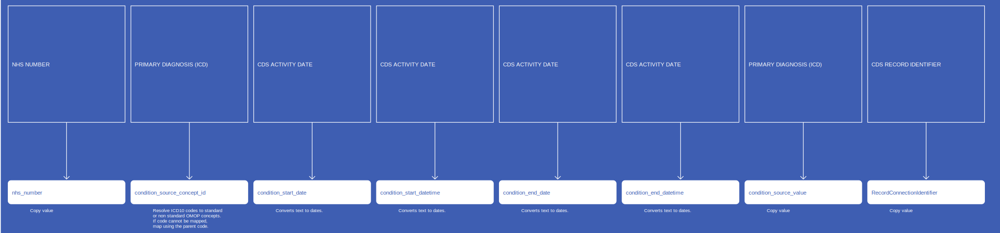
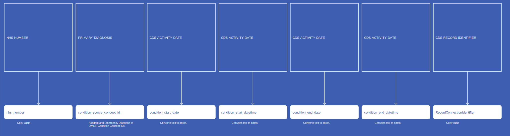
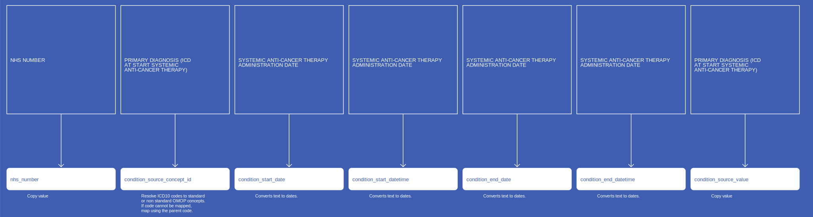
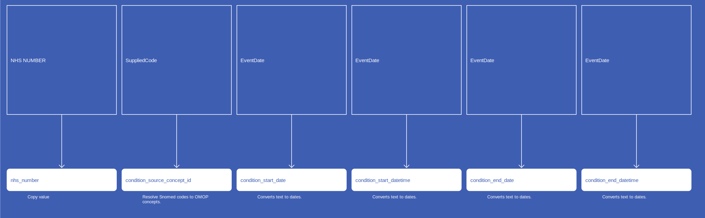
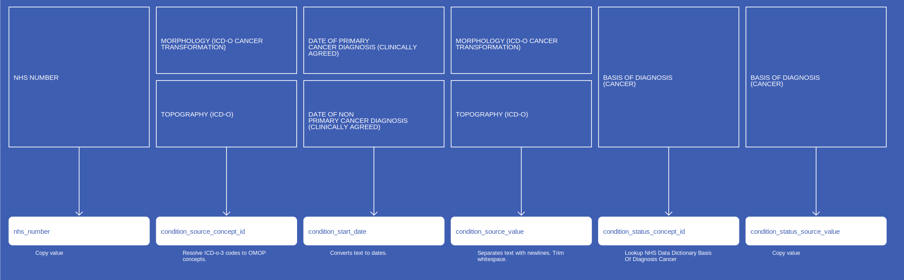
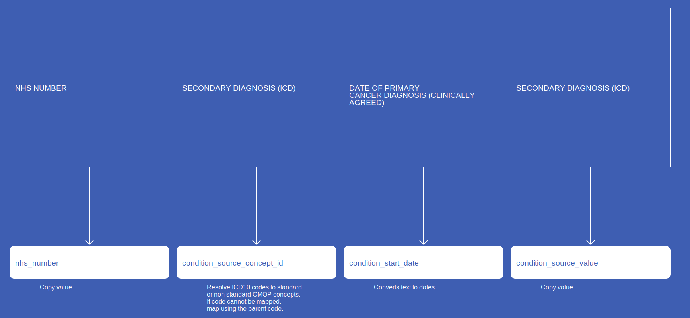
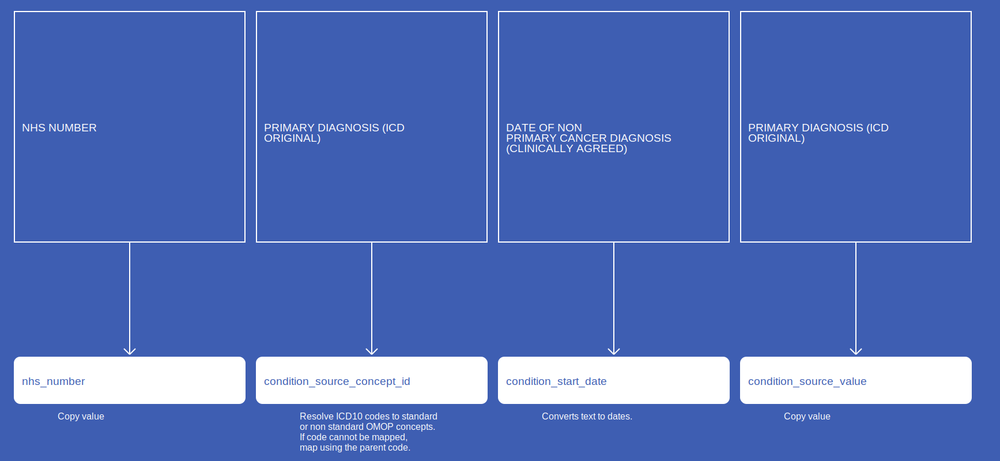
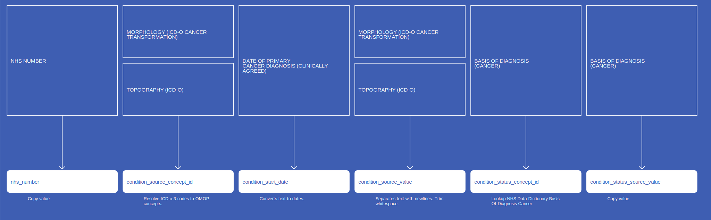

# ConditionOccurrence
* [nhs_number]()
* [condition_source_concept_id]()
* [condition_concept_id]()
* [condition_start_date]()
* [condition_start_datetime]()
* [condition_end_date]()
* [condition_end_datetime]()
* [condition_source_value]()
* [condition_type_concept_id]()
* [RecordConnectionIdentifier]()
* [condition_status_concept_id]()
* [condition_status_source_value]()

## SusOPConditionOccurrence

[Comment or raise an issue for this mapping.](https://github.com/answerdigital/oxford-omop-data-mapper/issues/new?title=SusOPConditionOccurrence%20mapping){: .btn }
## SusAPCConditionOccurrence

[Comment or raise an issue for this mapping.](https://github.com/answerdigital/oxford-omop-data-mapper/issues/new?title=SusAPCConditionOccurrence%20mapping){: .btn }
## SusAEConditionOccurrence

[Comment or raise an issue for this mapping.](https://github.com/answerdigital/oxford-omop-data-mapper/issues/new?title=SusAEConditionOccurrence%20mapping){: .btn }
## SactConditionOccurrence

[Comment or raise an issue for this mapping.](https://github.com/answerdigital/oxford-omop-data-mapper/issues/new?title=SactConditionOccurrence%20mapping){: .btn }
## RtdsConditionOccurrence

[Comment or raise an issue for this mapping.](https://github.com/answerdigital/oxford-omop-data-mapper/issues/new?title=RtdsConditionOccurrence%20mapping){: .btn }
## OxfordGPConditionOccurrence

[Comment or raise an issue for this mapping.](https://github.com/answerdigital/oxford-omop-data-mapper/issues/new?title=OxfordGPConditionOccurrence%20mapping){: .btn }
## CosdV9LungConditionOccurrenceRecurrence

{: .important-title }
> Assumptions
>
> * Any changes in a Diagnosis that may occur in later submissions, for the same Diagnosis date, is taken to be an additional diagnosis as opposed to a change (hence removal of the original)
> * If the same Diagnosis occurs but we have 2 separate "basis of diagnosis" values, then the first one will be taken only

[Comment or raise an issue for this mapping.](https://github.com/answerdigital/oxford-omop-data-mapper/issues/new?title=CosdV9LungConditionOccurrenceRecurrence%20mapping){: .btn }
## CosdV9LungConditionOccurrenceProgression

{: .important-title }
> Assumptions
>
> * Any changes in a Diagnosis that may occur in later submissions, for the same Diagnosis date, is taken to be an additional diagnosis as opposed to a change (hence removal of the original)
> * If the same Diagnosis occurs but we have 2 separate "basis of diagnosis" values, then the first one will be taken only

[Comment or raise an issue for this mapping.](https://github.com/answerdigital/oxford-omop-data-mapper/issues/new?title=CosdV9LungConditionOccurrenceProgression%20mapping){: .btn }
## CosdV8LungConditionOccurrenceProgression

{: .important-title }
> Assumptions
>
> * Any changes in a Diagnosis that may occur in later submissions, for the same Diagnosis date, is taken to be an additional diagnosis as opposed to a change (hence removal of the original)
> * If the same Diagnosis occurs but we have 2 separate "basis of diagnosis" values, then the first one will be taken only

[Comment or raise an issue for this mapping.](https://github.com/answerdigital/oxford-omop-data-mapper/issues/new?title=CosdV8LungConditionOccurrenceProgression%20mapping){: .btn }
## CosdV8LungConditionOccurrencePrimaryDiagnosis

{: .important-title }
> Assumptions
>
> * Any changes in a Diagnosis that may occur in later submissions, for the same Diagnosis date, is taken to be an additional diagnosis as opposed to a change (hence removal of the original)
> * If the same Diagnosis occurs but we have 2 separate "basis of diagnosis" values, then the first one will be taken only

[Comment or raise an issue for this mapping.](https://github.com/answerdigital/oxford-omop-data-mapper/issues/new?title=CosdV8LungConditionOccurrencePrimaryDiagnosis%20mapping){: .btn }
## CosdV8LungConditionOccurrencePrimaryDiagnosisHistologyTopography

{: .important-title }
> Assumptions
>
> * For a given Diagnosis date, all valid combinations of Histology and Topography are added (thereby giving us an ICD-O-3 condition) as well as the ICD10 Diagnosis.
> * Any changes in a Diagnosis that may occur in later submissions, for the same Diagnosis date, is taken to be an additional diagnosis as opposed to a change (hence removal of the original)
> * If the same Diagnosis occurs but we have 2 separate "basis of diagnosis" values, then the first one will be taken only

[Comment or raise an issue for this mapping.](https://github.com/answerdigital/oxford-omop-data-mapper/issues/new?title=CosdV8LungConditionOccurrencePrimaryDiagnosisHistologyTopography%20mapping){: .btn }
## CosdV8ConditionOccurrencePrimaryDiagnosis

{: .important-title }
> Assumptions
>
> * Any changes in a Diagnosis that may occur in later submissions, for the same Diagnosis date, is taken to be an additional diagnosis as opposed to a change (hence removal of the original)
> * If the same Diagnosis occurs but we have 2 separate "basis of diagnosis" values, then the first one will be taken only

[Comment or raise an issue for this mapping.](https://github.com/answerdigital/oxford-omop-data-mapper/issues/new?title=CosdV8ConditionOccurrencePrimaryDiagnosis%20mapping){: .btn }
## CosdV8ConditionOccurrencePrimaryDiagnosisHistologyTopography

{: .important-title }
> Assumptions
>
> * For a given Diagnosis date, all valid combinations of Histology and Topography are added (thereby giving us an ICD-O-3 condition) as well as the ICD10 Diagnosis.
> * Any changes in a Diagnosis that may occur in later submissions, for the same Diagnosis date, is taken to be an additional diagnosis as opposed to a change (hence removal of the original)
> * If the same Diagnosis occurs but we have 2 separate "basis of diagnosis" values, then the first one will be taken only

[Comment or raise an issue for this mapping.](https://github.com/answerdigital/oxford-omop-data-mapper/issues/new?title=CosdV8ConditionOccurrencePrimaryDiagnosisHistologyTopography%20mapping){: .btn }
## CosdV9ConditionOccurrenceSecondaryDiagnosis

[Comment or raise an issue for this mapping.](https://github.com/answerdigital/oxford-omop-data-mapper/issues/new?title=CosdV9ConditionOccurrenceSecondaryDiagnosis%20mapping){: .btn }
## CosdV9ConditionOccurrenceRecurrence

{: .important-title }
> Assumptions
>
> * Any changes in a Diagnosis that may occur in later submissions, for the same Diagnosis date, is taken to be an additional diagnosis as opposed to a change (hence removal of the original)
> * If the same Diagnosis occurs but we have 2 separate "basis of diagnosis" values, then the first one will be taken only

[Comment or raise an issue for this mapping.](https://github.com/answerdigital/oxford-omop-data-mapper/issues/new?title=CosdV9ConditionOccurrenceRecurrence%20mapping){: .btn }
## CosdV9ConditionOccurrenceProgression

{: .important-title }
> Assumptions
>
> * Any changes in a Diagnosis that may occur in later submissions, for the same Diagnosis date, is taken to be an additional diagnosis as opposed to a change (hence removal of the original)
> * If the same Diagnosis occurs but we have 2 separate "basis of diagnosis" values, then the first one will be taken only

[Comment or raise an issue for this mapping.](https://github.com/answerdigital/oxford-omop-data-mapper/issues/new?title=CosdV9ConditionOccurrenceProgression%20mapping){: .btn }
## CosdConditionOccurrencePrimaryDiagnosis

{: .important-title }
> Assumptions
>
> * Any changes in a Diagnosis that may occur in later submissions, for the same Diagnosis date, is taken to be an additional diagnosis as opposed to a change (hence removal of the original)
> * If the same Diagnosis occurs but we have 2 separate "basis of diagnosis" values, then the first one will be taken only

[Comment or raise an issue for this mapping.](https://github.com/answerdigital/oxford-omop-data-mapper/issues/new?title=CosdConditionOccurrencePrimaryDiagnosis%20mapping){: .btn }
## CosdConditionOccurrencePrimaryDiagnosisHistologyTopography

{: .important-title }
> Assumptions
>
> * For a given Diagnosis date, all valid combinations of Histology and Topography are added (thereby giving us an ICD-O-3 condition) as well as the ICD10 Diagnosis.
> * Any changes in a Diagnosis that may occur in later submissions, for the same Diagnosis date, is taken to be an additional diagnosis as opposed to a change (hence removal of the original)
> * If the same Diagnosis occurs but we have 2 separate "basis of diagnosis" values, then the first one will be taken only

[Comment or raise an issue for this mapping.](https://github.com/answerdigital/oxford-omop-data-mapper/issues/new?title=CosdConditionOccurrencePrimaryDiagnosisHistologyTopography%20mapping){: .btn }
