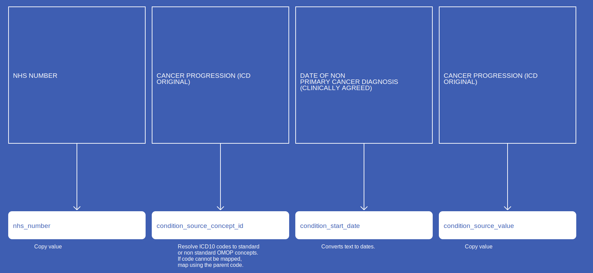

# ConditionOccurrence
* [nhs_number]()
* [condition_start_date]()
* [condition_type_concept_id]()
* [condition_status_concept_id]()
* [condition_status_source_value]()
* [condition_source_concept_id]()
* [condition_concept_id]()
* [condition_source_value]()
* [RecordConnectionIdentifier]()

## CosdV8ConditionOccurrencePrimaryDiagnosis

[Comment or raise an issue for this mapping.](https://github.com/answerdigital/oxford-omop-data-mapper/issues/new?title=CosdV8ConditionOccurrencePrimaryDiagnosis%20mapping){: .btn }
## CosdV8ConditionOccurrencePrimaryDiagnosisHistologyTopography

[Comment or raise an issue for this mapping.](https://github.com/answerdigital/oxford-omop-data-mapper/issues/new?title=CosdV8ConditionOccurrencePrimaryDiagnosisHistologyTopography%20mapping){: .btn }
## CosdV9ConditionOccurrenceSecondaryDiagnosis

[Comment or raise an issue for this mapping.](https://github.com/answerdigital/oxford-omop-data-mapper/issues/new?title=CosdV9ConditionOccurrenceSecondaryDiagnosis%20mapping){: .btn }
## CosdV9ConditionOccurrenceRecurrence

[Comment or raise an issue for this mapping.](https://github.com/answerdigital/oxford-omop-data-mapper/issues/new?title=CosdV9ConditionOccurrenceRecurrence%20mapping){: .btn }
## CosdV9ConditionOccurrenceProgression

[Comment or raise an issue for this mapping.](https://github.com/answerdigital/oxford-omop-data-mapper/issues/new?title=CosdV9ConditionOccurrenceProgression%20mapping){: .btn }
## CosdConditionOccurrencePrimaryDiagnosis

[Comment or raise an issue for this mapping.](https://github.com/answerdigital/oxford-omop-data-mapper/issues/new?title=CosdConditionOccurrencePrimaryDiagnosis%20mapping){: .btn }
## CosdConditionOccurrencePrimaryDiagnosisHistologyTopography

[Comment or raise an issue for this mapping.](https://github.com/answerdigital/oxford-omop-data-mapper/issues/new?title=CosdConditionOccurrencePrimaryDiagnosisHistologyTopography%20mapping){: .btn }
## CdsConditionOccurrence

[Comment or raise an issue for this mapping.](https://github.com/answerdigital/oxford-omop-data-mapper/issues/new?title=CdsConditionOccurrence%20mapping){: .btn }
