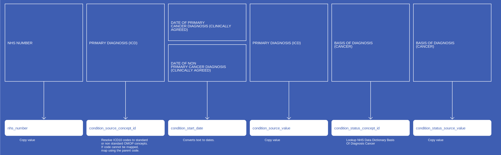

# ConditionOccurrence
* [nhs_number]()
* [condition_start_date]()
* [condition_type_concept_id]()
* [condition_status_concept_id]()
* [condition_status_source_value]()
* [condition_source_concept_id]()
* [condition_concept_id]()
* [condition_source_value]()
* [RecordConnectionIdentifier]()

## CosdV8ConditionOccurrencePrimaryDiagnosis

{: .important-title }
> Assumptions
>
> * Any changes in a Diagnosis that may occur in later submissions, for the same Diagnosis date, is taken to be an additional diagnosis as opposed to a change (hence removal of the original)
> * If the same Diagnosis occurs but we have 2 separate "basis of diagnosis" values, then the first one will be taken only

[Comment or raise an issue for this mapping.](https://github.com/answerdigital/oxford-omop-data-mapper/issues/new?title=CosdV8ConditionOccurrencePrimaryDiagnosis%20mapping){: .btn }
## CosdV8ConditionOccurrencePrimaryDiagnosisHistologyTopography

{: .important-title }
> Assumptions
>
> * For a given Diagnosis date, all valid combinations of Histology and Topography are added (thereby giving us an ICD-O-3 condition) as well as the ICD10 Diagnosis.
> * Any changes in a Diagnosis that may occur in later submissions, for the same Diagnosis date, is taken to be an additional diagnosis as opposed to a change (hence removal of the original)
> * If the same Diagnosis occurs but we have 2 separate "basis of diagnosis" values, then the first one will be taken only

[Comment or raise an issue for this mapping.](https://github.com/answerdigital/oxford-omop-data-mapper/issues/new?title=CosdV8ConditionOccurrencePrimaryDiagnosisHistologyTopography%20mapping){: .btn }
## CosdV9ConditionOccurrenceSecondaryDiagnosis

[Comment or raise an issue for this mapping.](https://github.com/answerdigital/oxford-omop-data-mapper/issues/new?title=CosdV9ConditionOccurrenceSecondaryDiagnosis%20mapping){: .btn }
## CosdV9ConditionOccurrenceRecurrence

{: .important-title }
> Assumptions
>
> * Any changes in a Diagnosis that may occur in later submissions, for the same Diagnosis date, is taken to be an additional diagnosis as opposed to a change (hence removal of the original)
> * If the same Diagnosis occurs but we have 2 separate "basis of diagnosis" values, then the first one will be taken only

[Comment or raise an issue for this mapping.](https://github.com/answerdigital/oxford-omop-data-mapper/issues/new?title=CosdV9ConditionOccurrenceRecurrence%20mapping){: .btn }
## CosdV9ConditionOccurrenceProgression

{: .important-title }
> Assumptions
>
> * Any changes in a Diagnosis that may occur in later submissions, for the same Diagnosis date, is taken to be an additional diagnosis as opposed to a change (hence removal of the original)
> * If the same Diagnosis occurs but we have 2 separate "basis of diagnosis" values, then the first one will be taken only

[Comment or raise an issue for this mapping.](https://github.com/answerdigital/oxford-omop-data-mapper/issues/new?title=CosdV9ConditionOccurrenceProgression%20mapping){: .btn }
## CosdConditionOccurrencePrimaryDiagnosis

{: .important-title }
> Assumptions
>
> * Any changes in a Diagnosis that may occur in later submissions, for the same Diagnosis date, is taken to be an additional diagnosis as opposed to a change (hence removal of the original)
> * If the same Diagnosis occurs but we have 2 separate "basis of diagnosis" values, then the first one will be taken only

[Comment or raise an issue for this mapping.](https://github.com/answerdigital/oxford-omop-data-mapper/issues/new?title=CosdConditionOccurrencePrimaryDiagnosis%20mapping){: .btn }
## CosdConditionOccurrencePrimaryDiagnosisHistologyTopography

{: .important-title }
> Assumptions
>
> * For a given Diagnosis date, all valid combinations of Histology and Topography are added (thereby giving us an ICD-O-3 condition) as well as the ICD10 Diagnosis.
> * Any changes in a Diagnosis that may occur in later submissions, for the same Diagnosis date, is taken to be an additional diagnosis as opposed to a change (hence removal of the original)
> * If the same Diagnosis occurs but we have 2 separate "basis of diagnosis" values, then the first one will be taken only

[Comment or raise an issue for this mapping.](https://github.com/answerdigital/oxford-omop-data-mapper/issues/new?title=CosdConditionOccurrencePrimaryDiagnosisHistologyTopography%20mapping){: .btn }
## CdsConditionOccurrence

{: .important-title }
> Duplicates
>
> CDS data contains numerous duplicated records for cds_diagnosis.DiagnosisCode (condition_concept_id), cds_line01.cdsActivityDate (condition_start_date) and cds_line01.NHSNumber (person_id).
>
> In order to avoid true duplicates occurring in the data, we have included distinct records for  cds_diagnosis.DiagnosisCode (condition_concept_id), cds_line01.cdsActivityDate (condition_start_date) , cds_line01.NHSNumber (person_id) and cds_line01.RecordConnectionIdentifier and excluded all duplicates.
>

[Comment or raise an issue for this mapping.](https://github.com/answerdigital/oxford-omop-data-mapper/issues/new?title=CdsConditionOccurrence%20mapping){: .btn }
