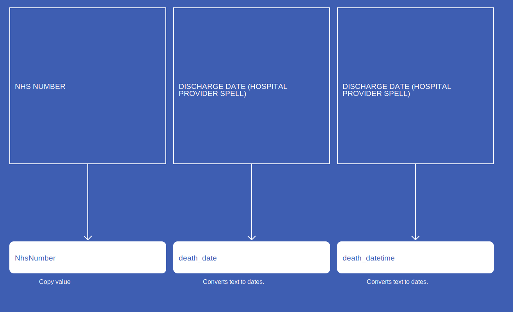

# Death
* [NhsNumber]()
* [death_date]()
* [death_datetime]()
* [death_type_concept_id]()
* [cause_source_concept_id]()

## CdsDeath

[Comment or raise an issue for this mapping.](https://github.com/answerdigital/oxford-omop-data-mapper/issues/new?title=CdsDeath%20mapping){: .btn }
