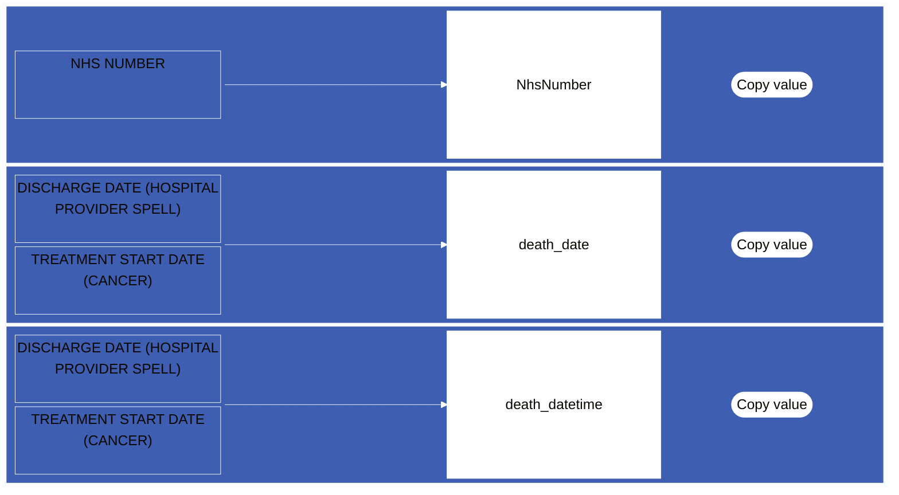
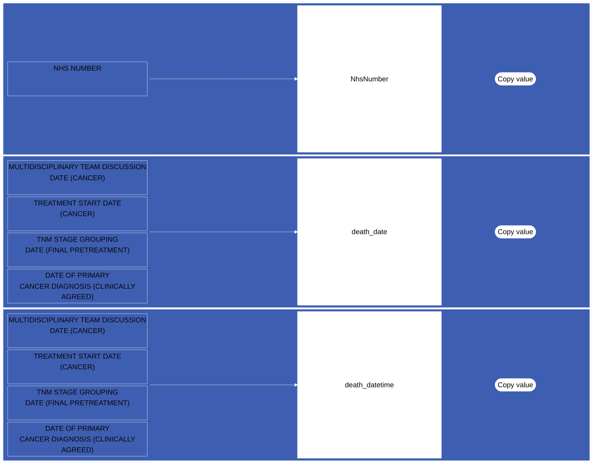
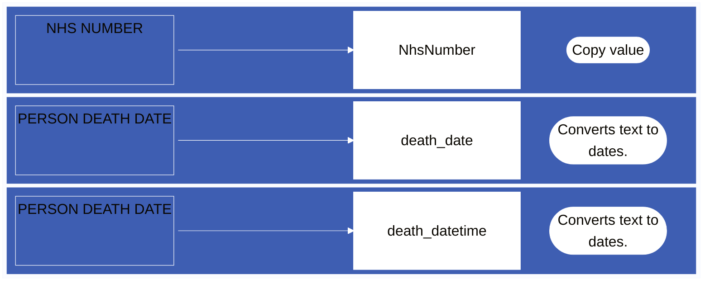
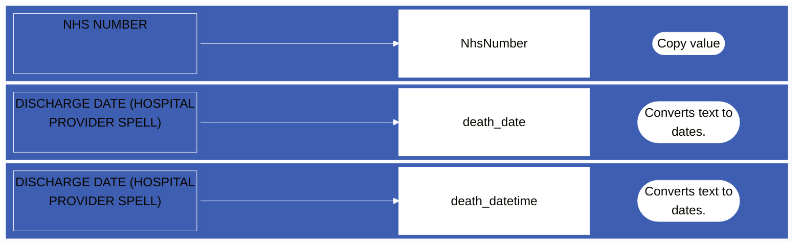

# Death
* [NhsNumber]()
* [death_date]()
* [death_datetime]()
* [death_type_concept_id]()
* [cause_source_concept_id]()

## CosdDeathV9DeathDischargeDestination

```mermaid
%%{
  init: {
    'theme': 'base',
   'themeVariables': {
         'lineColor': '#Fff',
         'fontSize': '27px'
    }
  }
}%%

block-beta
  columns 1
  block:container:1
    columns 1
    block:nhsnumber_container:1
        columns 4
        block:nhsnumber:1
        columns 1
            nhs_number_0["NHS NUMBER<br/> <br/> <br/> "]
            class nhs_number_0 sourceItem
        end
        
        space
        
        nhsnumber-->nhsnumber_target_0["NhsNumber"]

        nhsnumber_label(["Copy value"])
    end
   class nhsnumber_container container1
   class nhsnumber container1
   class nhsnumber_target_0 targetItem
   class nhsnumber_label targetItem
    columns 1
    block:death_date_container:1
        columns 4
        block:death_date:1
        columns 1
            discharge_date_hospital_provider_spell_1["DISCHARGE DATE (HOSPITAL<br/> PROVIDER SPELL)<br/> <br/> "]
            class discharge_date_hospital_provider_spell_1 sourceItem
            treatment_start_date_cancer_1["TREATMENT START DATE<br/> (CANCER)<br/> <br/> "]
            class treatment_start_date_cancer_1 sourceItem
        end
        
        space
        
        death_date-->death_date_target_1["death_date"]

        death_date_label(["Copy value"])
    end
   class death_date_container container1
   class death_date container1
   class death_date_target_1 targetItem
   class death_date_label targetItem
    columns 1
    block:death_datetime_container:1
        columns 4
        block:death_datetime:1
        columns 1
            discharge_date_hospital_provider_spell_2["DISCHARGE DATE (HOSPITAL<br/> PROVIDER SPELL)<br/> <br/> "]
            class discharge_date_hospital_provider_spell_2 sourceItem
            treatment_start_date_cancer_2["TREATMENT START DATE<br/> (CANCER)<br/> <br/> "]
            class treatment_start_date_cancer_2 sourceItem
        end
        
        space
        
        death_datetime-->death_datetime_target_2["death_datetime"]

        death_datetime_label(["Copy value"])
    end
   class death_datetime_container container1
   class death_datetime container1
   class death_datetime_target_2 targetItem
   class death_datetime_label targetItem
   classDef container1 fill:#3E5EB2, color:#3E5EB2, stroke:#3E5EB2;
   classDef sourceItem fill:#3E5EB2, color:#fff, stroke:#fff;
   classDef targetItem fill:#fff, color:#3E5EB2, stroke:#fff;
end
```

[Comment or raise an issue for this mapping.](https://github.com/answerdigital/oxford-omop-data-mapper/issues/new?title=CosdDeathV9DeathDischargeDestination%20mapping){: .btn }
## CosdV9DeathBasisOfDiagnosisCancer

```mermaid
%%{
  init: {
    'theme': 'base',
   'themeVariables': {
         'lineColor': '#Fff',
         'fontSize': '27px'
    }
  }
}%%

block-beta
  columns 1
  block:container:1
    columns 1
    block:nhsnumber_container:1
        columns 4
        block:nhsnumber:1
        columns 1
            nhs_number_0["NHS NUMBER<br/> <br/> <br/> "]
            class nhs_number_0 sourceItem
        end
        
        space
        
        nhsnumber-->nhsnumber_target_0["NhsNumber"]

        nhsnumber_label(["Copy value"])
    end
   class nhsnumber_container container1
   class nhsnumber container1
   class nhsnumber_target_0 targetItem
   class nhsnumber_label targetItem
    columns 1
    block:death_date_container:1
        columns 4
        block:death_date:1
        columns 1
            multidisciplinary_team_discussion_date_cancer_1["MULTIDISCIPLINARY TEAM DISCUSSION<br/> DATE (CANCER)<br/> <br/> "]
            class multidisciplinary_team_discussion_date_cancer_1 sourceItem
            treatment_start_date_cancer_1["TREATMENT START DATE<br/> (CANCER)<br/> <br/> "]
            class treatment_start_date_cancer_1 sourceItem
            tnm_stage_grouping_date_final_pretreatment_1["TNM STAGE GROUPING<br/> DATE (FINAL PRETREATMENT)<br/> <br/> "]
            class tnm_stage_grouping_date_final_pretreatment_1 sourceItem
            date_of_primary_cancer_diagnosis_clinically_agreed_1["DATE OF PRIMARY<br/> CANCER DIAGNOSIS (CLINICALLY<br/> AGREED)<br/> "]
            class date_of_primary_cancer_diagnosis_clinically_agreed_1 sourceItem
        end
        
        space
        
        death_date-->death_date_target_1["death_date"]

        death_date_label(["Copy value"])
    end
   class death_date_container container1
   class death_date container1
   class death_date_target_1 targetItem
   class death_date_label targetItem
    columns 1
    block:death_datetime_container:1
        columns 4
        block:death_datetime:1
        columns 1
            multidisciplinary_team_discussion_date_cancer_2["MULTIDISCIPLINARY TEAM DISCUSSION<br/> DATE (CANCER)<br/> <br/> "]
            class multidisciplinary_team_discussion_date_cancer_2 sourceItem
            treatment_start_date_cancer_2["TREATMENT START DATE<br/> (CANCER)<br/> <br/> "]
            class treatment_start_date_cancer_2 sourceItem
            tnm_stage_grouping_date_final_pretreatment_2["TNM STAGE GROUPING<br/> DATE (FINAL PRETREATMENT)<br/> <br/> "]
            class tnm_stage_grouping_date_final_pretreatment_2 sourceItem
            date_of_primary_cancer_diagnosis_clinically_agreed_2["DATE OF PRIMARY<br/> CANCER DIAGNOSIS (CLINICALLY<br/> AGREED)<br/> "]
            class date_of_primary_cancer_diagnosis_clinically_agreed_2 sourceItem
        end
        
        space
        
        death_datetime-->death_datetime_target_2["death_datetime"]

        death_datetime_label(["Copy value"])
    end
   class death_datetime_container container1
   class death_datetime container1
   class death_datetime_target_2 targetItem
   class death_datetime_label targetItem
   classDef container1 fill:#3E5EB2, color:#3E5EB2, stroke:#3E5EB2;
   classDef sourceItem fill:#3E5EB2, color:#fff, stroke:#fff;
   classDef targetItem fill:#fff, color:#3E5EB2, stroke:#fff;
end
```

[Comment or raise an issue for this mapping.](https://github.com/answerdigital/oxford-omop-data-mapper/issues/new?title=CosdV9DeathBasisOfDiagnosisCancer%20mapping){: .btn }
## CosdV8Death

```mermaid
%%{
  init: {
    'theme': 'base',
   'themeVariables': {
         'lineColor': '#Fff',
         'fontSize': '27px'
    }
  }
}%%

block-beta
  columns 1
  block:container:1
    columns 1
    block:nhsnumber_container:1
        columns 4
        block:nhsnumber:1
        columns 1
            nhs_number_0["NHS NUMBER<br/> <br/> <br/> "]
            class nhs_number_0 sourceItem
        end
        
        space
        
        nhsnumber-->nhsnumber_target_0["NhsNumber"]

        nhsnumber_label(["Copy value"])
    end
   class nhsnumber_container container1
   class nhsnumber container1
   class nhsnumber_target_0 targetItem
   class nhsnumber_label targetItem
    columns 1
    block:death_date_container:1
        columns 4
        block:death_date:1
        columns 1
            person_death_date_1["PERSON DEATH DATE<br/> <br/> <br/> "]
            class person_death_date_1 sourceItem
        end
        
        space
        
        death_date-->death_date_target_1["death_date"]

        death_date_label(["Converts text to<br/> dates."])
    end
   class death_date_container container1
   class death_date container1
   class death_date_target_1 targetItem
   class death_date_label targetItem
    columns 1
    block:death_datetime_container:1
        columns 4
        block:death_datetime:1
        columns 1
            person_death_date_2["PERSON DEATH DATE<br/> <br/> <br/> "]
            class person_death_date_2 sourceItem
        end
        
        space
        
        death_datetime-->death_datetime_target_2["death_datetime"]

        death_datetime_label(["Converts text to<br/> dates."])
    end
   class death_datetime_container container1
   class death_datetime container1
   class death_datetime_target_2 targetItem
   class death_datetime_label targetItem
   classDef container1 fill:#3E5EB2, color:#3E5EB2, stroke:#3E5EB2;
   classDef sourceItem fill:#3E5EB2, color:#fff, stroke:#fff;
   classDef targetItem fill:#fff, color:#3E5EB2, stroke:#fff;
end
```

[Comment or raise an issue for this mapping.](https://github.com/answerdigital/oxford-omop-data-mapper/issues/new?title=CosdV8Death%20mapping){: .btn }
## CdsDeath

```mermaid
%%{
  init: {
    'theme': 'base',
   'themeVariables': {
         'lineColor': '#Fff',
         'fontSize': '27px'
    }
  }
}%%

block-beta
  columns 1
  block:container:1
    columns 1
    block:nhsnumber_container:1
        columns 4
        block:nhsnumber:1
        columns 1
            nhs_number_0["NHS NUMBER<br/> <br/> <br/> "]
            class nhs_number_0 sourceItem
        end
        
        space
        
        nhsnumber-->nhsnumber_target_0["NhsNumber"]

        nhsnumber_label(["Copy value"])
    end
   class nhsnumber_container container1
   class nhsnumber container1
   class nhsnumber_target_0 targetItem
   class nhsnumber_label targetItem
    columns 1
    block:death_date_container:1
        columns 4
        block:death_date:1
        columns 1
            discharge_date_hospital_provider_spell_1["DISCHARGE DATE (HOSPITAL<br/> PROVIDER SPELL)<br/> <br/> "]
            class discharge_date_hospital_provider_spell_1 sourceItem
        end
        
        space
        
        death_date-->death_date_target_1["death_date"]

        death_date_label(["Converts text to<br/> dates."])
    end
   class death_date_container container1
   class death_date container1
   class death_date_target_1 targetItem
   class death_date_label targetItem
    columns 1
    block:death_datetime_container:1
        columns 4
        block:death_datetime:1
        columns 1
            discharge_date_hospital_provider_spell_2["DISCHARGE DATE (HOSPITAL<br/> PROVIDER SPELL)<br/> <br/> "]
            class discharge_date_hospital_provider_spell_2 sourceItem
        end
        
        space
        
        death_datetime-->death_datetime_target_2["death_datetime"]

        death_datetime_label(["Converts text to<br/> dates."])
    end
   class death_datetime_container container1
   class death_datetime container1
   class death_datetime_target_2 targetItem
   class death_datetime_label targetItem
   classDef container1 fill:#3E5EB2, color:#3E5EB2, stroke:#3E5EB2;
   classDef sourceItem fill:#3E5EB2, color:#fff, stroke:#fff;
   classDef targetItem fill:#fff, color:#3E5EB2, stroke:#fff;
end
```

[Comment or raise an issue for this mapping.](https://github.com/answerdigital/oxford-omop-data-mapper/issues/new?title=CdsDeath%20mapping){: .btn }
