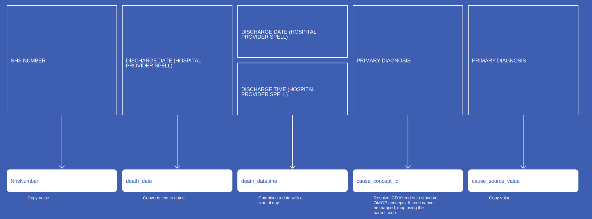

# Death
* [NhsNumber]()
* [death_date]()
* [death_datetime]()
* [cause_source_value]()
* [cause_concept_id]()
* [death_type_concept_id]()
* [cause_source_concept_id]()

## SusAPCDeath

[Comment or raise an issue for this mapping.](https://github.com/answerdigital/oxford-omop-data-mapper/issues/new?title=SusAPCDeath%20mapping){: .btn }
## CosdDeathV9DeathDischargeDestination

[Comment or raise an issue for this mapping.](https://github.com/answerdigital/oxford-omop-data-mapper/issues/new?title=CosdDeathV9DeathDischargeDestination%20mapping){: .btn }
## CosdV9DeathBasisOfDiagnosisCancer

[Comment or raise an issue for this mapping.](https://github.com/answerdigital/oxford-omop-data-mapper/issues/new?title=CosdV9DeathBasisOfDiagnosisCancer%20mapping){: .btn }
## CosdV8Death

[Comment or raise an issue for this mapping.](https://github.com/answerdigital/oxford-omop-data-mapper/issues/new?title=CosdV8Death%20mapping){: .btn }
## CdsDeath

[Comment or raise an issue for this mapping.](https://github.com/answerdigital/oxford-omop-data-mapper/issues/new?title=CdsDeath%20mapping){: .btn }
