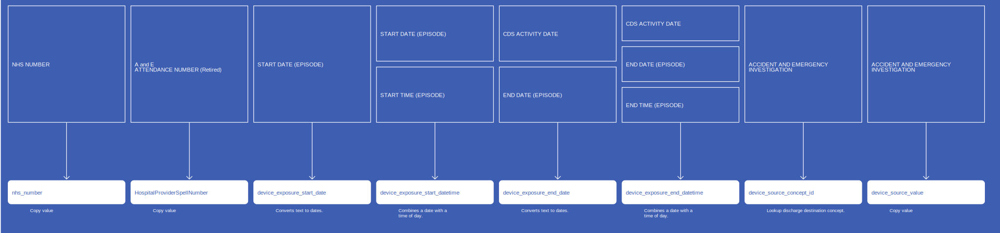

# DeviceExposure
* [nhs_number]()
* [device_concept_id]()
* [device_exposure_start_date]()
* [device_exposure_start_datetime]()
* [device_exposure_end_date]()
* [device_exposure_end_datetime]()
* [device_type_concept_id]()
* [device_source_concept_id]()
* [device_source_value]()
* [HospitalProviderSpellNumber]()

## SusAEDeviceExposure

[Comment or raise an issue for this mapping.](https://github.com/answerdigital/oxford-omop-data-mapper/issues/new?title=SusAEDeviceExposure%20mapping){: .btn }
