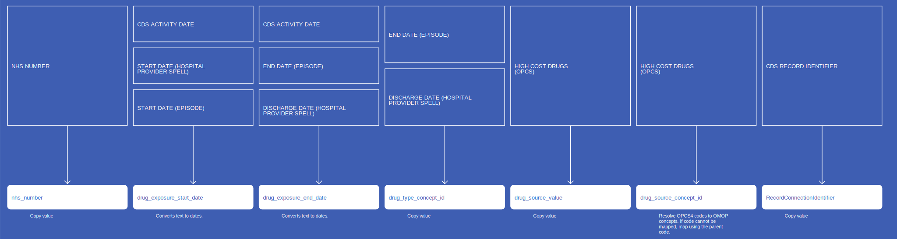

# DrugExposure
* [nhs_number]()
* [drug_concept_id]()
* [drug_exposure_start_date]()
* [drug_exposure_end_date]()
* [drug_type_concept_id]()
* [drug_source_value]()
* [drug_source_concept_id]()
* [RecordConnectionIdentifier]()

## CdsDrugExposure

[Comment or raise an issue for this mapping.](https://github.com/answerdigital/oxford-omop-data-mapper/issues/new?title=CdsDrugExposure%20mapping){: .btn }
