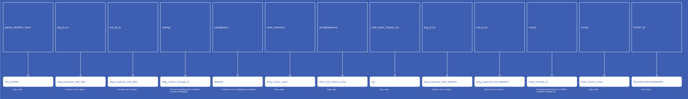
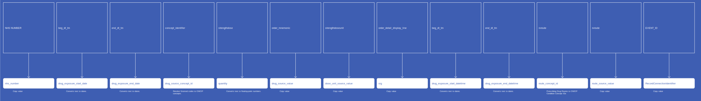

# DrugExposure
* [nhs_number]()
* [drug_concept_id]()
* [drug_exposure_start_date]()
* [drug_exposure_end_date]()
* [drug_type_concept_id]()
* [drug_source_concept_id]()
* [drug_source_value]()
* [dose_unit_source_value]()
* [drug_exposure_start_datetime]()
* [drug_exposure_end_datetime]()
* [quantity]()
* [sig]()
* [route_concept_id]()
* [route_source_value]()
* [RecordConnectionIdentifier]()

## SactDrugExposure

[Comment or raise an issue for this mapping.](https://github.com/answerdigital/oxford-omop-data-mapper/issues/new?title=SactDrugExposure%20mapping){: .btn }
## OxfordPrescribingDrugExposure

[Comment or raise an issue for this mapping.](https://github.com/answerdigital/oxford-omop-data-mapper/issues/new?title=OxfordPrescribingDrugExposure%20mapping){: .btn }
## OxfordPrescribingDrugExposureWithSnomed

[Comment or raise an issue for this mapping.](https://github.com/answerdigital/oxford-omop-data-mapper/issues/new?title=OxfordPrescribingDrugExposureWithSnomed%20mapping){: .btn }
## OxfordGPDrugExposure

[Comment or raise an issue for this mapping.](https://github.com/answerdigital/oxford-omop-data-mapper/issues/new?title=OxfordGPDrugExposure%20mapping){: .btn }
