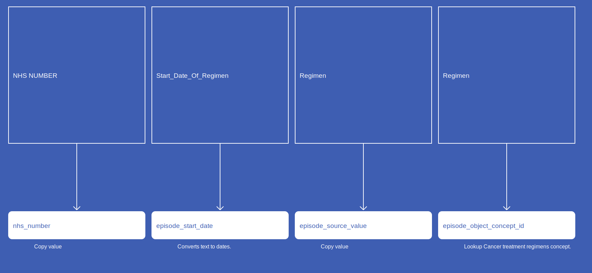

# Episode
* [nhs_number]()
* [episode_concept_id]()
* [episode_start_date]()
* [episode_source_value]()
* [episode_type_concept_id]()
* [episode_object_concept_id]()

## SactEpisode

[Comment or raise an issue for this mapping.](https://github.com/answerdigital/oxford-omop-data-mapper/issues/new?title=SactEpisode%20mapping){: .btn }
