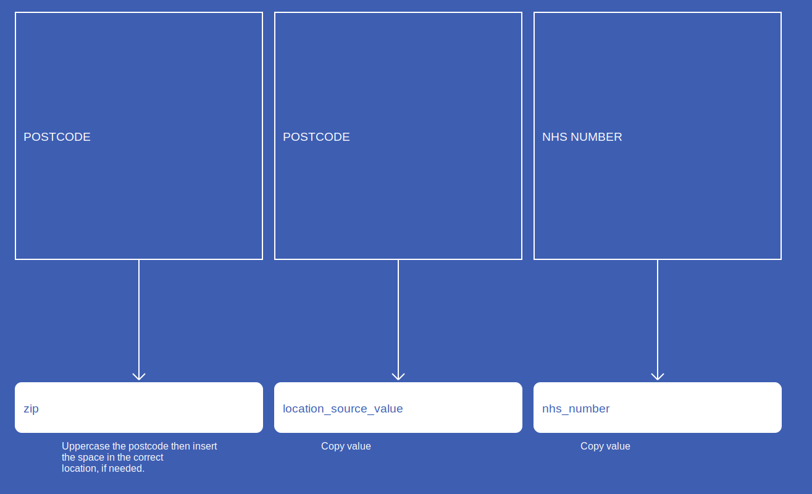
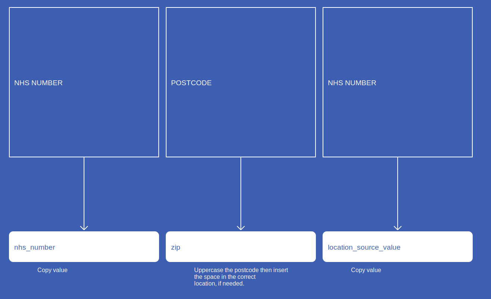
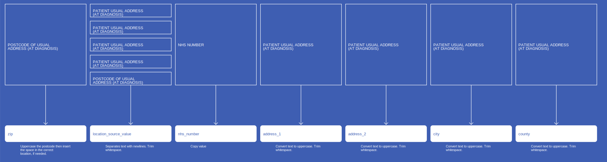
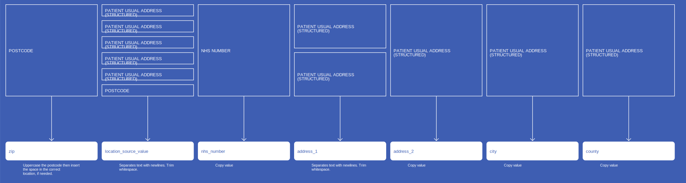
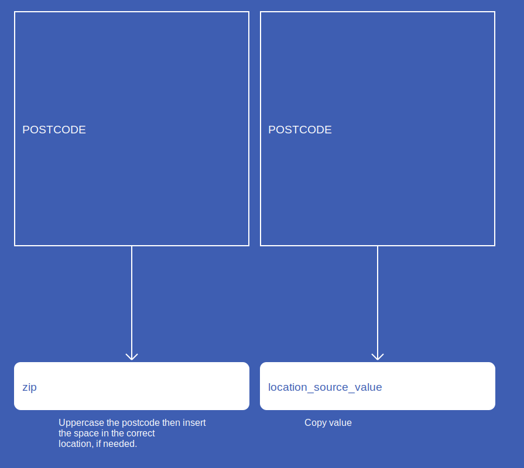

# Location
* [zip]()
* [location_source_value]()
* [nhs_number]()
* [address_1]()
* [address_2]()
* [city]()
* [county]()

## SactLocation

[Comment or raise an issue for this mapping.](https://github.com/answerdigital/oxford-omop-data-mapper/issues/new?title=SactLocation%20mapping){: .btn }
## RtdsLocation

[Comment or raise an issue for this mapping.](https://github.com/answerdigital/oxford-omop-data-mapper/issues/new?title=RtdsLocation%20mapping){: .btn }
## CosdLocation

[Comment or raise an issue for this mapping.](https://github.com/answerdigital/oxford-omop-data-mapper/issues/new?title=CosdLocation%20mapping){: .btn }
## CdsStructuredLocation

[Comment or raise an issue for this mapping.](https://github.com/answerdigital/oxford-omop-data-mapper/issues/new?title=CdsStructuredLocation%20mapping){: .btn }
## CdsUnstructuredLocation

[Comment or raise an issue for this mapping.](https://github.com/answerdigital/oxford-omop-data-mapper/issues/new?title=CdsUnstructuredLocation%20mapping){: .btn }
