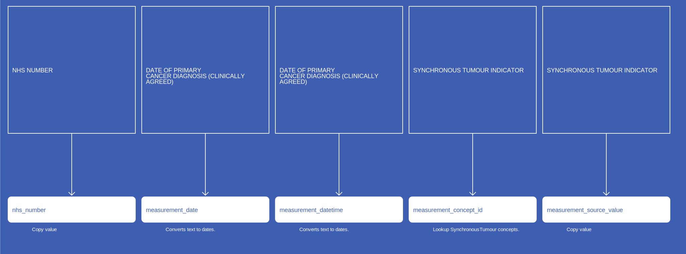

# Measurement
* [nhs_number]()
* [measurement_date]()
* [measurement_datetime]()
* [measurement_type_concept_id]()
* [measurement_source_concept_id]()
* [value_source_value]()
* [measurement_concept_id]()
* [measurement_source_value]()
* [operator_concept_id]()
* [value_as_number]()
* [unit_concept_id]()
* [range_low]()
* [range_high]()
* [unit_source_value]()
* [RecordConnectionIdentifier]()

## SusOPMeasurement

[Comment or raise an issue for this mapping.](https://github.com/answerdigital/oxford-omop-data-mapper/issues/new?title=SusOPMeasurement%20mapping){: .btn }
## SusCCMDSMeasurementGestationLength

[Comment or raise an issue for this mapping.](https://github.com/answerdigital/oxford-omop-data-mapper/issues/new?title=SusCCMDSMeasurementGestationLength%20mapping){: .btn }
## SusCCMDSMeasurementPersonWeight

[Comment or raise an issue for this mapping.](https://github.com/answerdigital/oxford-omop-data-mapper/issues/new?title=SusCCMDSMeasurementPersonWeight%20mapping){: .btn }
## SusAPCMeasurement

[Comment or raise an issue for this mapping.](https://github.com/answerdigital/oxford-omop-data-mapper/issues/new?title=SusAPCMeasurement%20mapping){: .btn }
## SactMeasurementWeightAtStartOfRegimen

[Comment or raise an issue for this mapping.](https://github.com/answerdigital/oxford-omop-data-mapper/issues/new?title=SactMeasurementWeightAtStartOfRegimen%20mapping){: .btn }
## SactMeasurementWeightAtStartOfCycle

[Comment or raise an issue for this mapping.](https://github.com/answerdigital/oxford-omop-data-mapper/issues/new?title=SactMeasurementWeightAtStartOfCycle%20mapping){: .btn }
## SactMeasurementHeight

[Comment or raise an issue for this mapping.](https://github.com/answerdigital/oxford-omop-data-mapper/issues/new?title=SactMeasurementHeight%20mapping){: .btn }
## OxfordLabMeasurement

[Comment or raise an issue for this mapping.](https://github.com/answerdigital/oxford-omop-data-mapper/issues/new?title=OxfordLabMeasurement%20mapping){: .btn }
## CosdV9LungMeasurementTumourLaterality

[Comment or raise an issue for this mapping.](https://github.com/answerdigital/oxford-omop-data-mapper/issues/new?title=CosdV9LungMeasurementTumourLaterality%20mapping){: .btn }
## CosdV9LungMeasurementTNMcategoryIntegratedStage

[Comment or raise an issue for this mapping.](https://github.com/answerdigital/oxford-omop-data-mapper/issues/new?title=CosdV9LungMeasurementTNMcategoryIntegratedStage%20mapping){: .btn }
## CosdV9LungMeasurementTNMcategoryFinalPreTreatmentStage

[Comment or raise an issue for this mapping.](https://github.com/answerdigital/oxford-omop-data-mapper/issues/new?title=CosdV9LungMeasurementTNMcategoryFinalPreTreatmentStage%20mapping){: .btn }
## CosdV9LungMeasurementTcategoryIntegratedStage

[Comment or raise an issue for this mapping.](https://github.com/answerdigital/oxford-omop-data-mapper/issues/new?title=CosdV9LungMeasurementTcategoryIntegratedStage%20mapping){: .btn }
## CosdV9LungMeasurementTcategoryFinalPreTreatmentStage

[Comment or raise an issue for this mapping.](https://github.com/answerdigital/oxford-omop-data-mapper/issues/new?title=CosdV9LungMeasurementTcategoryFinalPreTreatmentStage%20mapping){: .btn }
## CosdV9LungMeasurementPrimaryPathwayMetastasis

[Comment or raise an issue for this mapping.](https://github.com/answerdigital/oxford-omop-data-mapper/issues/new?title=CosdV9LungMeasurementPrimaryPathwayMetastasis%20mapping){: .btn }
## CosdV9LungMeasurementNonPrimaryPathwayRecurrenceMetastasis

[Comment or raise an issue for this mapping.](https://github.com/answerdigital/oxford-omop-data-mapper/issues/new?title=CosdV9LungMeasurementNonPrimaryPathwayRecurrenceMetastasis%20mapping){: .btn }
## CosdV9LungMeasurementNonPrimaryPathwayProgressionMetastasis

[Comment or raise an issue for this mapping.](https://github.com/answerdigital/oxford-omop-data-mapper/issues/new?title=CosdV9LungMeasurementNonPrimaryPathwayProgressionMetastasis%20mapping){: .btn }
## CosdV9LungMeasurementNcategoryIntegratedStage

[Comment or raise an issue for this mapping.](https://github.com/answerdigital/oxford-omop-data-mapper/issues/new?title=CosdV9LungMeasurementNcategoryIntegratedStage%20mapping){: .btn }
## CosdV9LungMeasurementNcategoryFinalPreTreatmentStage

[Comment or raise an issue for this mapping.](https://github.com/answerdigital/oxford-omop-data-mapper/issues/new?title=CosdV9LungMeasurementNcategoryFinalPreTreatmentStage%20mapping){: .btn }
## CosdV9LungMeasurementMcategoryIntegratedStage

[Comment or raise an issue for this mapping.](https://github.com/answerdigital/oxford-omop-data-mapper/issues/new?title=CosdV9LungMeasurementMcategoryIntegratedStage%20mapping){: .btn }
## CosdV9LungMeasurementMcategoryFinalPreTreatmentStage

[Comment or raise an issue for this mapping.](https://github.com/answerdigital/oxford-omop-data-mapper/issues/new?title=CosdV9LungMeasurementMcategoryFinalPreTreatmentStage%20mapping){: .btn }
## CosdV9LungMeasurementGradeOfDifferentiation

[Comment or raise an issue for this mapping.](https://github.com/answerdigital/oxford-omop-data-mapper/issues/new?title=CosdV9LungMeasurementGradeOfDifferentiation%20mapping){: .btn }
## CosdV8LungMeasurementTumourLaterality

[Comment or raise an issue for this mapping.](https://github.com/answerdigital/oxford-omop-data-mapper/issues/new?title=CosdV8LungMeasurementTumourLaterality%20mapping){: .btn }
## CosdV8LungMeasurementTNMcategoryIntegratedStage

[Comment or raise an issue for this mapping.](https://github.com/answerdigital/oxford-omop-data-mapper/issues/new?title=CosdV8LungMeasurementTNMcategoryIntegratedStage%20mapping){: .btn }
## CosdV8LungMeasurementTNMcategoryFinalPreTreatmentStage

[Comment or raise an issue for this mapping.](https://github.com/answerdigital/oxford-omop-data-mapper/issues/new?title=CosdV8LungMeasurementTNMcategoryFinalPreTreatmentStage%20mapping){: .btn }
## CosdV8LungMeasurementTcategoryIntegratedStage

[Comment or raise an issue for this mapping.](https://github.com/answerdigital/oxford-omop-data-mapper/issues/new?title=CosdV8LungMeasurementTcategoryIntegratedStage%20mapping){: .btn }
## CosdV8LungMeasurementTcategoryFinalPreTreatmentStage

[Comment or raise an issue for this mapping.](https://github.com/answerdigital/oxford-omop-data-mapper/issues/new?title=CosdV8LungMeasurementTcategoryFinalPreTreatmentStage%20mapping){: .btn }
## CosdV8LungMeasurementPrimaryPathwayMetastasis

[Comment or raise an issue for this mapping.](https://github.com/answerdigital/oxford-omop-data-mapper/issues/new?title=CosdV8LungMeasurementPrimaryPathwayMetastasis%20mapping){: .btn }
## CosdV8LungMeasurementNonPrimaryPathwayMetastasis

[Comment or raise an issue for this mapping.](https://github.com/answerdigital/oxford-omop-data-mapper/issues/new?title=CosdV8LungMeasurementNonPrimaryPathwayMetastasis%20mapping){: .btn }
## CosdV8LungMeasurementNcategoryIntegratedStage

[Comment or raise an issue for this mapping.](https://github.com/answerdigital/oxford-omop-data-mapper/issues/new?title=CosdV8LungMeasurementNcategoryIntegratedStage%20mapping){: .btn }
## CosdV8LungMeasurementNcategoryFinalPreTreatmentStage

[Comment or raise an issue for this mapping.](https://github.com/answerdigital/oxford-omop-data-mapper/issues/new?title=CosdV8LungMeasurementNcategoryFinalPreTreatmentStage%20mapping){: .btn }
## CosdV8LungMeasurementMcategoryIntegratedStage

[Comment or raise an issue for this mapping.](https://github.com/answerdigital/oxford-omop-data-mapper/issues/new?title=CosdV8LungMeasurementMcategoryIntegratedStage%20mapping){: .btn }
## CosdV8LungMeasurementMcategoryFinalPreTreatmentStage

[Comment or raise an issue for this mapping.](https://github.com/answerdigital/oxford-omop-data-mapper/issues/new?title=CosdV8LungMeasurementMcategoryFinalPreTreatmentStage%20mapping){: .btn }
## CosdV8LungMeasurementGradeOfDifferentiation

[Comment or raise an issue for this mapping.](https://github.com/answerdigital/oxford-omop-data-mapper/issues/new?title=CosdV8LungMeasurementGradeOfDifferentiation%20mapping){: .btn }
## CosdV9MeasurementTumourLaterality

[Comment or raise an issue for this mapping.](https://github.com/answerdigital/oxford-omop-data-mapper/issues/new?title=CosdV9MeasurementTumourLaterality%20mapping){: .btn }
## CosdV9MeasurementTNMcategoryIntegratedStage

[Comment or raise an issue for this mapping.](https://github.com/answerdigital/oxford-omop-data-mapper/issues/new?title=CosdV9MeasurementTNMcategoryIntegratedStage%20mapping){: .btn }
## CosdV9MeasurementTNMcategoryFinalPreTreatmentStage

[Comment or raise an issue for this mapping.](https://github.com/answerdigital/oxford-omop-data-mapper/issues/new?title=CosdV9MeasurementTNMcategoryFinalPreTreatmentStage%20mapping){: .btn }
## CosdV9MeasurementTcategoryIntegratedStage

[Comment or raise an issue for this mapping.](https://github.com/answerdigital/oxford-omop-data-mapper/issues/new?title=CosdV9MeasurementTcategoryIntegratedStage%20mapping){: .btn }
## CosdV9MeasurementTcategoryFinalPreTreatmentStage

[Comment or raise an issue for this mapping.](https://github.com/answerdigital/oxford-omop-data-mapper/issues/new?title=CosdV9MeasurementTcategoryFinalPreTreatmentStage%20mapping){: .btn }
## CosdV9MeasurementSynchronousTumourIndicator

[Comment or raise an issue for this mapping.](https://github.com/answerdigital/oxford-omop-data-mapper/issues/new?title=CosdV9MeasurementSynchronousTumourIndicator%20mapping){: .btn }
## CosdV9MeasurementPrimaryPathwayMetastasis

[Comment or raise an issue for this mapping.](https://github.com/answerdigital/oxford-omop-data-mapper/issues/new?title=CosdV9MeasurementPrimaryPathwayMetastasis%20mapping){: .btn }
## CosdV9MeasurementNonPrimaryPathwayRecurrenceMetastasis

[Comment or raise an issue for this mapping.](https://github.com/answerdigital/oxford-omop-data-mapper/issues/new?title=CosdV9MeasurementNonPrimaryPathwayRecurrenceMetastasis%20mapping){: .btn }
## CosdV9MeasurementNonPrimaryPathwayProgressionMetastasis

[Comment or raise an issue for this mapping.](https://github.com/answerdigital/oxford-omop-data-mapper/issues/new?title=CosdV9MeasurementNonPrimaryPathwayProgressionMetastasis%20mapping){: .btn }
## CosdV9MeasurementNcategoryIntegratedStage

[Comment or raise an issue for this mapping.](https://github.com/answerdigital/oxford-omop-data-mapper/issues/new?title=CosdV9MeasurementNcategoryIntegratedStage%20mapping){: .btn }
## CosdV9MeasurementNcategoryFinalPreTreatmentStage

[Comment or raise an issue for this mapping.](https://github.com/answerdigital/oxford-omop-data-mapper/issues/new?title=CosdV9MeasurementNcategoryFinalPreTreatmentStage%20mapping){: .btn }
## CosdV9MeasurementMcategoryIntegratedStage

[Comment or raise an issue for this mapping.](https://github.com/answerdigital/oxford-omop-data-mapper/issues/new?title=CosdV9MeasurementMcategoryIntegratedStage%20mapping){: .btn }
## CosdV9MeasurementMcategoryFinalPreTreatmentStage

[Comment or raise an issue for this mapping.](https://github.com/answerdigital/oxford-omop-data-mapper/issues/new?title=CosdV9MeasurementMcategoryFinalPreTreatmentStage%20mapping){: .btn }
## CosdV9MeasurementGradeOfDifferentiation

[Comment or raise an issue for this mapping.](https://github.com/answerdigital/oxford-omop-data-mapper/issues/new?title=CosdV9MeasurementGradeOfDifferentiation%20mapping){: .btn }
## CosdV8MeasurementTumourLaterality

[Comment or raise an issue for this mapping.](https://github.com/answerdigital/oxford-omop-data-mapper/issues/new?title=CosdV8MeasurementTumourLaterality%20mapping){: .btn }
## CosdV8MeasurementTumourHeightAboveAnalVerge

[Comment or raise an issue for this mapping.](https://github.com/answerdigital/oxford-omop-data-mapper/issues/new?title=CosdV8MeasurementTumourHeightAboveAnalVerge%20mapping){: .btn }
## CosdV8MeasurementTNMcategoryIntegratedStage

[Comment or raise an issue for this mapping.](https://github.com/answerdigital/oxford-omop-data-mapper/issues/new?title=CosdV8MeasurementTNMcategoryIntegratedStage%20mapping){: .btn }
## CosdV8MeasurementTNMcategoryFinalPreTreatmentStage

[Comment or raise an issue for this mapping.](https://github.com/answerdigital/oxford-omop-data-mapper/issues/new?title=CosdV8MeasurementTNMcategoryFinalPreTreatmentStage%20mapping){: .btn }
## CosdV8MeasurementTcategoryIntegratedStage

[Comment or raise an issue for this mapping.](https://github.com/answerdigital/oxford-omop-data-mapper/issues/new?title=CosdV8MeasurementTcategoryIntegratedStage%20mapping){: .btn }
## CosdV8MeasurementTcategoryFinalPreTreatmentStage

[Comment or raise an issue for this mapping.](https://github.com/answerdigital/oxford-omop-data-mapper/issues/new?title=CosdV8MeasurementTcategoryFinalPreTreatmentStage%20mapping){: .btn }
## CosdV8MeasurementSynchronousTumourIndicator

[Comment or raise an issue for this mapping.](https://github.com/answerdigital/oxford-omop-data-mapper/issues/new?title=CosdV8MeasurementSynchronousTumourIndicator%20mapping){: .btn }
## CosdV8MeasurementPrimaryPathwayMetastasis

[Comment or raise an issue for this mapping.](https://github.com/answerdigital/oxford-omop-data-mapper/issues/new?title=CosdV8MeasurementPrimaryPathwayMetastasis%20mapping){: .btn }
## CosdV8MeasurementNonPrimaryPathwayMetastasis

[Comment or raise an issue for this mapping.](https://github.com/answerdigital/oxford-omop-data-mapper/issues/new?title=CosdV8MeasurementNonPrimaryPathwayMetastasis%20mapping){: .btn }
## CosdV8MeasurementNcategoryIntegratedStage

[Comment or raise an issue for this mapping.](https://github.com/answerdigital/oxford-omop-data-mapper/issues/new?title=CosdV8MeasurementNcategoryIntegratedStage%20mapping){: .btn }
## CosdV8MeasurementNcategoryFinalPreTreatmentStage

[Comment or raise an issue for this mapping.](https://github.com/answerdigital/oxford-omop-data-mapper/issues/new?title=CosdV8MeasurementNcategoryFinalPreTreatmentStage%20mapping){: .btn }
## CosdV8MeasurementMcategoryIntegratedStage

[Comment or raise an issue for this mapping.](https://github.com/answerdigital/oxford-omop-data-mapper/issues/new?title=CosdV8MeasurementMcategoryIntegratedStage%20mapping){: .btn }
## CosdV8MeasurementMcategoryFinalPreTreatmentStage

[Comment or raise an issue for this mapping.](https://github.com/answerdigital/oxford-omop-data-mapper/issues/new?title=CosdV8MeasurementMcategoryFinalPreTreatmentStage%20mapping){: .btn }
## CosdV8MeasurementGradeOfDifferentiation

[Comment or raise an issue for this mapping.](https://github.com/answerdigital/oxford-omop-data-mapper/issues/new?title=CosdV8MeasurementGradeOfDifferentiation%20mapping){: .btn }
## CosdV9BreastMeasurementTumourLaterality

[Comment or raise an issue for this mapping.](https://github.com/answerdigital/oxford-omop-data-mapper/issues/new?title=CosdV9BreastMeasurementTumourLaterality%20mapping){: .btn }
## CosdV9BreastMeasurementTNMcategoryIntegratedStage

[Comment or raise an issue for this mapping.](https://github.com/answerdigital/oxford-omop-data-mapper/issues/new?title=CosdV9BreastMeasurementTNMcategoryIntegratedStage%20mapping){: .btn }
## CosdV9BreastMeasurementTNMcategoryFinalPreTreatmentStage

[Comment or raise an issue for this mapping.](https://github.com/answerdigital/oxford-omop-data-mapper/issues/new?title=CosdV9BreastMeasurementTNMcategoryFinalPreTreatmentStage%20mapping){: .btn }
## CosdV9BreastMeasurementTcategoryIntegratedStage

[Comment or raise an issue for this mapping.](https://github.com/answerdigital/oxford-omop-data-mapper/issues/new?title=CosdV9BreastMeasurementTcategoryIntegratedStage%20mapping){: .btn }
## CosdV9BreastMeasurementTcategoryFinalPreTreatmentStage

[Comment or raise an issue for this mapping.](https://github.com/answerdigital/oxford-omop-data-mapper/issues/new?title=CosdV9BreastMeasurementTcategoryFinalPreTreatmentStage%20mapping){: .btn }
## CosdV9BreastMeasurementPrimaryPathwayMetastasis

[Comment or raise an issue for this mapping.](https://github.com/answerdigital/oxford-omop-data-mapper/issues/new?title=CosdV9BreastMeasurementPrimaryPathwayMetastasis%20mapping){: .btn }
## CosdV9BreastMeasurementNonPrimaryPathwayRecurrenceMetastasis

[Comment or raise an issue for this mapping.](https://github.com/answerdigital/oxford-omop-data-mapper/issues/new?title=CosdV9BreastMeasurementNonPrimaryPathwayRecurrenceMetastasis%20mapping){: .btn }
## CosdV9BreastMeasurementNonPrimaryPathwayProgressionMetastasis

[Comment or raise an issue for this mapping.](https://github.com/answerdigital/oxford-omop-data-mapper/issues/new?title=CosdV9BreastMeasurementNonPrimaryPathwayProgressionMetastasis%20mapping){: .btn }
## CosdV9BreastMeasurementNcategoryIntegratedStage

[Comment or raise an issue for this mapping.](https://github.com/answerdigital/oxford-omop-data-mapper/issues/new?title=CosdV9BreastMeasurementNcategoryIntegratedStage%20mapping){: .btn }
## CosdV9BreastMeasurementNcategoryFinalPreTreatmentStage

[Comment or raise an issue for this mapping.](https://github.com/answerdigital/oxford-omop-data-mapper/issues/new?title=CosdV9BreastMeasurementNcategoryFinalPreTreatmentStage%20mapping){: .btn }
## CosdV9BreastMeasurementMcategoryIntegratedStage

[Comment or raise an issue for this mapping.](https://github.com/answerdigital/oxford-omop-data-mapper/issues/new?title=CosdV9BreastMeasurementMcategoryIntegratedStage%20mapping){: .btn }
## CosdV9BreastMeasurementMcategoryFinalPreTreatmentStage

[Comment or raise an issue for this mapping.](https://github.com/answerdigital/oxford-omop-data-mapper/issues/new?title=CosdV9BreastMeasurementMcategoryFinalPreTreatmentStage%20mapping){: .btn }
## CosdV9BreastMeasurementGradeOfDifferentiation

[Comment or raise an issue for this mapping.](https://github.com/answerdigital/oxford-omop-data-mapper/issues/new?title=CosdV9BreastMeasurementGradeOfDifferentiation%20mapping){: .btn }
## CosdV8BreastMeasurementTumourLaterality

[Comment or raise an issue for this mapping.](https://github.com/answerdigital/oxford-omop-data-mapper/issues/new?title=CosdV8BreastMeasurementTumourLaterality%20mapping){: .btn }
## CosdV8BreastMeasurementTNMcategoryFinalPreTreatmentStage

[Comment or raise an issue for this mapping.](https://github.com/answerdigital/oxford-omop-data-mapper/issues/new?title=CosdV8BreastMeasurementTNMcategoryFinalPreTreatmentStage%20mapping){: .btn }
## CosdV8BreastMeasurementTcategoryIntegratedStage

[Comment or raise an issue for this mapping.](https://github.com/answerdigital/oxford-omop-data-mapper/issues/new?title=CosdV8BreastMeasurementTcategoryIntegratedStage%20mapping){: .btn }
## CosdV8BreastMeasurementTcategoryFinalPreTreatmentStage

[Comment or raise an issue for this mapping.](https://github.com/answerdigital/oxford-omop-data-mapper/issues/new?title=CosdV8BreastMeasurementTcategoryFinalPreTreatmentStage%20mapping){: .btn }
## CosdV8BreastMeasurementPrimaryPathwayMetastasis

[Comment or raise an issue for this mapping.](https://github.com/answerdigital/oxford-omop-data-mapper/issues/new?title=CosdV8BreastMeasurementPrimaryPathwayMetastasis%20mapping){: .btn }
## CosdV8BreastMeasurementNonPrimaryPathwayMetastasis

[Comment or raise an issue for this mapping.](https://github.com/answerdigital/oxford-omop-data-mapper/issues/new?title=CosdV8BreastMeasurementNonPrimaryPathwayMetastasis%20mapping){: .btn }
## CosdV8BreastMeasurementNcategoryIntegratedStage

[Comment or raise an issue for this mapping.](https://github.com/answerdigital/oxford-omop-data-mapper/issues/new?title=CosdV8BreastMeasurementNcategoryIntegratedStage%20mapping){: .btn }
## CosdV8BreastMeasurementNcategoryFinalPreTreatmentStage

[Comment or raise an issue for this mapping.](https://github.com/answerdigital/oxford-omop-data-mapper/issues/new?title=CosdV8BreastMeasurementNcategoryFinalPreTreatmentStage%20mapping){: .btn }
## CosdV8BreastMeasurementMcategoryIntegratedStage

[Comment or raise an issue for this mapping.](https://github.com/answerdigital/oxford-omop-data-mapper/issues/new?title=CosdV8BreastMeasurementMcategoryIntegratedStage%20mapping){: .btn }
## CosdV8BreastMeasurementMcategoryFinalPreTreatmentStage

[Comment or raise an issue for this mapping.](https://github.com/answerdigital/oxford-omop-data-mapper/issues/new?title=CosdV8BreastMeasurementMcategoryFinalPreTreatmentStage%20mapping){: .btn }
## CosdV8BreastMeasurementGradeOfDifferentiation

[Comment or raise an issue for this mapping.](https://github.com/answerdigital/oxford-omop-data-mapper/issues/new?title=CosdV8BreastMeasurementGradeOfDifferentiation%20mapping){: .btn }
