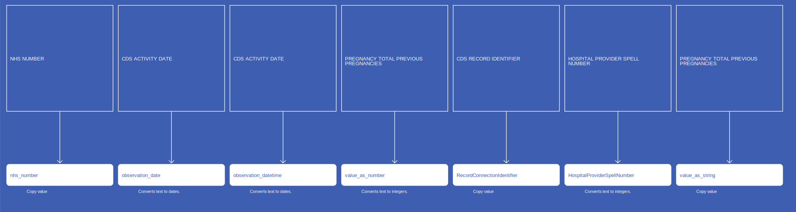
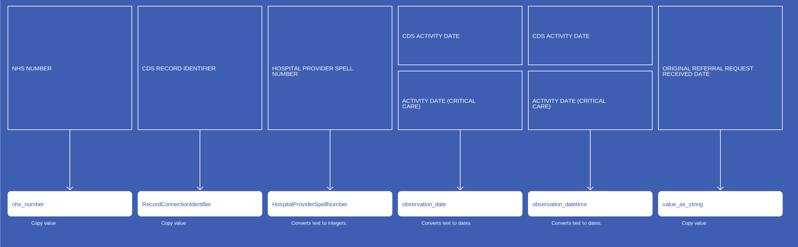
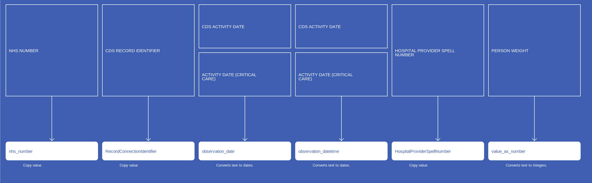
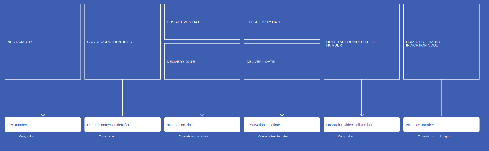
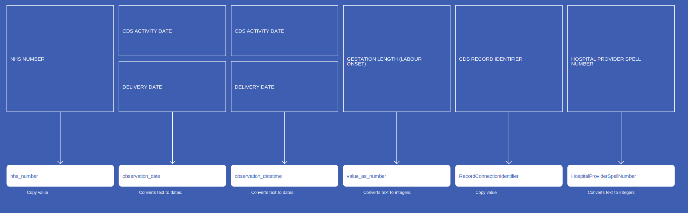
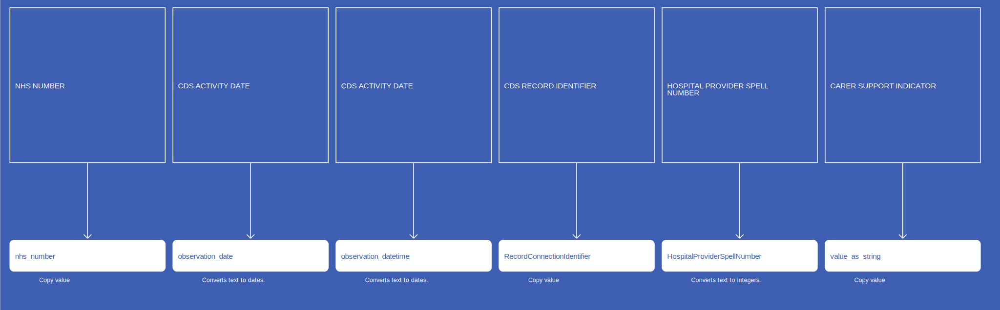
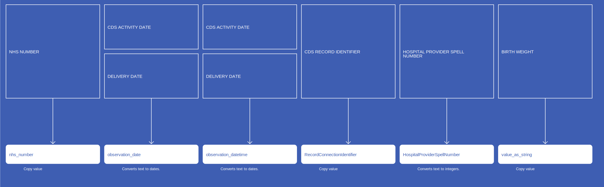
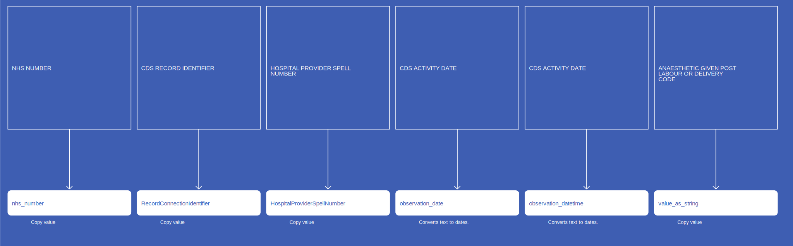
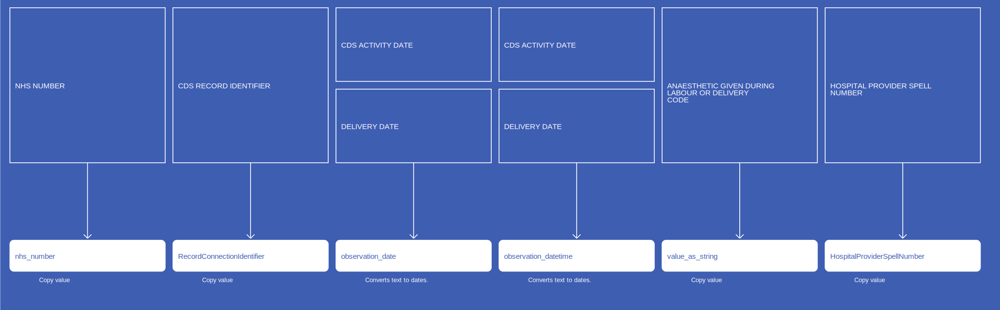

# Observation
* [nhs_number]()
* [observation_concept_id]()
* [observation_date]()
* [observation_datetime]()
* [observation_type_concept_id]()
* [value_as_number]()
* [RecordConnectionIdentifier]()
* [HospitalProviderSpellNumber]()
* [value_as_string]()
* [unit_concept_id]()
* [observation_source_concept_id]()

## CosdV9TobaccoSmokingStatus

[Comment or raise an issue for this mapping.](https://github.com/answerdigital/oxford-omop-data-mapper/issues/new?title=CosdV9TobaccoSmokingStatus%20mapping){: .btn }
## CosdV9TobaccoSmokingCessation

[Comment or raise an issue for this mapping.](https://github.com/answerdigital/oxford-omop-data-mapper/issues/new?title=CosdV9TobaccoSmokingCessation%20mapping){: .btn }
## CosdV9SourceOfReferralForOutpatients

[Comment or raise an issue for this mapping.](https://github.com/answerdigital/oxford-omop-data-mapper/issues/new?title=CosdV9SourceOfReferralForOutpatients%20mapping){: .btn }
## CosdV9SourceOfReferralForNonPrimaryCancerPathway

[Comment or raise an issue for this mapping.](https://github.com/answerdigital/oxford-omop-data-mapper/issues/new?title=CosdV9SourceOfReferralForNonPrimaryCancerPathway%20mapping){: .btn }
## CosdV9PersonSexualOrientationCodeAtDiagnosis

[Comment or raise an issue for this mapping.](https://github.com/answerdigital/oxford-omop-data-mapper/issues/new?title=CosdV9PersonSexualOrientationCodeAtDiagnosis%20mapping){: .btn }
## CosdV9PerformanceStatusAdult

[Comment or raise an issue for this mapping.](https://github.com/answerdigital/oxford-omop-data-mapper/issues/new?title=CosdV9PerformanceStatusAdult%20mapping){: .btn }
## CosdV9MenopausalStatus

[Comment or raise an issue for this mapping.](https://github.com/answerdigital/oxford-omop-data-mapper/issues/new?title=CosdV9MenopausalStatus%20mapping){: .btn }
## CosdV9HistoryOfAlcoholPast

[Comment or raise an issue for this mapping.](https://github.com/answerdigital/oxford-omop-data-mapper/issues/new?title=CosdV9HistoryOfAlcoholPast%20mapping){: .btn }
## CosdV9HistoryOfAlcoholCurrent

[Comment or raise an issue for this mapping.](https://github.com/answerdigital/oxford-omop-data-mapper/issues/new?title=CosdV9HistoryOfAlcoholCurrent%20mapping){: .btn }
## CosdV9FamilialCancerSyndrome

[Comment or raise an issue for this mapping.](https://github.com/answerdigital/oxford-omop-data-mapper/issues/new?title=CosdV9FamilialCancerSyndrome%20mapping){: .btn }
## CosdV9FamilialCancerSyndromeSubsidiaryComment

[Comment or raise an issue for this mapping.](https://github.com/answerdigital/oxford-omop-data-mapper/issues/new?title=CosdV9FamilialCancerSyndromeSubsidiaryComment%20mapping){: .btn }
## CosdV9AsaScore

[Comment or raise an issue for this mapping.](https://github.com/answerdigital/oxford-omop-data-mapper/issues/new?title=CosdV9AsaScore%20mapping){: .btn }
## CosdV9AdultComorbidityEvaluation

[Comment or raise an issue for this mapping.](https://github.com/answerdigital/oxford-omop-data-mapper/issues/new?title=CosdV9AdultComorbidityEvaluation%20mapping){: .btn }
## CosdV8SourceOfReferralOutPatients

[Comment or raise an issue for this mapping.](https://github.com/answerdigital/oxford-omop-data-mapper/issues/new?title=CosdV8SourceOfReferralOutPatients%20mapping){: .btn }
## CosdV8SourceOfReferralForOutPatientsNonPrimaryCancerPathway

[Comment or raise an issue for this mapping.](https://github.com/answerdigital/oxford-omop-data-mapper/issues/new?title=CosdV8SourceOfReferralForOutPatientsNonPrimaryCancerPathway%20mapping){: .btn }
## CosdV8SmokingStatusCode

[Comment or raise an issue for this mapping.](https://github.com/answerdigital/oxford-omop-data-mapper/issues/new?title=CosdV8SmokingStatusCode%20mapping){: .btn }
## CosdV8PersonStatedSexualOrientationCodeAtDiagnosis

[Comment or raise an issue for this mapping.](https://github.com/answerdigital/oxford-omop-data-mapper/issues/new?title=CosdV8PersonStatedSexualOrientationCodeAtDiagnosis%20mapping){: .btn }
## CosdV8FamilialCancerSyndromeIndicator

[Comment or raise an issue for this mapping.](https://github.com/answerdigital/oxford-omop-data-mapper/issues/new?title=CosdV8FamilialCancerSyndromeIndicator%20mapping){: .btn }
## CosdV8AlcoholHistoryCancerInLastThreeMonths

[Comment or raise an issue for this mapping.](https://github.com/answerdigital/oxford-omop-data-mapper/issues/new?title=CosdV8AlcoholHistoryCancerInLastThreeMonths%20mapping){: .btn }
## CosdV8AlcoholHistoryCancerBeforeLastThreeMonths

[Comment or raise an issue for this mapping.](https://github.com/answerdigital/oxford-omop-data-mapper/issues/new?title=CosdV8AlcoholHistoryCancerBeforeLastThreeMonths%20mapping){: .btn }
## CosdV8AdultPerformanceStatus

[Comment or raise an issue for this mapping.](https://github.com/answerdigital/oxford-omop-data-mapper/issues/new?title=CosdV8AdultPerformanceStatus%20mapping){: .btn }
## CosdV8AdultComorbidityEvaluation

[Comment or raise an issue for this mapping.](https://github.com/answerdigital/oxford-omop-data-mapper/issues/new?title=CosdV8AdultComorbidityEvaluation%20mapping){: .btn }
## CdsTotalPreviousPregnancies

{: .important-title }
> Notes
>
> Observations do not require a standardized test or other activity to generate clinical fact. Typical observations are medical history, family history, lifestyle choices, healthcare utilization patterns, social circumstances etc
>
> Valid Observation Concepts are not enforced to be from any domain.  They should still be standard concepts and typically belong to the Observation or Measurement domain.
>
> Observations can be stored as attribute value pairs, with the attribute as the Observation Concept and the value representing the clinical fact. This fact can be stored as a Concept (value_as_concept), a numerical value (value_as_number) or a verbatim string (value_as_string)
>

[Comment or raise an issue for this mapping.](https://github.com/answerdigital/oxford-omop-data-mapper/issues/new?title=CdsTotalPreviousPregnancies%20mapping){: .btn }
## CdsSourceOfReferralForOutpatients

{: .important-title }
> Notes
>
> Observations do not require a standardized test or other activity to generate clinical fact. Typical observations are medical history, family history, lifestyle choices, healthcare utilization patterns, social circumstances etc
>
> Valid Observation Concepts are not enforced to be from any domain.  They should still be standard concepts and typically belong to the Observation or Measurement domain.
>
> Observations can be stored as attribute value pairs, with the attribute as the Observation Concept and the value representing the clinical fact. This fact can be stored as a Concept (value_as_concept), a numerical value (value_as_number) or a verbatim string (value_as_string)
>

[Comment or raise an issue for this mapping.](https://github.com/answerdigital/oxford-omop-data-mapper/issues/new?title=CdsSourceOfReferralForOutpatients%20mapping){: .btn }
## CdsPersonWeight

{: .important-title }
> Notes
>
> Observations do not require a standardized test or other activity to generate clinical fact. Typical observations are medical history, family history, lifestyle choices, healthcare utilization patterns, social circumstances etc
>
> Valid Observation Concepts are not enforced to be from any domain.  They should still be standard concepts and typically belong to the Observation or Measurement domain.
>
> Observations can be stored as attribute value pairs, with the attribute as the Observation Concept and the value representing the clinical fact. This fact can be stored as a Concept (value_as_concept), a numerical value (value_as_number) or a verbatim string (value_as_string)
>

[Comment or raise an issue for this mapping.](https://github.com/answerdigital/oxford-omop-data-mapper/issues/new?title=CdsPersonWeight%20mapping){: .btn }
## CdsNumberOfBabies

{: .important-title }
> Notes
>
> Observations do not require a standardized test or other activity to generate clinical fact. Typical observations are medical history, family history, lifestyle choices, healthcare utilization patterns, social circumstances etc
>
> Valid Observation Concepts are not enforced to be from any domain.  They should still be standard concepts and typically belong to the Observation or Measurement domain.
>
> Observations can be stored as attribute value pairs, with the attribute as the Observation Concept and the value representing the clinical fact. This fact can be stored as a Concept (value_as_concept), a numerical value (value_as_number) or a verbatim string (value_as_string)
>

[Comment or raise an issue for this mapping.](https://github.com/answerdigital/oxford-omop-data-mapper/issues/new?title=CdsNumberOfBabies%20mapping){: .btn }
## CdsGestationLengthLabourOnset

{: .important-title }
> Notes
>
> Observations do not require a standardized test or other activity to generate clinical fact. Typical observations are medical history, family history, lifestyle choices, healthcare utilization patterns, social circumstances etc
>
> Valid Observation Concepts are not enforced to be from any domain.  They should still be standard concepts and typically belong to the Observation or Measurement domain.
>
> Observations can be stored as attribute value pairs, with the attribute as the Observation Concept and the value representing the clinical fact. This fact can be stored as a Concept (value_as_concept), a numerical value (value_as_number) or a verbatim string (value_as_string)
>

[Comment or raise an issue for this mapping.](https://github.com/answerdigital/oxford-omop-data-mapper/issues/new?title=CdsGestationLengthLabourOnset%20mapping){: .btn }
## CdsCarerSupportIndicator

{: .important-title }
> Notes
>
> Observations do not require a standardized test or other activity to generate clinical fact. Typical observations are medical history, family history, lifestyle choices, healthcare utilization patterns, social circumstances etc
>
> Valid Observation Concepts are not enforced to be from any domain.  They should still be standard concepts and typically belong to the Observation or Measurement domain.
>
> Observations can be stored as attribute value pairs, with the attribute as the Observation Concept and the value representing the clinical fact. This fact can be stored as a Concept (value_as_concept), a numerical value (value_as_number) or a verbatim string (value_as_string)
>

[Comment or raise an issue for this mapping.](https://github.com/answerdigital/oxford-omop-data-mapper/issues/new?title=CdsCarerSupportIndicator%20mapping){: .btn }
## CdsBirthWeight

{: .important-title }
> Notes
>
> Observations do not require a standardized test or other activity to generate clinical fact. Typical observations are medical history, family history, lifestyle choices, healthcare utilization patterns, social circumstances etc
>
> Valid Observation Concepts are not enforced to be from any domain.  They should still be standard concepts and typically belong to the Observation or Measurement domain.
>
> Observations can be stored as attribute value pairs, with the attribute as the Observation Concept and the value representing the clinical fact. This fact can be stored as a Concept (value_as_concept), a numerical value (value_as_number) or a verbatim string (value_as_string)
>

[Comment or raise an issue for this mapping.](https://github.com/answerdigital/oxford-omop-data-mapper/issues/new?title=CdsBirthWeight%20mapping){: .btn }
## CdsAnaestheticGivenPostLabourDelivery

{: .important-title }
> Notes
>
> Observations do not require a standardized test or other activity to generate clinical fact. Typical observations are medical history, family history, lifestyle choices, healthcare utilization patterns, social circumstances etc
>
> Valid Observation Concepts are not enforced to be from any domain.  They should still be standard concepts and typically belong to the Observation or Measurement domain.
>
> Observations can be stored as attribute value pairs, with the attribute as the Observation Concept and the value representing the clinical fact. This fact can be stored as a Concept (value_as_concept), a numerical value (value_as_number) or a verbatim string (value_as_string)
>

[Comment or raise an issue for this mapping.](https://github.com/answerdigital/oxford-omop-data-mapper/issues/new?title=CdsAnaestheticGivenPostLabourDelivery%20mapping){: .btn }
## CdsAnaestheticDuringLabourDelivery

{: .important-title }
> Notes
>
> Observations do not require a standardized test or other activity to generate clinical fact. Typical observations are medical history, family history, lifestyle choices, healthcare utilization patterns, social circumstances etc
>
> Valid Observation Concepts are not enforced to be from any domain.  They should still be standard concepts and typically belong to the Observation or Measurement domain.
>
> Observations can be stored as attribute value pairs, with the attribute as the Observation Concept and the value representing the clinical fact. This fact can be stored as a Concept (value_as_concept), a numerical value (value_as_number) or a verbatim string (value_as_string)
>

[Comment or raise an issue for this mapping.](https://github.com/answerdigital/oxford-omop-data-mapper/issues/new?title=CdsAnaestheticDuringLabourDelivery%20mapping){: .btn }
