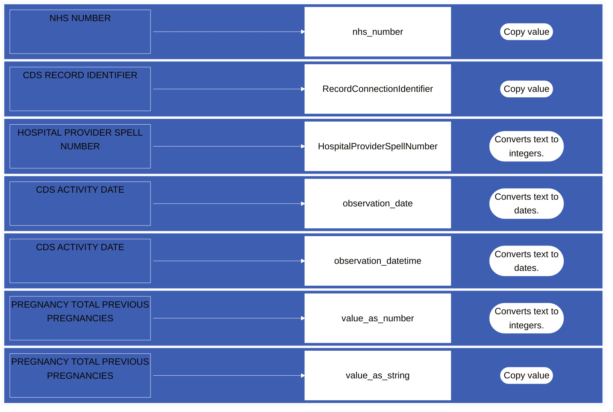
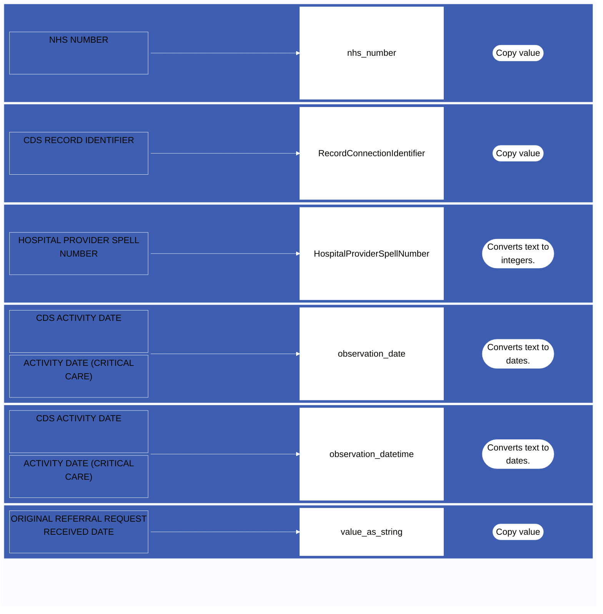
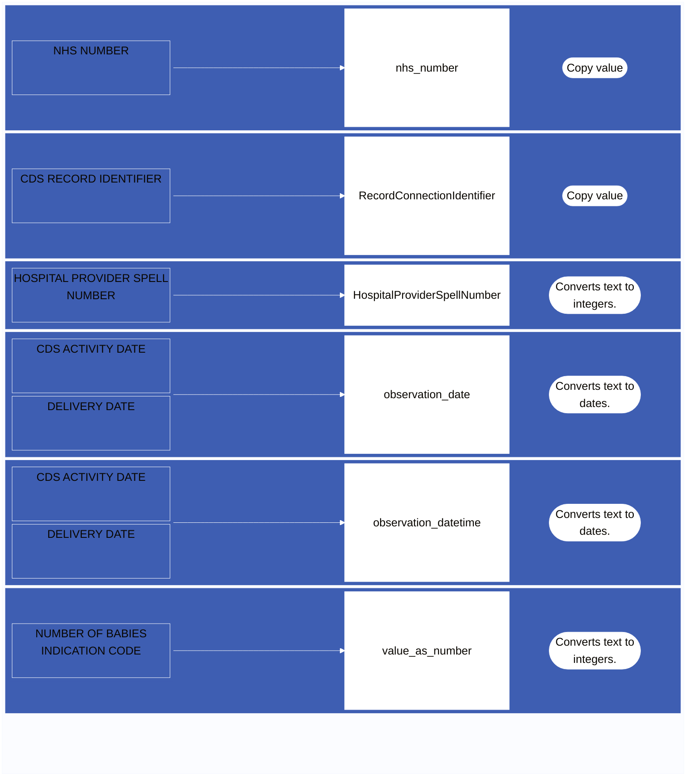
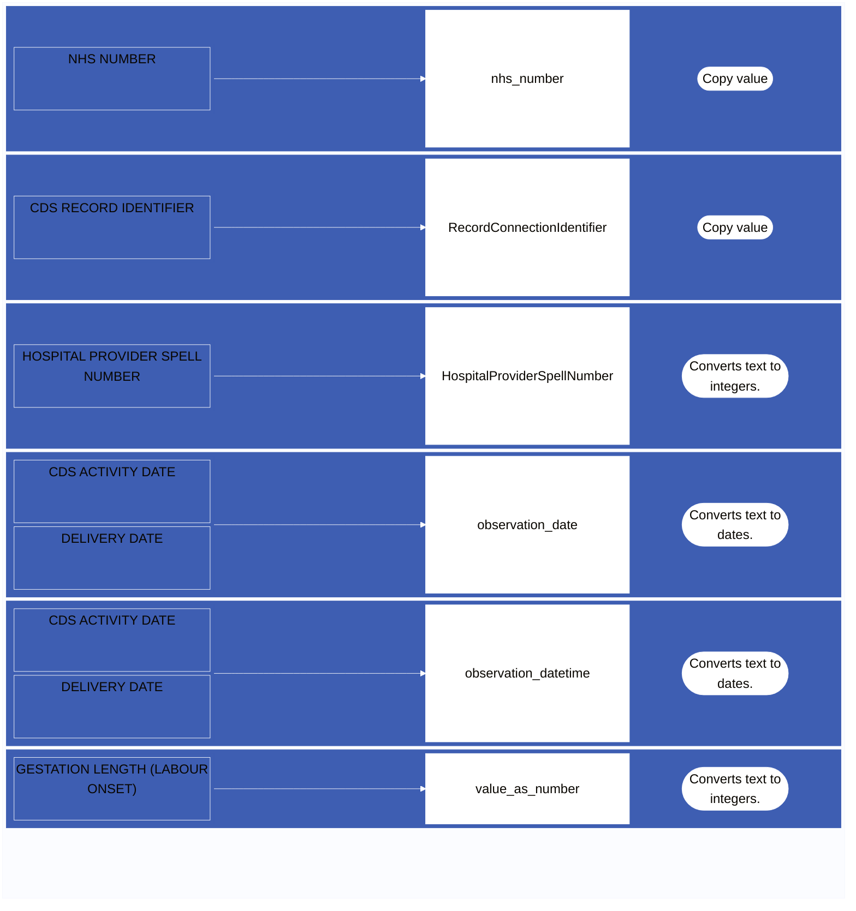
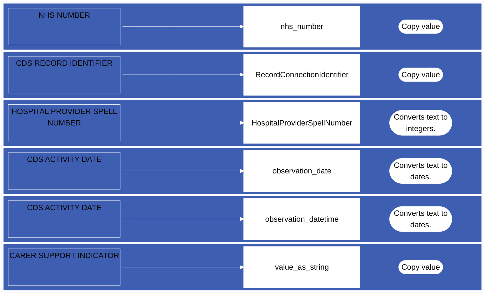
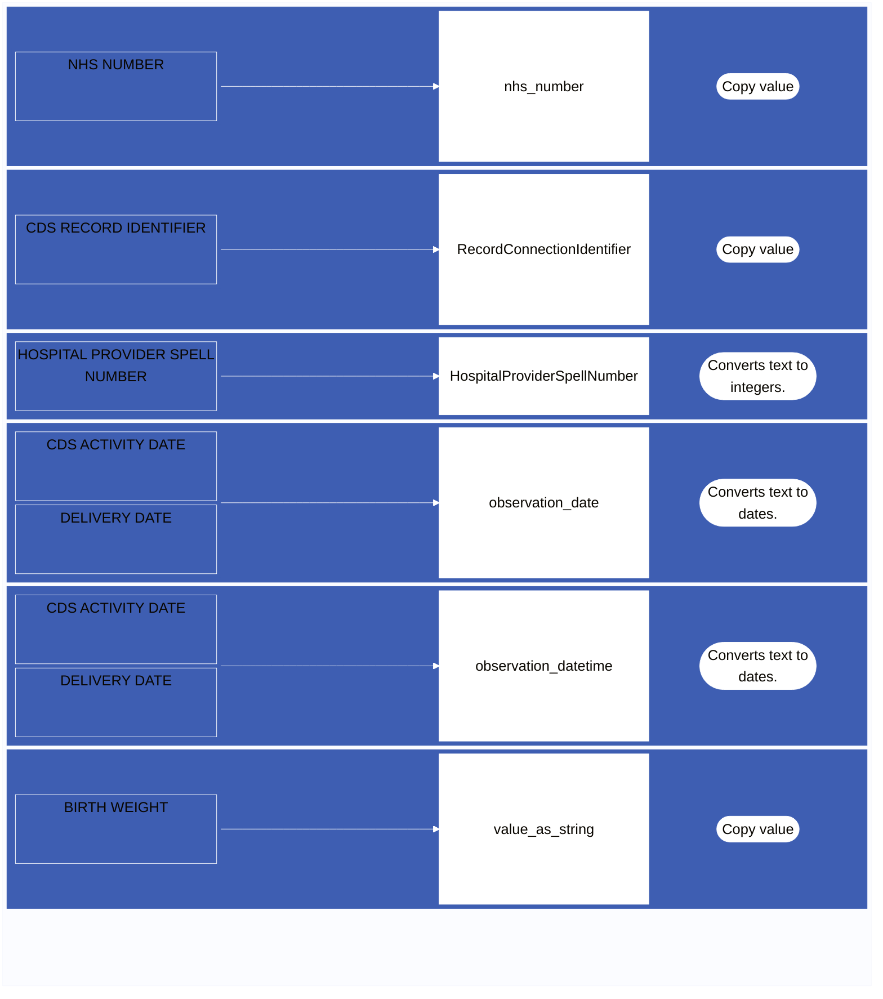
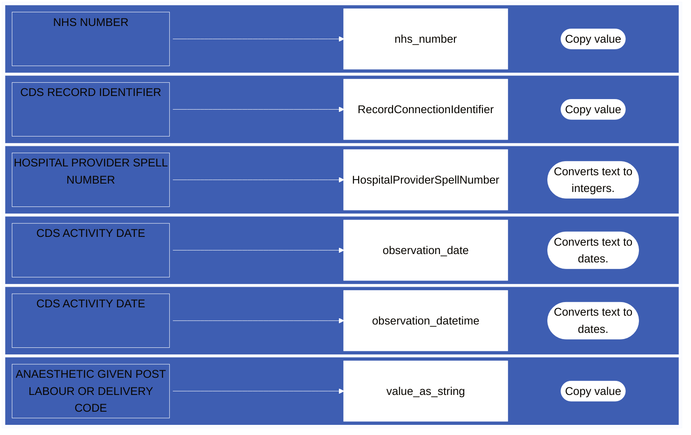
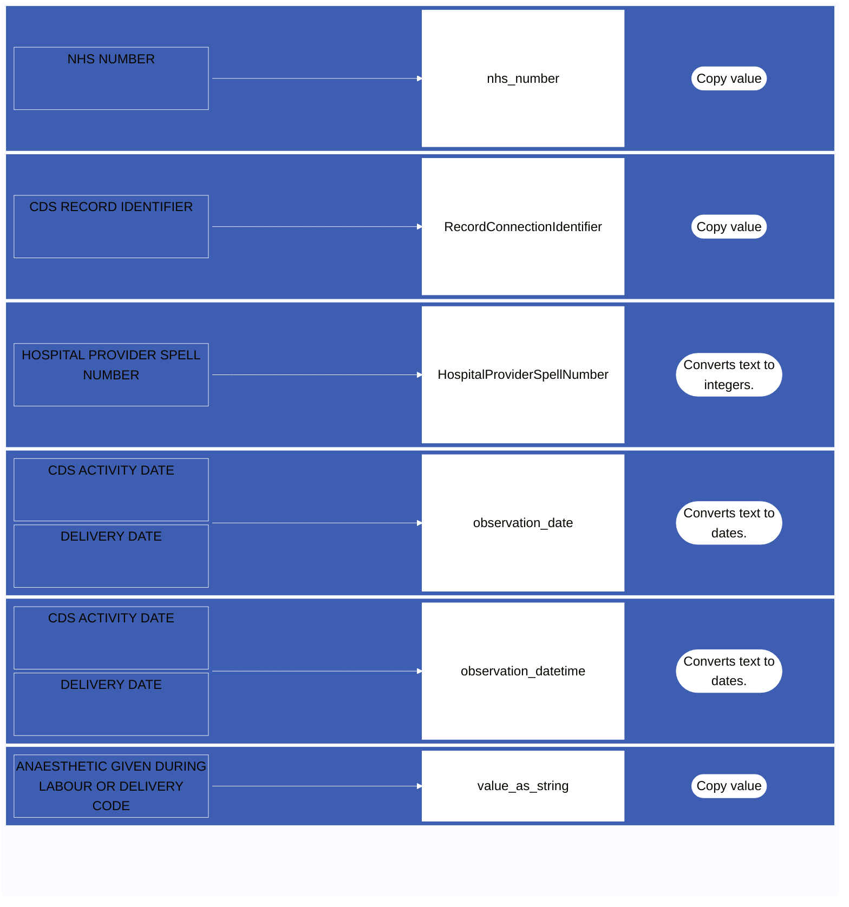

# Observation
* [nhs_number]()
* [RecordConnectionIdentifier]()
* [HospitalProviderSpellNumber]()
* [observation_concept_id]()
* [observation_date]()
* [observation_datetime]()
* [observation_type_concept_id]()
* [value_as_number]()
* [value_as_string]()
* [unit_concept_id]()
* [observation_source_concept_id]()

## CdsTotalPreviousPregnancies

```mermaid
%%{
  init: {
    'theme': 'base',
   'themeVariables': {
         'lineColor': '#Fff',
         'fontSize': '27px'
    }
  }
}%%

block-beta
  columns 1
  block:container:1
    columns 1
    block:nhs_number_container:1
        columns 4
        block:nhs_number:1
        columns 1
            nhs_number_0["NHS NUMBER<br/> <br/> <br/> "]
            class nhs_number_0 sourceItem
        end
        
        space
        
        nhs_number-->nhs_number_target_0["nhs_number"]

        nhs_number_label(["Copy value"])
    end
   class nhs_number_container container1
   class nhs_number container1
   class nhs_number_target_0 targetItem
   class nhs_number_label targetItem
    columns 1
    block:recordconnectionidentifier_container:1
        columns 4
        block:recordconnectionidentifier:1
        columns 1
            cds_record_identifier_1["CDS RECORD IDENTIFIER<br/> <br/> <br/> "]
            class cds_record_identifier_1 sourceItem
        end
        
        space
        
        recordconnectionidentifier-->recordconnectionidentifier_target_1["RecordConnectionIdentifier"]

        recordconnectionidentifier_label(["Copy value"])
    end
   class recordconnectionidentifier_container container1
   class recordconnectionidentifier container1
   class recordconnectionidentifier_target_1 targetItem
   class recordconnectionidentifier_label targetItem
    columns 1
    block:hospitalproviderspellnumber_container:1
        columns 4
        block:hospitalproviderspellnumber:1
        columns 1
            hospital_provider_spell_number_2["HOSPITAL PROVIDER SPELL<br/> NUMBER<br/> <br/> "]
            class hospital_provider_spell_number_2 sourceItem
        end
        
        space
        
        hospitalproviderspellnumber-->hospitalproviderspellnumber_target_2["HospitalProviderSpellNumber"]

        hospitalproviderspellnumber_label(["Converts text to<br/> integers."])
    end
   class hospitalproviderspellnumber_container container1
   class hospitalproviderspellnumber container1
   class hospitalproviderspellnumber_target_2 targetItem
   class hospitalproviderspellnumber_label targetItem
    columns 1
    block:observation_date_container:1
        columns 4
        block:observation_date:1
        columns 1
            cds_activity_date_3["CDS ACTIVITY DATE<br/> <br/> <br/> "]
            class cds_activity_date_3 sourceItem
        end
        
        space
        
        observation_date-->observation_date_target_3["observation_date"]

        observation_date_label(["Converts text to<br/> dates."])
    end
   class observation_date_container container1
   class observation_date container1
   class observation_date_target_3 targetItem
   class observation_date_label targetItem
    columns 1
    block:observation_datetime_container:1
        columns 4
        block:observation_datetime:1
        columns 1
            cds_activity_date_4["CDS ACTIVITY DATE<br/> <br/> <br/> "]
            class cds_activity_date_4 sourceItem
        end
        
        space
        
        observation_datetime-->observation_datetime_target_4["observation_datetime"]

        observation_datetime_label(["Converts text to<br/> dates."])
    end
   class observation_datetime_container container1
   class observation_datetime container1
   class observation_datetime_target_4 targetItem
   class observation_datetime_label targetItem
    columns 1
    block:value_as_number_container:1
        columns 4
        block:value_as_number:1
        columns 1
            pregnancy_total_previous_pregnancies_5["PREGNANCY TOTAL PREVIOUS<br/> PREGNANCIES<br/> <br/> "]
            class pregnancy_total_previous_pregnancies_5 sourceItem
        end
        
        space
        
        value_as_number-->value_as_number_target_5["value_as_number"]

        value_as_number_label(["Converts text to<br/> integers."])
    end
   class value_as_number_container container1
   class value_as_number container1
   class value_as_number_target_5 targetItem
   class value_as_number_label targetItem
    columns 1
    block:value_as_string_container:1
        columns 4
        block:value_as_string:1
        columns 1
            pregnancy_total_previous_pregnancies_6["PREGNANCY TOTAL PREVIOUS<br/> PREGNANCIES<br/> <br/> "]
            class pregnancy_total_previous_pregnancies_6 sourceItem
        end
        
        space
        
        value_as_string-->value_as_string_target_6["value_as_string"]

        value_as_string_label(["Copy value"])
    end
   class value_as_string_container container1
   class value_as_string container1
   class value_as_string_target_6 targetItem
   class value_as_string_label targetItem
   classDef container1 fill:#3E5EB2, color:#3E5EB2, stroke:#3E5EB2;
   classDef sourceItem fill:#3E5EB2, color:#fff, stroke:#fff;
   classDef targetItem fill:#fff, color:#3E5EB2, stroke:#fff;
end
```

[Comment or raise an issue for this mapping.](https://github.com/answerdigital/oxford-omop-data-mapper/issues/new?title=CdsTotalPreviousPregnancies%20mapping){: .btn }
## CdsSourceOfReferralForOutpatients

```mermaid
%%{
  init: {
    'theme': 'base',
   'themeVariables': {
         'lineColor': '#Fff',
         'fontSize': '27px'
    }
  }
}%%

block-beta
  columns 1
  block:container:1
    columns 1
    block:nhs_number_container:1
        columns 4
        block:nhs_number:1
        columns 1
            nhs_number_0["NHS NUMBER<br/> <br/> <br/> "]
            class nhs_number_0 sourceItem
        end
        
        space
        
        nhs_number-->nhs_number_target_0["nhs_number"]

        nhs_number_label(["Copy value"])
    end
   class nhs_number_container container1
   class nhs_number container1
   class nhs_number_target_0 targetItem
   class nhs_number_label targetItem
    columns 1
    block:recordconnectionidentifier_container:1
        columns 4
        block:recordconnectionidentifier:1
        columns 1
            cds_record_identifier_1["CDS RECORD IDENTIFIER<br/> <br/> <br/> "]
            class cds_record_identifier_1 sourceItem
        end
        
        space
        
        recordconnectionidentifier-->recordconnectionidentifier_target_1["RecordConnectionIdentifier"]

        recordconnectionidentifier_label(["Copy value"])
    end
   class recordconnectionidentifier_container container1
   class recordconnectionidentifier container1
   class recordconnectionidentifier_target_1 targetItem
   class recordconnectionidentifier_label targetItem
    columns 1
    block:hospitalproviderspellnumber_container:1
        columns 4
        block:hospitalproviderspellnumber:1
        columns 1
            hospital_provider_spell_number_2["HOSPITAL PROVIDER SPELL<br/> NUMBER<br/> <br/> "]
            class hospital_provider_spell_number_2 sourceItem
        end
        
        space
        
        hospitalproviderspellnumber-->hospitalproviderspellnumber_target_2["HospitalProviderSpellNumber"]

        hospitalproviderspellnumber_label(["Converts text to<br/> integers."])
    end
   class hospitalproviderspellnumber_container container1
   class hospitalproviderspellnumber container1
   class hospitalproviderspellnumber_target_2 targetItem
   class hospitalproviderspellnumber_label targetItem
    columns 1
    block:observation_date_container:1
        columns 4
        block:observation_date:1
        columns 1
            cds_activity_date_3["CDS ACTIVITY DATE<br/> <br/> <br/> "]
            class cds_activity_date_3 sourceItem
            activity_date_critical_care_3["ACTIVITY DATE (CRITICAL<br/> CARE)<br/> <br/> "]
            class activity_date_critical_care_3 sourceItem
        end
        
        space
        
        observation_date-->observation_date_target_3["observation_date"]

        observation_date_label(["Converts text to<br/> dates."])
    end
   class observation_date_container container1
   class observation_date container1
   class observation_date_target_3 targetItem
   class observation_date_label targetItem
    columns 1
    block:observation_datetime_container:1
        columns 4
        block:observation_datetime:1
        columns 1
            cds_activity_date_4["CDS ACTIVITY DATE<br/> <br/> <br/> "]
            class cds_activity_date_4 sourceItem
            activity_date_critical_care_4["ACTIVITY DATE (CRITICAL<br/> CARE)<br/> <br/> "]
            class activity_date_critical_care_4 sourceItem
        end
        
        space
        
        observation_datetime-->observation_datetime_target_4["observation_datetime"]

        observation_datetime_label(["Converts text to<br/> dates."])
    end
   class observation_datetime_container container1
   class observation_datetime container1
   class observation_datetime_target_4 targetItem
   class observation_datetime_label targetItem
    columns 1
    block:value_as_string_container:1
        columns 4
        block:value_as_string:1
        columns 1
            original_referral_request_received_date_5["ORIGINAL REFERRAL REQUEST<br/> RECEIVED DATE<br/> <br/> "]
            class original_referral_request_received_date_5 sourceItem
        end
        
        space
        
        value_as_string-->value_as_string_target_5["value_as_string"]

        value_as_string_label(["Copy value"])
    end
   class value_as_string_container container1
   class value_as_string container1
   class value_as_string_target_5 targetItem
   class value_as_string_label targetItem
   classDef container1 fill:#3E5EB2, color:#3E5EB2, stroke:#3E5EB2;
   classDef sourceItem fill:#3E5EB2, color:#fff, stroke:#fff;
   classDef targetItem fill:#fff, color:#3E5EB2, stroke:#fff;
end
```

[Comment or raise an issue for this mapping.](https://github.com/answerdigital/oxford-omop-data-mapper/issues/new?title=CdsSourceOfReferralForOutpatients%20mapping){: .btn }
## CdsPersonWeight

```mermaid
%%{
  init: {
    'theme': 'base',
   'themeVariables': {
         'lineColor': '#Fff',
         'fontSize': '27px'
    }
  }
}%%

block-beta
  columns 1
  block:container:1
    columns 1
    block:nhs_number_container:1
        columns 4
        block:nhs_number:1
        columns 1
            nhs_number_0["NHS NUMBER<br/> <br/> <br/> "]
            class nhs_number_0 sourceItem
        end
        
        space
        
        nhs_number-->nhs_number_target_0["nhs_number"]

        nhs_number_label(["Copy value"])
    end
   class nhs_number_container container1
   class nhs_number container1
   class nhs_number_target_0 targetItem
   class nhs_number_label targetItem
    columns 1
    block:recordconnectionidentifier_container:1
        columns 4
        block:recordconnectionidentifier:1
        columns 1
            cds_record_identifier_1["CDS RECORD IDENTIFIER<br/> <br/> <br/> "]
            class cds_record_identifier_1 sourceItem
        end
        
        space
        
        recordconnectionidentifier-->recordconnectionidentifier_target_1["RecordConnectionIdentifier"]

        recordconnectionidentifier_label(["Copy value"])
    end
   class recordconnectionidentifier_container container1
   class recordconnectionidentifier container1
   class recordconnectionidentifier_target_1 targetItem
   class recordconnectionidentifier_label targetItem
    columns 1
    block:hospitalproviderspellnumber_container:1
        columns 4
        block:hospitalproviderspellnumber:1
        columns 1
            hospital_provider_spell_number_2["HOSPITAL PROVIDER SPELL<br/> NUMBER<br/> <br/> "]
            class hospital_provider_spell_number_2 sourceItem
        end
        
        space
        
        hospitalproviderspellnumber-->hospitalproviderspellnumber_target_2["HospitalProviderSpellNumber"]

        hospitalproviderspellnumber_label(["Converts text to<br/> integers."])
    end
   class hospitalproviderspellnumber_container container1
   class hospitalproviderspellnumber container1
   class hospitalproviderspellnumber_target_2 targetItem
   class hospitalproviderspellnumber_label targetItem
    columns 1
    block:observation_date_container:1
        columns 4
        block:observation_date:1
        columns 1
            cds_activity_date_3["CDS ACTIVITY DATE<br/> <br/> <br/> "]
            class cds_activity_date_3 sourceItem
            activity_date_critical_care_3["ACTIVITY DATE (CRITICAL<br/> CARE)<br/> <br/> "]
            class activity_date_critical_care_3 sourceItem
        end
        
        space
        
        observation_date-->observation_date_target_3["observation_date"]

        observation_date_label(["Converts text to<br/> dates."])
    end
   class observation_date_container container1
   class observation_date container1
   class observation_date_target_3 targetItem
   class observation_date_label targetItem
    columns 1
    block:observation_datetime_container:1
        columns 4
        block:observation_datetime:1
        columns 1
            cds_activity_date_4["CDS ACTIVITY DATE<br/> <br/> <br/> "]
            class cds_activity_date_4 sourceItem
            activity_date_critical_care_4["ACTIVITY DATE (CRITICAL<br/> CARE)<br/> <br/> "]
            class activity_date_critical_care_4 sourceItem
        end
        
        space
        
        observation_datetime-->observation_datetime_target_4["observation_datetime"]

        observation_datetime_label(["Converts text to<br/> dates."])
    end
   class observation_datetime_container container1
   class observation_datetime container1
   class observation_datetime_target_4 targetItem
   class observation_datetime_label targetItem
    columns 1
    block:value_as_number_container:1
        columns 4
        block:value_as_number:1
        columns 1
            person_weight_5["PERSON WEIGHT<br/> <br/> <br/> "]
            class person_weight_5 sourceItem
        end
        
        space
        
        value_as_number-->value_as_number_target_5["value_as_number"]

        value_as_number_label(["Converts text to<br/> integers."])
    end
   class value_as_number_container container1
   class value_as_number container1
   class value_as_number_target_5 targetItem
   class value_as_number_label targetItem
   classDef container1 fill:#3E5EB2, color:#3E5EB2, stroke:#3E5EB2;
   classDef sourceItem fill:#3E5EB2, color:#fff, stroke:#fff;
   classDef targetItem fill:#fff, color:#3E5EB2, stroke:#fff;
end
```

[Comment or raise an issue for this mapping.](https://github.com/answerdigital/oxford-omop-data-mapper/issues/new?title=CdsPersonWeight%20mapping){: .btn }
## CdsNumberOfBabies

```mermaid
%%{
  init: {
    'theme': 'base',
   'themeVariables': {
         'lineColor': '#Fff',
         'fontSize': '27px'
    }
  }
}%%

block-beta
  columns 1
  block:container:1
    columns 1
    block:nhs_number_container:1
        columns 4
        block:nhs_number:1
        columns 1
            nhs_number_0["NHS NUMBER<br/> <br/> <br/> "]
            class nhs_number_0 sourceItem
        end
        
        space
        
        nhs_number-->nhs_number_target_0["nhs_number"]

        nhs_number_label(["Copy value"])
    end
   class nhs_number_container container1
   class nhs_number container1
   class nhs_number_target_0 targetItem
   class nhs_number_label targetItem
    columns 1
    block:recordconnectionidentifier_container:1
        columns 4
        block:recordconnectionidentifier:1
        columns 1
            cds_record_identifier_1["CDS RECORD IDENTIFIER<br/> <br/> <br/> "]
            class cds_record_identifier_1 sourceItem
        end
        
        space
        
        recordconnectionidentifier-->recordconnectionidentifier_target_1["RecordConnectionIdentifier"]

        recordconnectionidentifier_label(["Copy value"])
    end
   class recordconnectionidentifier_container container1
   class recordconnectionidentifier container1
   class recordconnectionidentifier_target_1 targetItem
   class recordconnectionidentifier_label targetItem
    columns 1
    block:hospitalproviderspellnumber_container:1
        columns 4
        block:hospitalproviderspellnumber:1
        columns 1
            hospital_provider_spell_number_2["HOSPITAL PROVIDER SPELL<br/> NUMBER<br/> <br/> "]
            class hospital_provider_spell_number_2 sourceItem
        end
        
        space
        
        hospitalproviderspellnumber-->hospitalproviderspellnumber_target_2["HospitalProviderSpellNumber"]

        hospitalproviderspellnumber_label(["Converts text to<br/> integers."])
    end
   class hospitalproviderspellnumber_container container1
   class hospitalproviderspellnumber container1
   class hospitalproviderspellnumber_target_2 targetItem
   class hospitalproviderspellnumber_label targetItem
    columns 1
    block:observation_date_container:1
        columns 4
        block:observation_date:1
        columns 1
            cds_activity_date_3["CDS ACTIVITY DATE<br/> <br/> <br/> "]
            class cds_activity_date_3 sourceItem
            delivery_date_3["DELIVERY DATE<br/> <br/> <br/> "]
            class delivery_date_3 sourceItem
        end
        
        space
        
        observation_date-->observation_date_target_3["observation_date"]

        observation_date_label(["Converts text to<br/> dates."])
    end
   class observation_date_container container1
   class observation_date container1
   class observation_date_target_3 targetItem
   class observation_date_label targetItem
    columns 1
    block:observation_datetime_container:1
        columns 4
        block:observation_datetime:1
        columns 1
            cds_activity_date_4["CDS ACTIVITY DATE<br/> <br/> <br/> "]
            class cds_activity_date_4 sourceItem
            delivery_date_4["DELIVERY DATE<br/> <br/> <br/> "]
            class delivery_date_4 sourceItem
        end
        
        space
        
        observation_datetime-->observation_datetime_target_4["observation_datetime"]

        observation_datetime_label(["Converts text to<br/> dates."])
    end
   class observation_datetime_container container1
   class observation_datetime container1
   class observation_datetime_target_4 targetItem
   class observation_datetime_label targetItem
    columns 1
    block:value_as_number_container:1
        columns 4
        block:value_as_number:1
        columns 1
            number_of_babies_indication_code_5["NUMBER OF BABIES<br/> INDICATION CODE<br/> <br/> "]
            class number_of_babies_indication_code_5 sourceItem
        end
        
        space
        
        value_as_number-->value_as_number_target_5["value_as_number"]

        value_as_number_label(["Converts text to<br/> integers."])
    end
   class value_as_number_container container1
   class value_as_number container1
   class value_as_number_target_5 targetItem
   class value_as_number_label targetItem
   classDef container1 fill:#3E5EB2, color:#3E5EB2, stroke:#3E5EB2;
   classDef sourceItem fill:#3E5EB2, color:#fff, stroke:#fff;
   classDef targetItem fill:#fff, color:#3E5EB2, stroke:#fff;
end
```

[Comment or raise an issue for this mapping.](https://github.com/answerdigital/oxford-omop-data-mapper/issues/new?title=CdsNumberOfBabies%20mapping){: .btn }
## CdsGestationLengthLabourOnset

```mermaid
%%{
  init: {
    'theme': 'base',
   'themeVariables': {
         'lineColor': '#Fff',
         'fontSize': '27px'
    }
  }
}%%

block-beta
  columns 1
  block:container:1
    columns 1
    block:nhs_number_container:1
        columns 4
        block:nhs_number:1
        columns 1
            nhs_number_0["NHS NUMBER<br/> <br/> <br/> "]
            class nhs_number_0 sourceItem
        end
        
        space
        
        nhs_number-->nhs_number_target_0["nhs_number"]

        nhs_number_label(["Copy value"])
    end
   class nhs_number_container container1
   class nhs_number container1
   class nhs_number_target_0 targetItem
   class nhs_number_label targetItem
    columns 1
    block:recordconnectionidentifier_container:1
        columns 4
        block:recordconnectionidentifier:1
        columns 1
            cds_record_identifier_1["CDS RECORD IDENTIFIER<br/> <br/> <br/> "]
            class cds_record_identifier_1 sourceItem
        end
        
        space
        
        recordconnectionidentifier-->recordconnectionidentifier_target_1["RecordConnectionIdentifier"]

        recordconnectionidentifier_label(["Copy value"])
    end
   class recordconnectionidentifier_container container1
   class recordconnectionidentifier container1
   class recordconnectionidentifier_target_1 targetItem
   class recordconnectionidentifier_label targetItem
    columns 1
    block:hospitalproviderspellnumber_container:1
        columns 4
        block:hospitalproviderspellnumber:1
        columns 1
            hospital_provider_spell_number_2["HOSPITAL PROVIDER SPELL<br/> NUMBER<br/> <br/> "]
            class hospital_provider_spell_number_2 sourceItem
        end
        
        space
        
        hospitalproviderspellnumber-->hospitalproviderspellnumber_target_2["HospitalProviderSpellNumber"]

        hospitalproviderspellnumber_label(["Converts text to<br/> integers."])
    end
   class hospitalproviderspellnumber_container container1
   class hospitalproviderspellnumber container1
   class hospitalproviderspellnumber_target_2 targetItem
   class hospitalproviderspellnumber_label targetItem
    columns 1
    block:observation_date_container:1
        columns 4
        block:observation_date:1
        columns 1
            cds_activity_date_3["CDS ACTIVITY DATE<br/> <br/> <br/> "]
            class cds_activity_date_3 sourceItem
            delivery_date_3["DELIVERY DATE<br/> <br/> <br/> "]
            class delivery_date_3 sourceItem
        end
        
        space
        
        observation_date-->observation_date_target_3["observation_date"]

        observation_date_label(["Converts text to<br/> dates."])
    end
   class observation_date_container container1
   class observation_date container1
   class observation_date_target_3 targetItem
   class observation_date_label targetItem
    columns 1
    block:observation_datetime_container:1
        columns 4
        block:observation_datetime:1
        columns 1
            cds_activity_date_4["CDS ACTIVITY DATE<br/> <br/> <br/> "]
            class cds_activity_date_4 sourceItem
            delivery_date_4["DELIVERY DATE<br/> <br/> <br/> "]
            class delivery_date_4 sourceItem
        end
        
        space
        
        observation_datetime-->observation_datetime_target_4["observation_datetime"]

        observation_datetime_label(["Converts text to<br/> dates."])
    end
   class observation_datetime_container container1
   class observation_datetime container1
   class observation_datetime_target_4 targetItem
   class observation_datetime_label targetItem
    columns 1
    block:value_as_number_container:1
        columns 4
        block:value_as_number:1
        columns 1
            gestation_length_labour_onset_5["GESTATION LENGTH (LABOUR<br/> ONSET)<br/> <br/> "]
            class gestation_length_labour_onset_5 sourceItem
        end
        
        space
        
        value_as_number-->value_as_number_target_5["value_as_number"]

        value_as_number_label(["Converts text to<br/> integers."])
    end
   class value_as_number_container container1
   class value_as_number container1
   class value_as_number_target_5 targetItem
   class value_as_number_label targetItem
   classDef container1 fill:#3E5EB2, color:#3E5EB2, stroke:#3E5EB2;
   classDef sourceItem fill:#3E5EB2, color:#fff, stroke:#fff;
   classDef targetItem fill:#fff, color:#3E5EB2, stroke:#fff;
end
```

[Comment or raise an issue for this mapping.](https://github.com/answerdigital/oxford-omop-data-mapper/issues/new?title=CdsGestationLengthLabourOnset%20mapping){: .btn }
## CdsCarerSupportIndicator

```mermaid
%%{
  init: {
    'theme': 'base',
   'themeVariables': {
         'lineColor': '#Fff',
         'fontSize': '27px'
    }
  }
}%%

block-beta
  columns 1
  block:container:1
    columns 1
    block:nhs_number_container:1
        columns 4
        block:nhs_number:1
        columns 1
            nhs_number_0["NHS NUMBER<br/> <br/> <br/> "]
            class nhs_number_0 sourceItem
        end
        
        space
        
        nhs_number-->nhs_number_target_0["nhs_number"]

        nhs_number_label(["Copy value"])
    end
   class nhs_number_container container1
   class nhs_number container1
   class nhs_number_target_0 targetItem
   class nhs_number_label targetItem
    columns 1
    block:recordconnectionidentifier_container:1
        columns 4
        block:recordconnectionidentifier:1
        columns 1
            cds_record_identifier_1["CDS RECORD IDENTIFIER<br/> <br/> <br/> "]
            class cds_record_identifier_1 sourceItem
        end
        
        space
        
        recordconnectionidentifier-->recordconnectionidentifier_target_1["RecordConnectionIdentifier"]

        recordconnectionidentifier_label(["Copy value"])
    end
   class recordconnectionidentifier_container container1
   class recordconnectionidentifier container1
   class recordconnectionidentifier_target_1 targetItem
   class recordconnectionidentifier_label targetItem
    columns 1
    block:hospitalproviderspellnumber_container:1
        columns 4
        block:hospitalproviderspellnumber:1
        columns 1
            hospital_provider_spell_number_2["HOSPITAL PROVIDER SPELL<br/> NUMBER<br/> <br/> "]
            class hospital_provider_spell_number_2 sourceItem
        end
        
        space
        
        hospitalproviderspellnumber-->hospitalproviderspellnumber_target_2["HospitalProviderSpellNumber"]

        hospitalproviderspellnumber_label(["Converts text to<br/> integers."])
    end
   class hospitalproviderspellnumber_container container1
   class hospitalproviderspellnumber container1
   class hospitalproviderspellnumber_target_2 targetItem
   class hospitalproviderspellnumber_label targetItem
    columns 1
    block:observation_date_container:1
        columns 4
        block:observation_date:1
        columns 1
            cds_activity_date_3["CDS ACTIVITY DATE<br/> <br/> <br/> "]
            class cds_activity_date_3 sourceItem
        end
        
        space
        
        observation_date-->observation_date_target_3["observation_date"]

        observation_date_label(["Converts text to<br/> dates."])
    end
   class observation_date_container container1
   class observation_date container1
   class observation_date_target_3 targetItem
   class observation_date_label targetItem
    columns 1
    block:observation_datetime_container:1
        columns 4
        block:observation_datetime:1
        columns 1
            cds_activity_date_4["CDS ACTIVITY DATE<br/> <br/> <br/> "]
            class cds_activity_date_4 sourceItem
        end
        
        space
        
        observation_datetime-->observation_datetime_target_4["observation_datetime"]

        observation_datetime_label(["Converts text to<br/> dates."])
    end
   class observation_datetime_container container1
   class observation_datetime container1
   class observation_datetime_target_4 targetItem
   class observation_datetime_label targetItem
    columns 1
    block:value_as_string_container:1
        columns 4
        block:value_as_string:1
        columns 1
            carer_support_indicator_5["CARER SUPPORT INDICATOR<br/> <br/> <br/> "]
            class carer_support_indicator_5 sourceItem
        end
        
        space
        
        value_as_string-->value_as_string_target_5["value_as_string"]

        value_as_string_label(["Copy value"])
    end
   class value_as_string_container container1
   class value_as_string container1
   class value_as_string_target_5 targetItem
   class value_as_string_label targetItem
   classDef container1 fill:#3E5EB2, color:#3E5EB2, stroke:#3E5EB2;
   classDef sourceItem fill:#3E5EB2, color:#fff, stroke:#fff;
   classDef targetItem fill:#fff, color:#3E5EB2, stroke:#fff;
end
```

[Comment or raise an issue for this mapping.](https://github.com/answerdigital/oxford-omop-data-mapper/issues/new?title=CdsCarerSupportIndicator%20mapping){: .btn }
## CdsBirthWeight

```mermaid
%%{
  init: {
    'theme': 'base',
   'themeVariables': {
         'lineColor': '#Fff',
         'fontSize': '27px'
    }
  }
}%%

block-beta
  columns 1
  block:container:1
    columns 1
    block:nhs_number_container:1
        columns 4
        block:nhs_number:1
        columns 1
            nhs_number_0["NHS NUMBER<br/> <br/> <br/> "]
            class nhs_number_0 sourceItem
        end
        
        space
        
        nhs_number-->nhs_number_target_0["nhs_number"]

        nhs_number_label(["Copy value"])
    end
   class nhs_number_container container1
   class nhs_number container1
   class nhs_number_target_0 targetItem
   class nhs_number_label targetItem
    columns 1
    block:recordconnectionidentifier_container:1
        columns 4
        block:recordconnectionidentifier:1
        columns 1
            cds_record_identifier_1["CDS RECORD IDENTIFIER<br/> <br/> <br/> "]
            class cds_record_identifier_1 sourceItem
        end
        
        space
        
        recordconnectionidentifier-->recordconnectionidentifier_target_1["RecordConnectionIdentifier"]

        recordconnectionidentifier_label(["Copy value"])
    end
   class recordconnectionidentifier_container container1
   class recordconnectionidentifier container1
   class recordconnectionidentifier_target_1 targetItem
   class recordconnectionidentifier_label targetItem
    columns 1
    block:hospitalproviderspellnumber_container:1
        columns 4
        block:hospitalproviderspellnumber:1
        columns 1
            hospital_provider_spell_number_2["HOSPITAL PROVIDER SPELL<br/> NUMBER<br/> <br/> "]
            class hospital_provider_spell_number_2 sourceItem
        end
        
        space
        
        hospitalproviderspellnumber-->hospitalproviderspellnumber_target_2["HospitalProviderSpellNumber"]

        hospitalproviderspellnumber_label(["Converts text to<br/> integers."])
    end
   class hospitalproviderspellnumber_container container1
   class hospitalproviderspellnumber container1
   class hospitalproviderspellnumber_target_2 targetItem
   class hospitalproviderspellnumber_label targetItem
    columns 1
    block:observation_date_container:1
        columns 4
        block:observation_date:1
        columns 1
            cds_activity_date_3["CDS ACTIVITY DATE<br/> <br/> <br/> "]
            class cds_activity_date_3 sourceItem
            delivery_date_3["DELIVERY DATE<br/> <br/> <br/> "]
            class delivery_date_3 sourceItem
        end
        
        space
        
        observation_date-->observation_date_target_3["observation_date"]

        observation_date_label(["Converts text to<br/> dates."])
    end
   class observation_date_container container1
   class observation_date container1
   class observation_date_target_3 targetItem
   class observation_date_label targetItem
    columns 1
    block:observation_datetime_container:1
        columns 4
        block:observation_datetime:1
        columns 1
            cds_activity_date_4["CDS ACTIVITY DATE<br/> <br/> <br/> "]
            class cds_activity_date_4 sourceItem
            delivery_date_4["DELIVERY DATE<br/> <br/> <br/> "]
            class delivery_date_4 sourceItem
        end
        
        space
        
        observation_datetime-->observation_datetime_target_4["observation_datetime"]

        observation_datetime_label(["Converts text to<br/> dates."])
    end
   class observation_datetime_container container1
   class observation_datetime container1
   class observation_datetime_target_4 targetItem
   class observation_datetime_label targetItem
    columns 1
    block:value_as_string_container:1
        columns 4
        block:value_as_string:1
        columns 1
            birth_weight_5["BIRTH WEIGHT<br/> <br/> <br/> "]
            class birth_weight_5 sourceItem
        end
        
        space
        
        value_as_string-->value_as_string_target_5["value_as_string"]

        value_as_string_label(["Copy value"])
    end
   class value_as_string_container container1
   class value_as_string container1
   class value_as_string_target_5 targetItem
   class value_as_string_label targetItem
   classDef container1 fill:#3E5EB2, color:#3E5EB2, stroke:#3E5EB2;
   classDef sourceItem fill:#3E5EB2, color:#fff, stroke:#fff;
   classDef targetItem fill:#fff, color:#3E5EB2, stroke:#fff;
end
```

[Comment or raise an issue for this mapping.](https://github.com/answerdigital/oxford-omop-data-mapper/issues/new?title=CdsBirthWeight%20mapping){: .btn }
## CdsAnaestheticGivenPostLabourDelivery

```mermaid
%%{
  init: {
    'theme': 'base',
   'themeVariables': {
         'lineColor': '#Fff',
         'fontSize': '27px'
    }
  }
}%%

block-beta
  columns 1
  block:container:1
    columns 1
    block:nhs_number_container:1
        columns 4
        block:nhs_number:1
        columns 1
            nhs_number_0["NHS NUMBER<br/> <br/> <br/> "]
            class nhs_number_0 sourceItem
        end
        
        space
        
        nhs_number-->nhs_number_target_0["nhs_number"]

        nhs_number_label(["Copy value"])
    end
   class nhs_number_container container1
   class nhs_number container1
   class nhs_number_target_0 targetItem
   class nhs_number_label targetItem
    columns 1
    block:recordconnectionidentifier_container:1
        columns 4
        block:recordconnectionidentifier:1
        columns 1
            cds_record_identifier_1["CDS RECORD IDENTIFIER<br/> <br/> <br/> "]
            class cds_record_identifier_1 sourceItem
        end
        
        space
        
        recordconnectionidentifier-->recordconnectionidentifier_target_1["RecordConnectionIdentifier"]

        recordconnectionidentifier_label(["Copy value"])
    end
   class recordconnectionidentifier_container container1
   class recordconnectionidentifier container1
   class recordconnectionidentifier_target_1 targetItem
   class recordconnectionidentifier_label targetItem
    columns 1
    block:hospitalproviderspellnumber_container:1
        columns 4
        block:hospitalproviderspellnumber:1
        columns 1
            hospital_provider_spell_number_2["HOSPITAL PROVIDER SPELL<br/> NUMBER<br/> <br/> "]
            class hospital_provider_spell_number_2 sourceItem
        end
        
        space
        
        hospitalproviderspellnumber-->hospitalproviderspellnumber_target_2["HospitalProviderSpellNumber"]

        hospitalproviderspellnumber_label(["Converts text to<br/> integers."])
    end
   class hospitalproviderspellnumber_container container1
   class hospitalproviderspellnumber container1
   class hospitalproviderspellnumber_target_2 targetItem
   class hospitalproviderspellnumber_label targetItem
    columns 1
    block:observation_date_container:1
        columns 4
        block:observation_date:1
        columns 1
            cds_activity_date_3["CDS ACTIVITY DATE<br/> <br/> <br/> "]
            class cds_activity_date_3 sourceItem
        end
        
        space
        
        observation_date-->observation_date_target_3["observation_date"]

        observation_date_label(["Converts text to<br/> dates."])
    end
   class observation_date_container container1
   class observation_date container1
   class observation_date_target_3 targetItem
   class observation_date_label targetItem
    columns 1
    block:observation_datetime_container:1
        columns 4
        block:observation_datetime:1
        columns 1
            cds_activity_date_4["CDS ACTIVITY DATE<br/> <br/> <br/> "]
            class cds_activity_date_4 sourceItem
        end
        
        space
        
        observation_datetime-->observation_datetime_target_4["observation_datetime"]

        observation_datetime_label(["Converts text to<br/> dates."])
    end
   class observation_datetime_container container1
   class observation_datetime container1
   class observation_datetime_target_4 targetItem
   class observation_datetime_label targetItem
    columns 1
    block:value_as_string_container:1
        columns 4
        block:value_as_string:1
        columns 1
            anaesthetic_given_post_labour_or_delivery_code_5["ANAESTHETIC GIVEN POST<br/> LABOUR OR DELIVERY<br/> CODE<br/> "]
            class anaesthetic_given_post_labour_or_delivery_code_5 sourceItem
        end
        
        space
        
        value_as_string-->value_as_string_target_5["value_as_string"]

        value_as_string_label(["Copy value"])
    end
   class value_as_string_container container1
   class value_as_string container1
   class value_as_string_target_5 targetItem
   class value_as_string_label targetItem
   classDef container1 fill:#3E5EB2, color:#3E5EB2, stroke:#3E5EB2;
   classDef sourceItem fill:#3E5EB2, color:#fff, stroke:#fff;
   classDef targetItem fill:#fff, color:#3E5EB2, stroke:#fff;
end
```

[Comment or raise an issue for this mapping.](https://github.com/answerdigital/oxford-omop-data-mapper/issues/new?title=CdsAnaestheticGivenPostLabourDelivery%20mapping){: .btn }
## CdsAnaestheticDuringLabourDelivery

```mermaid
%%{
  init: {
    'theme': 'base',
   'themeVariables': {
         'lineColor': '#Fff',
         'fontSize': '27px'
    }
  }
}%%

block-beta
  columns 1
  block:container:1
    columns 1
    block:nhs_number_container:1
        columns 4
        block:nhs_number:1
        columns 1
            nhs_number_0["NHS NUMBER<br/> <br/> <br/> "]
            class nhs_number_0 sourceItem
        end
        
        space
        
        nhs_number-->nhs_number_target_0["nhs_number"]

        nhs_number_label(["Copy value"])
    end
   class nhs_number_container container1
   class nhs_number container1
   class nhs_number_target_0 targetItem
   class nhs_number_label targetItem
    columns 1
    block:recordconnectionidentifier_container:1
        columns 4
        block:recordconnectionidentifier:1
        columns 1
            cds_record_identifier_1["CDS RECORD IDENTIFIER<br/> <br/> <br/> "]
            class cds_record_identifier_1 sourceItem
        end
        
        space
        
        recordconnectionidentifier-->recordconnectionidentifier_target_1["RecordConnectionIdentifier"]

        recordconnectionidentifier_label(["Copy value"])
    end
   class recordconnectionidentifier_container container1
   class recordconnectionidentifier container1
   class recordconnectionidentifier_target_1 targetItem
   class recordconnectionidentifier_label targetItem
    columns 1
    block:hospitalproviderspellnumber_container:1
        columns 4
        block:hospitalproviderspellnumber:1
        columns 1
            hospital_provider_spell_number_2["HOSPITAL PROVIDER SPELL<br/> NUMBER<br/> <br/> "]
            class hospital_provider_spell_number_2 sourceItem
        end
        
        space
        
        hospitalproviderspellnumber-->hospitalproviderspellnumber_target_2["HospitalProviderSpellNumber"]

        hospitalproviderspellnumber_label(["Converts text to<br/> integers."])
    end
   class hospitalproviderspellnumber_container container1
   class hospitalproviderspellnumber container1
   class hospitalproviderspellnumber_target_2 targetItem
   class hospitalproviderspellnumber_label targetItem
    columns 1
    block:observation_date_container:1
        columns 4
        block:observation_date:1
        columns 1
            cds_activity_date_3["CDS ACTIVITY DATE<br/> <br/> <br/> "]
            class cds_activity_date_3 sourceItem
            delivery_date_3["DELIVERY DATE<br/> <br/> <br/> "]
            class delivery_date_3 sourceItem
        end
        
        space
        
        observation_date-->observation_date_target_3["observation_date"]

        observation_date_label(["Converts text to<br/> dates."])
    end
   class observation_date_container container1
   class observation_date container1
   class observation_date_target_3 targetItem
   class observation_date_label targetItem
    columns 1
    block:observation_datetime_container:1
        columns 4
        block:observation_datetime:1
        columns 1
            cds_activity_date_4["CDS ACTIVITY DATE<br/> <br/> <br/> "]
            class cds_activity_date_4 sourceItem
            delivery_date_4["DELIVERY DATE<br/> <br/> <br/> "]
            class delivery_date_4 sourceItem
        end
        
        space
        
        observation_datetime-->observation_datetime_target_4["observation_datetime"]

        observation_datetime_label(["Converts text to<br/> dates."])
    end
   class observation_datetime_container container1
   class observation_datetime container1
   class observation_datetime_target_4 targetItem
   class observation_datetime_label targetItem
    columns 1
    block:value_as_string_container:1
        columns 4
        block:value_as_string:1
        columns 1
            anaesthetic_given_during_labour_or_delivery_code_5["ANAESTHETIC GIVEN DURING<br/> LABOUR OR DELIVERY<br/> CODE<br/> "]
            class anaesthetic_given_during_labour_or_delivery_code_5 sourceItem
        end
        
        space
        
        value_as_string-->value_as_string_target_5["value_as_string"]

        value_as_string_label(["Copy value"])
    end
   class value_as_string_container container1
   class value_as_string container1
   class value_as_string_target_5 targetItem
   class value_as_string_label targetItem
   classDef container1 fill:#3E5EB2, color:#3E5EB2, stroke:#3E5EB2;
   classDef sourceItem fill:#3E5EB2, color:#fff, stroke:#fff;
   classDef targetItem fill:#fff, color:#3E5EB2, stroke:#fff;
end
```

[Comment or raise an issue for this mapping.](https://github.com/answerdigital/oxford-omop-data-mapper/issues/new?title=CdsAnaestheticDuringLabourDelivery%20mapping){: .btn }
