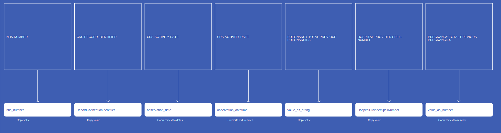
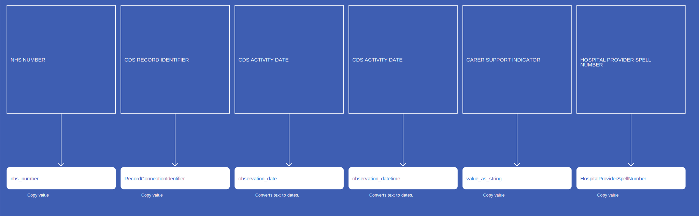
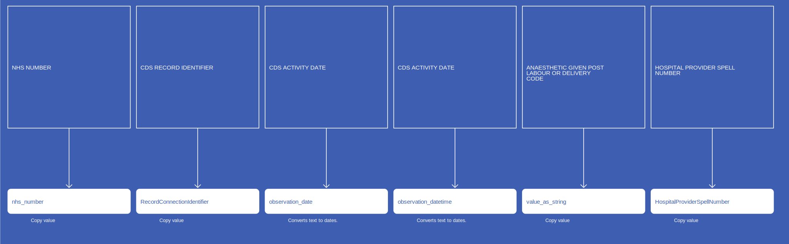
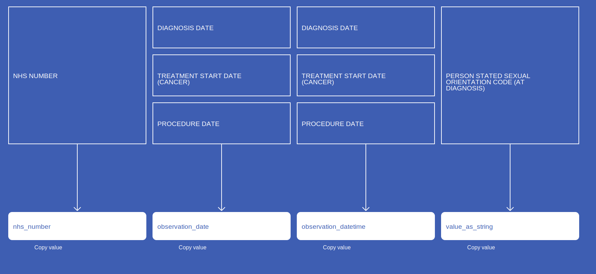

# Observation
* [nhs_number]()
* [RecordConnectionIdentifier]()
* [observation_concept_id]()
* [observation_date]()
* [observation_datetime]()
* [observation_type_concept_id]()
* [value_as_string]()
* [HospitalProviderSpellNumber]()
* [value_as_number]()
* [value_as_concept_id]()
* [qualifier_concept_id]()
* [unit_concept_id]()
* [observation_source_value]()
* [observation_source_concept_id]()
* [qualifier_source_value]()
* [value_source_value]()

## SusOPSourceOfReferralForOutpatients

{: .important-title }
> Notes
>
> Observations do not require a standardized test or other activity to generate clinical fact. Typical observations are medical history, family history, lifestyle choices, healthcare utilization patterns, social circumstances etc
>
> Valid Observation Concepts are not enforced to be from any domain.  They should still be standard concepts and typically belong to the Observation or Measurement domain.
>
> Observations can be stored as attribute value pairs, with the attribute as the Observation Concept and the value representing the clinical fact. This fact can be stored as a Concept (value_as_concept), a numerical value (value_as_number) or a verbatim string (value_as_string)
>

[Comment or raise an issue for this mapping.](https://github.com/answerdigital/oxford-omop-data-mapper/issues/new?title=SusOPSourceOfReferralForOutpatients%20mapping){: .btn }
## SusOPReferralReceivedDateForOutpatients

{: .important-title }
> Notes
>
> Observations do not require a standardized test or other activity to generate clinical fact. Typical observations are medical history, family history, lifestyle choices, healthcare utilization patterns, social circumstances etc
>
> Valid Observation Concepts are not enforced to be from any domain.  They should still be standard concepts and typically belong to the Observation or Measurement domain.
>
> Observations can be stored as attribute value pairs, with the attribute as the Observation Concept and the value representing the clinical fact. This fact can be stored as a Concept (value_as_concept), a numerical value (value_as_number) or a verbatim string (value_as_string)
>

[Comment or raise an issue for this mapping.](https://github.com/answerdigital/oxford-omop-data-mapper/issues/new?title=SusOPReferralReceivedDateForOutpatients%20mapping){: .btn }
## SusOPProcedureObservation

[Comment or raise an issue for this mapping.](https://github.com/answerdigital/oxford-omop-data-mapper/issues/new?title=SusOPProcedureObservation%20mapping){: .btn }
## SusOPICDDiagnosisObservation

[Comment or raise an issue for this mapping.](https://github.com/answerdigital/oxford-omop-data-mapper/issues/new?title=SusOPICDDiagnosisObservation%20mapping){: .btn }
## SusOPCarerSupportIndicator

{: .important-title }
> Notes
>
> Observations do not require a standardized test or other activity to generate clinical fact. Typical observations are medical history, family history, lifestyle choices, healthcare utilization patterns, social circumstances etc
>
> Valid Observation Concepts are not enforced to be from any domain.  They should still be standard concepts and typically belong to the Observation or Measurement domain.
>
> Observations can be stored as attribute value pairs, with the attribute as the Observation Concept and the value representing the clinical fact. This fact can be stored as a Concept (value_as_concept), a numerical value (value_as_number) or a verbatim string (value_as_string)
>

[Comment or raise an issue for this mapping.](https://github.com/answerdigital/oxford-omop-data-mapper/issues/new?title=SusOPCarerSupportIndicator%20mapping){: .btn }
## SusCCMDSHighCostDrugs

[Comment or raise an issue for this mapping.](https://github.com/answerdigital/oxford-omop-data-mapper/issues/new?title=SusCCMDSHighCostDrugs%20mapping){: .btn }
## SusAPCTotalPreviousPregnancies

{: .important-title }
> Notes
>
> Observations do not require a standardized test or other activity to generate clinical fact. Typical observations are medical history, family history, lifestyle choices, healthcare utilization patterns, social circumstances etc
>
> Valid Observation Concepts are not enforced to be from any domain.  They should still be standard concepts and typically belong to the Observation or Measurement domain.
>
> Observations can be stored as attribute value pairs, with the attribute as the Observation Concept and the value representing the clinical fact. This fact can be stored as a Concept (value_as_concept), a numerical value (value_as_number) or a verbatim string (value_as_string)
>

[Comment or raise an issue for this mapping.](https://github.com/answerdigital/oxford-omop-data-mapper/issues/new?title=SusAPCTotalPreviousPregnancies%20mapping){: .btn }
## SusAPCSourceOfReferralForInpatients

{: .important-title }
> Notes
>
> Observations do not require a standardized test or other activity to generate clinical fact. Typical observations are medical history, family history, lifestyle choices, healthcare utilization patterns, social circumstances etc
>
> Valid Observation Concepts are not enforced to be from any domain.  They should still be standard concepts and typically belong to the Observation or Measurement domain.
>
> Observations can be stored as attribute value pairs, with the attribute as the Observation Concept and the value representing the clinical fact. This fact can be stored as a Concept (value_as_concept), a numerical value (value_as_number) or a verbatim string (value_as_string)
>

[Comment or raise an issue for this mapping.](https://github.com/answerdigital/oxford-omop-data-mapper/issues/new?title=SusAPCSourceOfReferralForInpatients%20mapping){: .btn }
## SusAPCReferralReceivedDateForInpatients

{: .important-title }
> Notes
>
> Observations do not require a standardized test or other activity to generate clinical fact. Typical observations are medical history, family history, lifestyle choices, healthcare utilization patterns, social circumstances etc
>
> Valid Observation Concepts are not enforced to be from any domain.  They should still be standard concepts and typically belong to the Observation or Measurement domain.
>
> Observations can be stored as attribute value pairs, with the attribute as the Observation Concept and the value representing the clinical fact. This fact can be stored as a Concept (value_as_concept), a numerical value (value_as_number) or a verbatim string (value_as_string)
>

[Comment or raise an issue for this mapping.](https://github.com/answerdigital/oxford-omop-data-mapper/issues/new?title=SusAPCReferralReceivedDateForInpatients%20mapping){: .btn }
## SusAPCProcedureObservations

[Comment or raise an issue for this mapping.](https://github.com/answerdigital/oxford-omop-data-mapper/issues/new?title=SusAPCProcedureObservations%20mapping){: .btn }
## SusAPCNumberOfBabies

{: .important-title }
> Notes
>
> Observations do not require a standardized test or other activity to generate clinical fact. Typical observations are medical history, family history, lifestyle choices, healthcare utilization patterns, social circumstances etc
>
> Valid Observation Concepts are not enforced to be from any domain.  They should still be standard concepts and typically belong to the Observation or Measurement domain.
>
> Observations can be stored as attribute value pairs, with the attribute as the Observation Concept and the value representing the clinical fact. This fact can be stored as a Concept (value_as_concept), a numerical value (value_as_number) or a verbatim string (value_as_string)
>

[Comment or raise an issue for this mapping.](https://github.com/answerdigital/oxford-omop-data-mapper/issues/new?title=SusAPCNumberOfBabies%20mapping){: .btn }
## SusAPCSusDiagnosisObservation

[Comment or raise an issue for this mapping.](https://github.com/answerdigital/oxford-omop-data-mapper/issues/new?title=SusAPCSusDiagnosisObservation%20mapping){: .btn }
## SusAPCGestationLengthLabourOnset

{: .important-title }
> Notes
>
> Observations do not require a standardized test or other activity to generate clinical fact. Typical observations are medical history, family history, lifestyle choices, healthcare utilization patterns, social circumstances etc
>
> Valid Observation Concepts are not enforced to be from any domain.  They should still be standard concepts and typically belong to the Observation or Measurement domain.
>
> Observations can be stored as attribute value pairs, with the attribute as the Observation Concept and the value representing the clinical fact. This fact can be stored as a Concept (value_as_concept), a numerical value (value_as_number) or a verbatim string (value_as_string)
>

[Comment or raise an issue for this mapping.](https://github.com/answerdigital/oxford-omop-data-mapper/issues/new?title=SusAPCGestationLengthLabourOnset%20mapping){: .btn }
## SusAPCCarerSupportIndicator

{: .important-title }
> Notes
>
> Observations do not require a standardized test or other activity to generate clinical fact. Typical observations are medical history, family history, lifestyle choices, healthcare utilization patterns, social circumstances etc
>
> Valid Observation Concepts are not enforced to be from any domain.  They should still be standard concepts and typically belong to the Observation or Measurement domain.
>
> Observations can be stored as attribute value pairs, with the attribute as the Observation Concept and the value representing the clinical fact. This fact can be stored as a Concept (value_as_concept), a numerical value (value_as_number) or a verbatim string (value_as_string)
>

[Comment or raise an issue for this mapping.](https://github.com/answerdigital/oxford-omop-data-mapper/issues/new?title=SusAPCCarerSupportIndicator%20mapping){: .btn }
## SusAPCBirthWeight

{: .important-title }
> Notes
>
> Observations do not require a standardized test or other activity to generate clinical fact. Typical observations are medical history, family history, lifestyle choices, healthcare utilization patterns, social circumstances etc
>
> Valid Observation Concepts are not enforced to be from any domain.  They should still be standard concepts and typically belong to the Observation or Measurement domain.
>
> Observations can be stored as attribute value pairs, with the attribute as the Observation Concept and the value representing the clinical fact. This fact can be stored as a Concept (value_as_concept), a numerical value (value_as_number) or a verbatim string (value_as_string)
>

[Comment or raise an issue for this mapping.](https://github.com/answerdigital/oxford-omop-data-mapper/issues/new?title=SusAPCBirthWeight%20mapping){: .btn }
## SusAPCAnaestheticGivenPostLabourDelivery

{: .important-title }
> Notes
>
> Observations do not require a standardized test or other activity to generate clinical fact. Typical observations are medical history, family history, lifestyle choices, healthcare utilization patterns, social circumstances etc
>
> Valid Observation Concepts are not enforced to be from any domain.  They should still be standard concepts and typically belong to the Observation or Measurement domain.
>
> Observations can be stored as attribute value pairs, with the attribute as the Observation Concept and the value representing the clinical fact. This fact can be stored as a Concept (value_as_concept), a numerical value (value_as_number) or a verbatim string (value_as_string)
>

[Comment or raise an issue for this mapping.](https://github.com/answerdigital/oxford-omop-data-mapper/issues/new?title=SusAPCAnaestheticGivenPostLabourDelivery%20mapping){: .btn }
## SusAPCAnaestheticDuringLabourDelivery

{: .important-title }
> Notes
>
> Observations do not require a standardized test or other activity to generate clinical fact. Typical observations are medical history, family history, lifestyle choices, healthcare utilization patterns, social circumstances etc
>
> Valid Observation Concepts are not enforced to be from any domain.  They should still be standard concepts and typically belong to the Observation or Measurement domain.
>
> Observations can be stored as attribute value pairs, with the attribute as the Observation Concept and the value representing the clinical fact. This fact can be stored as a Concept (value_as_concept), a numerical value (value_as_number) or a verbatim string (value_as_string)
>

[Comment or raise an issue for this mapping.](https://github.com/answerdigital/oxford-omop-data-mapper/issues/new?title=SusAPCAnaestheticDuringLabourDelivery%20mapping){: .btn }
## SusAESourceOfReferralForAE

{: .important-title }
> Notes
>
> Observations do not require a standardized test or other activity to generate clinical fact. Typical observations are medical history, family history, lifestyle choices, healthcare utilization patterns, social circumstances etc
>
> Valid Observation Concepts are not enforced to be from any domain.  They should still be standard concepts and typically belong to the Observation or Measurement domain.
>
> Observations can be stored as attribute value pairs, with the attribute as the Observation Concept and the value representing the clinical fact. This fact can be stored as a Concept (value_as_concept), a numerical value (value_as_number) or a verbatim string (value_as_string)
>

[Comment or raise an issue for this mapping.](https://github.com/answerdigital/oxford-omop-data-mapper/issues/new?title=SusAESourceOfReferralForAE%20mapping){: .btn }
## SusAEDiabeticPatient

{: .important-title }
> Notes
>
> Observations do not require a standardized test or other activity to generate clinical fact. Typical observations are medical history, family history, lifestyle choices, healthcare utilization patterns, social circumstances etc
>
> Valid Observation Concepts are not enforced to be from any domain.  They should still be standard concepts and typically belong to the Observation or Measurement domain.
>
> Observations can be stored as attribute value pairs, with the attribute as the Observation Concept and the value representing the clinical fact. This fact can be stored as a Concept (value_as_concept), a numerical value (value_as_number) or a verbatim string (value_as_string)
>

[Comment or raise an issue for this mapping.](https://github.com/answerdigital/oxford-omop-data-mapper/issues/new?title=SusAEDiabeticPatient%20mapping){: .btn }
## SusAEAsthmaticPatient

{: .important-title }
> Notes
>
> Observations do not require a standardized test or other activity to generate clinical fact. Typical observations are medical history, family history, lifestyle choices, healthcare utilization patterns, social circumstances etc
>
> Valid Observation Concepts are not enforced to be from any domain.  They should still be standard concepts and typically belong to the Observation or Measurement domain.
>
> Observations can be stored as attribute value pairs, with the attribute as the Observation Concept and the value representing the clinical fact. This fact can be stored as a Concept (value_as_concept), a numerical value (value_as_number) or a verbatim string (value_as_string)
>

[Comment or raise an issue for this mapping.](https://github.com/answerdigital/oxford-omop-data-mapper/issues/new?title=SusAEAsthmaticPatient%20mapping){: .btn }
## SactAdjunctiveTherapyType

[Comment or raise an issue for this mapping.](https://github.com/answerdigital/oxford-omop-data-mapper/issues/new?title=SactAdjunctiveTherapyType%20mapping){: .btn }
## SactAdministrationRoute

[Comment or raise an issue for this mapping.](https://github.com/answerdigital/oxford-omop-data-mapper/issues/new?title=SactAdministrationRoute%20mapping){: .btn }
## SactClinicalTrial

[Comment or raise an issue for this mapping.](https://github.com/answerdigital/oxford-omop-data-mapper/issues/new?title=SactClinicalTrial%20mapping){: .btn }
## SactTreatmentIntent

[Comment or raise an issue for this mapping.](https://github.com/answerdigital/oxford-omop-data-mapper/issues/new?title=SactTreatmentIntent%20mapping){: .btn }
## RtdsDecisionToPerformDate

[Comment or raise an issue for this mapping.](https://github.com/answerdigital/oxford-omop-data-mapper/issues/new?title=RtdsDecisionToPerformDate%20mapping){: .btn }
## RtdsExternalBeamEnergy

{: .important-title }
> Assumptions
>
> * Multiple records around the same time is indicative of one nominal beam energy with multiple control points being recorded

[Comment or raise an issue for this mapping.](https://github.com/answerdigital/oxford-omop-data-mapper/issues/new?title=RtdsExternalBeamEnergy%20mapping){: .btn }
## RtdsNumberOfFractions

[Comment or raise an issue for this mapping.](https://github.com/answerdigital/oxford-omop-data-mapper/issues/new?title=RtdsNumberOfFractions%20mapping){: .btn }
## RtdsReferralDate

[Comment or raise an issue for this mapping.](https://github.com/answerdigital/oxford-omop-data-mapper/issues/new?title=RtdsReferralDate%20mapping){: .btn }
## RtdsTreatmentAnatomicalSite

[Comment or raise an issue for this mapping.](https://github.com/answerdigital/oxford-omop-data-mapper/issues/new?title=RtdsTreatmentAnatomicalSite%20mapping){: .btn }
## OxfordLabGeneralComment

[Comment or raise an issue for this mapping.](https://github.com/answerdigital/oxford-omop-data-mapper/issues/new?title=OxfordLabGeneralComment%20mapping){: .btn }
## CosdV9LungTobaccoSmokingStatus

{: .important-title }
> Notes
>
> Observation dates are approximated using other date fields.
>

[Comment or raise an issue for this mapping.](https://github.com/answerdigital/oxford-omop-data-mapper/issues/new?title=CosdV9LungTobaccoSmokingStatus%20mapping){: .btn }
## CosdV9LungTobaccoSmokingCessation

{: .important-title }
> Notes
>
> Observation dates are approximated using other date fields.
>

[Comment or raise an issue for this mapping.](https://github.com/answerdigital/oxford-omop-data-mapper/issues/new?title=CosdV9LungTobaccoSmokingCessation%20mapping){: .btn }
## CosdV9LungSurgicalAccessType

{: .important-title }
> Notes
>
> Observation dates are approximated using other date fields.
>

[Comment or raise an issue for this mapping.](https://github.com/answerdigital/oxford-omop-data-mapper/issues/new?title=CosdV9LungSurgicalAccessType%20mapping){: .btn }
## CosdV9LungSourceOfReferralForOutpatients

{: .important-title }
> Notes
>
> Observation dates are approximated using other date fields.
>

[Comment or raise an issue for this mapping.](https://github.com/answerdigital/oxford-omop-data-mapper/issues/new?title=CosdV9LungSourceOfReferralForOutpatients%20mapping){: .btn }
## CosdV9LungSourceOfReferralForNonPrimaryCancerPathway

{: .important-title }
> Notes
>
> Observation dates are approximated using other date fields.
>

[Comment or raise an issue for this mapping.](https://github.com/answerdigital/oxford-omop-data-mapper/issues/new?title=CosdV9LungSourceOfReferralForNonPrimaryCancerPathway%20mapping){: .btn }
## CosdV9LungPerformanceStatusAdult

{: .important-title }
> Notes
>
> Observation dates are approximated using other date fields.
>

[Comment or raise an issue for this mapping.](https://github.com/answerdigital/oxford-omop-data-mapper/issues/new?title=CosdV9LungPerformanceStatusAdult%20mapping){: .btn }
## CosdV9LungMenopausalStatus

{: .important-title }
> Notes
>
> Observation dates are approximated using other date fields.
>

[Comment or raise an issue for this mapping.](https://github.com/answerdigital/oxford-omop-data-mapper/issues/new?title=CosdV9LungMenopausalStatus%20mapping){: .btn }
## CosdV9LungHistoryOfAlcoholPast

{: .important-title }
> Notes
>
> Observation dates are approximated using other date fields.
>

[Comment or raise an issue for this mapping.](https://github.com/answerdigital/oxford-omop-data-mapper/issues/new?title=CosdV9LungHistoryOfAlcoholPast%20mapping){: .btn }
## CosdV9LungHistoryOfAlcoholCurrent

{: .important-title }
> Notes
>
> Observation dates are approximated using other date fields.
>

[Comment or raise an issue for this mapping.](https://github.com/answerdigital/oxford-omop-data-mapper/issues/new?title=CosdV9LungHistoryOfAlcoholCurrent%20mapping){: .btn }
## CosdV9LungFamilialCancerSyndrome

{: .important-title }
> Notes
>
> Observation dates are approximated using other date fields.
>

[Comment or raise an issue for this mapping.](https://github.com/answerdigital/oxford-omop-data-mapper/issues/new?title=CosdV9LungFamilialCancerSyndrome%20mapping){: .btn }
## CosdV9LungFamilialCancerSyndromeSubsidiaryComment

{: .important-title }
> Notes
>
> Observation dates are approximated using other date fields.
>

[Comment or raise an issue for this mapping.](https://github.com/answerdigital/oxford-omop-data-mapper/issues/new?title=CosdV9LungFamilialCancerSyndromeSubsidiaryComment%20mapping){: .btn }
## CosdV9LungAsaScore

{: .important-title }
> Notes
>
> Observation dates are approximated using other date fields.
>

[Comment or raise an issue for this mapping.](https://github.com/answerdigital/oxford-omop-data-mapper/issues/new?title=CosdV9LungAsaScore%20mapping){: .btn }
## CosdV9LungAdultComorbidityEvaluation

{: .important-title }
> Notes
>
> Observation dates are approximated using other date fields.
>

[Comment or raise an issue for this mapping.](https://github.com/answerdigital/oxford-omop-data-mapper/issues/new?title=CosdV9LungAdultComorbidityEvaluation%20mapping){: .btn }
## CosdV8LungSurgicalAccessType

{: .important-title }
> Notes
>
> Observation dates are approximated using other date fields.
>

[Comment or raise an issue for this mapping.](https://github.com/answerdigital/oxford-omop-data-mapper/issues/new?title=CosdV8LungSurgicalAccessType%20mapping){: .btn }
## CosdV8LungSourceOfReferralOutPatients

{: .important-title }
> Notes
>
> Observation dates are approximated using other date fields.
>

[Comment or raise an issue for this mapping.](https://github.com/answerdigital/oxford-omop-data-mapper/issues/new?title=CosdV8LungSourceOfReferralOutPatients%20mapping){: .btn }
## CosdV8LungSourceOfReferralForOutPatientsNonPrimaryCancerPathway

{: .important-title }
> Notes
>
> Observation dates are approximated using other date fields.
>

[Comment or raise an issue for this mapping.](https://github.com/answerdigital/oxford-omop-data-mapper/issues/new?title=CosdV8LungSourceOfReferralForOutPatientsNonPrimaryCancerPathway%20mapping){: .btn }
## CosdV8LungSmokingStatusCode

{: .important-title }
> Notes
>
> Observation dates are approximated using other date fields.
>

[Comment or raise an issue for this mapping.](https://github.com/answerdigital/oxford-omop-data-mapper/issues/new?title=CosdV8LungSmokingStatusCode%20mapping){: .btn }
## CosdV8LungPersonStatedSexualOrientationCodeAtDiagnosis

{: .important-title }
> Notes
>
> Observation dates are approximated using other date fields.
>

[Comment or raise an issue for this mapping.](https://github.com/answerdigital/oxford-omop-data-mapper/issues/new?title=CosdV8LungPersonStatedSexualOrientationCodeAtDiagnosis%20mapping){: .btn }
## CosdV8LungFamilialCancerSyndromeIndicator

{: .important-title }
> Notes
>
> Observation dates are approximated using other date fields.
>

[Comment or raise an issue for this mapping.](https://github.com/answerdigital/oxford-omop-data-mapper/issues/new?title=CosdV8LungFamilialCancerSyndromeIndicator%20mapping){: .btn }
## CosdV8LungAlcoholHistoryCancerInLastThreeMonths

{: .important-title }
> Notes
>
> Observation dates are approximated using other date fields.
>

[Comment or raise an issue for this mapping.](https://github.com/answerdigital/oxford-omop-data-mapper/issues/new?title=CosdV8LungAlcoholHistoryCancerInLastThreeMonths%20mapping){: .btn }
## CosdV8LungAlcoholHistoryCancerBeforeLastThreeMonths

{: .important-title }
> Notes
>
> Observation dates are approximated using other date fields.
>

[Comment or raise an issue for this mapping.](https://github.com/answerdigital/oxford-omop-data-mapper/issues/new?title=CosdV8LungAlcoholHistoryCancerBeforeLastThreeMonths%20mapping){: .btn }
## CosdV8LungAdultPerformanceStatus

{: .important-title }
> Notes
>
> Observation dates are approximated using other date fields.
>

[Comment or raise an issue for this mapping.](https://github.com/answerdigital/oxford-omop-data-mapper/issues/new?title=CosdV8LungAdultPerformanceStatus%20mapping){: .btn }
## CosdV8LungAdultComorbidityEvaluation

{: .important-title }
> Notes
>
> Observation dates are approximated using other date fields.
>

[Comment or raise an issue for this mapping.](https://github.com/answerdigital/oxford-omop-data-mapper/issues/new?title=CosdV8LungAdultComorbidityEvaluation%20mapping){: .btn }
## CosdV9TobaccoSmokingStatus

{: .important-title }
> Notes
>
> Observation dates are approximated using other date fields.
>

[Comment or raise an issue for this mapping.](https://github.com/answerdigital/oxford-omop-data-mapper/issues/new?title=CosdV9TobaccoSmokingStatus%20mapping){: .btn }
## CosdV9TobaccoSmokingCessation

{: .important-title }
> Notes
>
> Observation dates are approximated using other date fields.
>

[Comment or raise an issue for this mapping.](https://github.com/answerdigital/oxford-omop-data-mapper/issues/new?title=CosdV9TobaccoSmokingCessation%20mapping){: .btn }
## CosdV9SourceOfReferralForOutpatients

{: .important-title }
> Notes
>
> Observation dates are approximated using other date fields.
>

[Comment or raise an issue for this mapping.](https://github.com/answerdigital/oxford-omop-data-mapper/issues/new?title=CosdV9SourceOfReferralForOutpatients%20mapping){: .btn }
## CosdV9SourceOfReferralForNonPrimaryCancerPathway

{: .important-title }
> Notes
>
> Observation dates are approximated using other date fields.
>

[Comment or raise an issue for this mapping.](https://github.com/answerdigital/oxford-omop-data-mapper/issues/new?title=CosdV9SourceOfReferralForNonPrimaryCancerPathway%20mapping){: .btn }
## CosdV9PersonSexualOrientationCodeAtDiagnosis

{: .important-title }
> Notes
>
> Observation dates are approximated using other date fields.
>

[Comment or raise an issue for this mapping.](https://github.com/answerdigital/oxford-omop-data-mapper/issues/new?title=CosdV9PersonSexualOrientationCodeAtDiagnosis%20mapping){: .btn }
## CosdV9PerformanceStatusAdult

{: .important-title }
> Notes
>
> Observation dates are approximated using other date fields.
>

[Comment or raise an issue for this mapping.](https://github.com/answerdigital/oxford-omop-data-mapper/issues/new?title=CosdV9PerformanceStatusAdult%20mapping){: .btn }
## CosdV9MenopausalStatus

{: .important-title }
> Notes
>
> Observation dates are approximated using other date fields.
>

[Comment or raise an issue for this mapping.](https://github.com/answerdigital/oxford-omop-data-mapper/issues/new?title=CosdV9MenopausalStatus%20mapping){: .btn }
## CosdV9HistoryOfAlcoholPast

{: .important-title }
> Notes
>
> Observation dates are approximated using other date fields.
>

[Comment or raise an issue for this mapping.](https://github.com/answerdigital/oxford-omop-data-mapper/issues/new?title=CosdV9HistoryOfAlcoholPast%20mapping){: .btn }
## CosdV9HistoryOfAlcoholCurrent

{: .important-title }
> Notes
>
> Observation dates are approximated using other date fields.
>

[Comment or raise an issue for this mapping.](https://github.com/answerdigital/oxford-omop-data-mapper/issues/new?title=CosdV9HistoryOfAlcoholCurrent%20mapping){: .btn }
## CosdV9FamilialCancerSyndrome

{: .important-title }
> Notes
>
> Observation dates are approximated using other date fields.
>

[Comment or raise an issue for this mapping.](https://github.com/answerdigital/oxford-omop-data-mapper/issues/new?title=CosdV9FamilialCancerSyndrome%20mapping){: .btn }
## CosdV9FamilialCancerSyndromeSubsidiaryComment

{: .important-title }
> Notes
>
> Observation dates are approximated using other date fields.
>

[Comment or raise an issue for this mapping.](https://github.com/answerdigital/oxford-omop-data-mapper/issues/new?title=CosdV9FamilialCancerSyndromeSubsidiaryComment%20mapping){: .btn }
## CosdV9AsaScore

{: .important-title }
> Notes
>
> Observation dates are approximated using other date fields.
>

[Comment or raise an issue for this mapping.](https://github.com/answerdigital/oxford-omop-data-mapper/issues/new?title=CosdV9AsaScore%20mapping){: .btn }
## CosdV9AdultComorbidityEvaluation

{: .important-title }
> Notes
>
> Observation dates are approximated using other date fields.
>

[Comment or raise an issue for this mapping.](https://github.com/answerdigital/oxford-omop-data-mapper/issues/new?title=CosdV9AdultComorbidityEvaluation%20mapping){: .btn }
## CosdV8SourceOfReferralOutPatients

{: .important-title }
> Notes
>
> Observation dates are approximated using other date fields.
>

[Comment or raise an issue for this mapping.](https://github.com/answerdigital/oxford-omop-data-mapper/issues/new?title=CosdV8SourceOfReferralOutPatients%20mapping){: .btn }
## CosdV8SourceOfReferralForOutPatientsNonPrimaryCancerPathway

{: .important-title }
> Notes
>
> Observation dates are approximated using other date fields.
>

[Comment or raise an issue for this mapping.](https://github.com/answerdigital/oxford-omop-data-mapper/issues/new?title=CosdV8SourceOfReferralForOutPatientsNonPrimaryCancerPathway%20mapping){: .btn }
## CosdV8SmokingStatusCode

{: .important-title }
> Notes
>
> Observation dates are approximated using other date fields.
>

[Comment or raise an issue for this mapping.](https://github.com/answerdigital/oxford-omop-data-mapper/issues/new?title=CosdV8SmokingStatusCode%20mapping){: .btn }
## CosdV8PersonStatedSexualOrientationCodeAtDiagnosis

{: .important-title }
> Notes
>
> Observation dates are approximated using other date fields.
>

[Comment or raise an issue for this mapping.](https://github.com/answerdigital/oxford-omop-data-mapper/issues/new?title=CosdV8PersonStatedSexualOrientationCodeAtDiagnosis%20mapping){: .btn }
## CosdV8FamilialCancerSyndromeIndicator

{: .important-title }
> Notes
>
> Observation dates are approximated using other date fields.
>

[Comment or raise an issue for this mapping.](https://github.com/answerdigital/oxford-omop-data-mapper/issues/new?title=CosdV8FamilialCancerSyndromeIndicator%20mapping){: .btn }
## CosdV8AlcoholHistoryCancerInLastThreeMonths

{: .important-title }
> Notes
>
> Observation dates are approximated using other date fields.
>

[Comment or raise an issue for this mapping.](https://github.com/answerdigital/oxford-omop-data-mapper/issues/new?title=CosdV8AlcoholHistoryCancerInLastThreeMonths%20mapping){: .btn }
## CosdV8AlcoholHistoryCancerBeforeLastThreeMonths

{: .important-title }
> Notes
>
> Observation dates are approximated using other date fields.
>

[Comment or raise an issue for this mapping.](https://github.com/answerdigital/oxford-omop-data-mapper/issues/new?title=CosdV8AlcoholHistoryCancerBeforeLastThreeMonths%20mapping){: .btn }
## CosdV8AdultPerformanceStatus

{: .important-title }
> Notes
>
> Observation dates are approximated using other date fields.
>

[Comment or raise an issue for this mapping.](https://github.com/answerdigital/oxford-omop-data-mapper/issues/new?title=CosdV8AdultPerformanceStatus%20mapping){: .btn }
## CosdV8AdultComorbidityEvaluation

{: .important-title }
> Notes
>
> Observation dates are approximated using other date fields.
>

[Comment or raise an issue for this mapping.](https://github.com/answerdigital/oxford-omop-data-mapper/issues/new?title=CosdV8AdultComorbidityEvaluation%20mapping){: .btn }
## CosdV8BreastAdultComorbidityEvaluation

{: .important-title }
> Notes
>
> Observation dates are approximated using other date fields.
>

[Comment or raise an issue for this mapping.](https://github.com/answerdigital/oxford-omop-data-mapper/issues/new?title=CosdV8BreastAdultComorbidityEvaluation%20mapping){: .btn }
