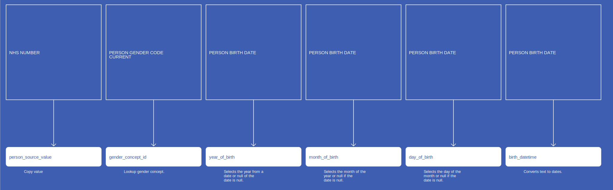

# Person
* [person_source_value]()
* [gender_concept_id]()
* [year_of_birth]()
* [month_of_birth]()
* [day_of_birth]()
* [birth_datetime]()
* [race_concept_id]()
* [gender_source_value]()
* [race_source_value]()
* [race_source_concept_id]()
* [ethnicity_concept_id]()

## SusOPPerson

[Comment or raise an issue for this mapping.](https://github.com/answerdigital/oxford-omop-data-mapper/issues/new?title=SusOPPerson%20mapping){: .btn }
## SusAPCPerson

[Comment or raise an issue for this mapping.](https://github.com/answerdigital/oxford-omop-data-mapper/issues/new?title=SusAPCPerson%20mapping){: .btn }
## SusAEPerson

[Comment or raise an issue for this mapping.](https://github.com/answerdigital/oxford-omop-data-mapper/issues/new?title=SusAEPerson%20mapping){: .btn }
## SactPerson

[Comment or raise an issue for this mapping.](https://github.com/answerdigital/oxford-omop-data-mapper/issues/new?title=SactPerson%20mapping){: .btn }
## RtdsPerson

[Comment or raise an issue for this mapping.](https://github.com/answerdigital/oxford-omop-data-mapper/issues/new?title=RtdsPerson%20mapping){: .btn }
## OxfordGPPerson

[Comment or raise an issue for this mapping.](https://github.com/answerdigital/oxford-omop-data-mapper/issues/new?title=OxfordGPPerson%20mapping){: .btn }
## CosdPersonV9

[Comment or raise an issue for this mapping.](https://github.com/answerdigital/oxford-omop-data-mapper/issues/new?title=CosdPersonV9%20mapping){: .btn }
## CosdPersonV8

[Comment or raise an issue for this mapping.](https://github.com/answerdigital/oxford-omop-data-mapper/issues/new?title=CosdPersonV8%20mapping){: .btn }
