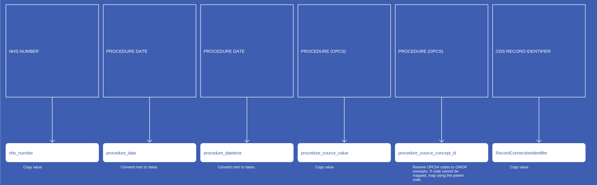
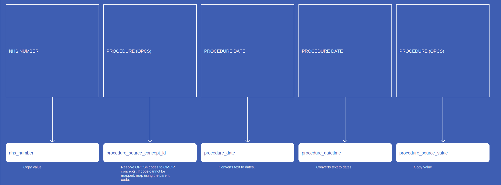
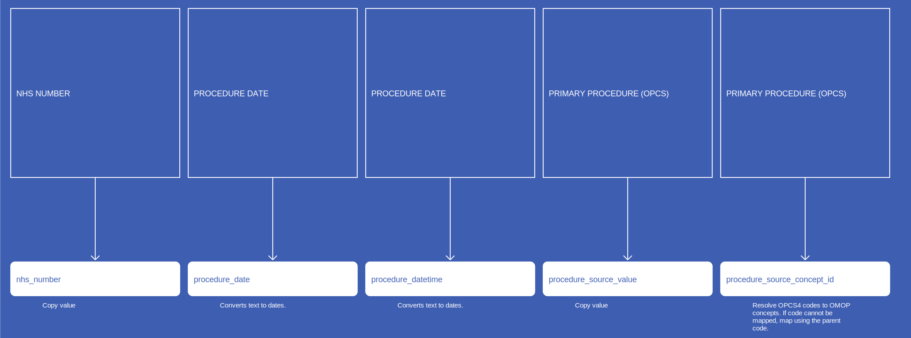
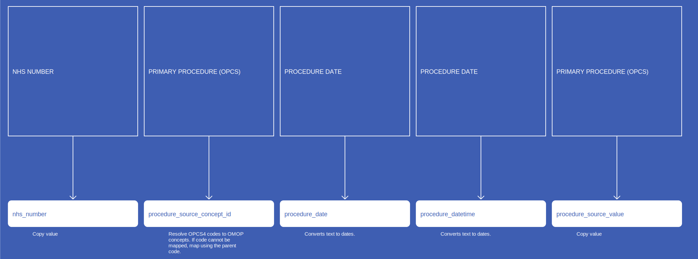
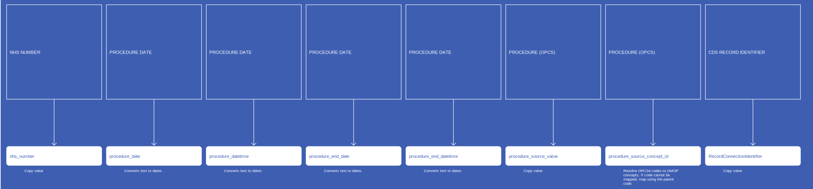

# ProcedureOccurrence
* [nhs_number]()
* [procedure_concept_id]()
* [procedure_date]()
* [procedure_datetime]()
* [procedure_type_concept_id]()
* [procedure_source_value]()
* [procedure_source_concept_id]()
* [RecordConnectionIdentifier]()
* [quantity]()

## SusOPProcedureOccurrence

[Comment or raise an issue for this mapping.](https://github.com/answerdigital/oxford-omop-data-mapper/issues/new?title=SusOPProcedureOccurrence%20mapping){: .btn }
## SusAPCProcedureOccurrence

[Comment or raise an issue for this mapping.](https://github.com/answerdigital/oxford-omop-data-mapper/issues/new?title=SusAPCProcedureOccurrence%20mapping){: .btn }
## CosdV9ProcedureOccurrenceProcedureOpcs

{: .important-title }
> Duplicates
>
> COSD data contains numerous duplicated records due to repeated submissions that include the same records.  The latest record may occasionally have a NULL field that was previously populated.  We observed this for address fields, date of birth and other personal details, but did not observe it for procedure data.
>
> In order to avoid true duplicates occurring in the data, we have included distinct records for  NHSNumber (person_id) , PrimaryProcedureOpcs(procedure_concept_id), ProcedureOpcs(procedure_concept_id), ProcedureDate (procedure_date) and excluded all duplicates.  The tool will handle things a little differently, as each new submission will have to be dealt with as it arrives.
>

[Comment or raise an issue for this mapping.](https://github.com/answerdigital/oxford-omop-data-mapper/issues/new?title=CosdV9ProcedureOccurrenceProcedureOpcs%20mapping){: .btn }
## CosdV9ProcedureOccurrencePrimaryProcedureOpcs

{: .important-title }
> Duplicates
>
> COSD data contains numerous duplicated records due to repeated submissions that include the same records.  The latest record may occasionally have a NULL field that was previously populated.  We observed this for address fields, date of birth and other personal details, but did not observe it for procedure data.
>
> In order to avoid true duplicates occurring in the data, we have included distinct records for  NHSNumber (person_id) , PrimaryProcedureOpcs(procedure_concept_id), ProcedureOpcs(procedure_concept_id), ProcedureDate (procedure_date) and excluded all duplicates.  The tool will handle things a little differently, as each new submission will have to be dealt with as it arrives.
>

[Comment or raise an issue for this mapping.](https://github.com/answerdigital/oxford-omop-data-mapper/issues/new?title=CosdV9ProcedureOccurrencePrimaryProcedureOpcs%20mapping){: .btn }
## CosdV8ProcedureOccurrenceProcedureOpcs

{: .important-title }
> Duplicates
>
> COSD data contains numerous duplicated records due to repeated submissions that include the same records.  The latest record may occasionally have a NULL field that was previously populated.  We observed this for address fields, date of birth and other personal details, but did not observe it for procedure data.
>
> In order to avoid true duplicates occurring in the data, we have included distinct records for  NHSNumber (person_id) , PrimaryProcedureOpcs(procedure_concept_id), ProcedureOpcs(procedure_concept_id), ProcedureDate (procedure_date) and excluded all duplicates.  The tool will handle things a little differently, as each new submission will have to be dealt with as it arrives.
>

[Comment or raise an issue for this mapping.](https://github.com/answerdigital/oxford-omop-data-mapper/issues/new?title=CosdV8ProcedureOccurrenceProcedureOpcs%20mapping){: .btn }
## CosdV8ProcedureOccurrencePrimaryProcedureOpcs

{: .important-title }
> Duplicates
>
> COSD data contains numerous duplicated records due to repeated submissions that include the same records.  The latest record may occasionally have a NULL field that was previously populated.  We observed this for address fields, date of birth and other personal details, but did not observe it for procedure data.
>
> In order to avoid true duplicates occurring in the data, we have included distinct records for  NHSNumber (person_id) , PrimaryProcedureOpcs(procedure_concept_id), ProcedureOpcs(procedure_concept_id), ProcedureDate (procedure_date) and excluded all duplicates.  The tool will handle things a little differently, as each new submission will have to be dealt with as it arrives.
>

[Comment or raise an issue for this mapping.](https://github.com/answerdigital/oxford-omop-data-mapper/issues/new?title=CosdV8ProcedureOccurrencePrimaryProcedureOpcs%20mapping){: .btn }
## CdsProcedureOccurrence

[Comment or raise an issue for this mapping.](https://github.com/answerdigital/oxford-omop-data-mapper/issues/new?title=CdsProcedureOccurrence%20mapping){: .btn }
