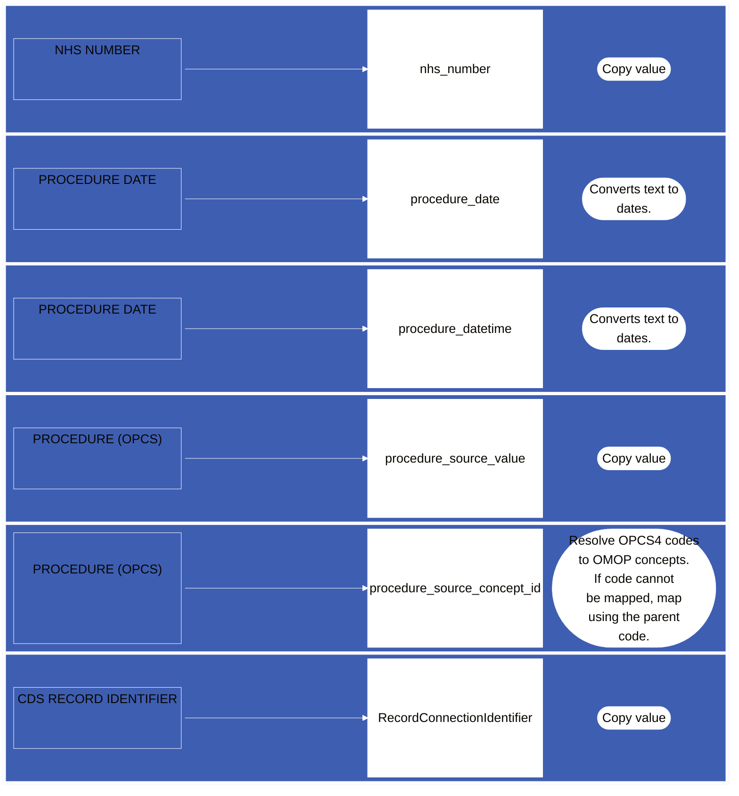

# ProcedureOccurrence
* [nhs_number]()
* [procedure_concept_id]()
* [procedure_date]()
* [procedure_datetime]()
* [procedure_type_concept_id]()
* [procedure_source_value]()
* [procedure_source_concept_id]()
* [RecordConnectionIdentifier]()

## CdsProcedureOccurrence

```mermaid
%%{
  init: {
    'theme': 'base',
   'themeVariables': {
         'lineColor': '#Fff',
         'fontSize': '27px'
    }
  }
}%%

block-beta
  columns 1
  block:container:1
    columns 1
    block:nhs_number_container:1
        columns 4
        block:nhs_number:1
        columns 1
            nhs_number_0["NHS NUMBER<br/> <br/> <br/> "]
            class nhs_number_0 sourceItem
        end
        
        space
        
        nhs_number-->nhs_number_target_0["nhs_number"]

        nhs_number_label(["Copy value"])
    end
   class nhs_number_container container1
   class nhs_number container1
   class nhs_number_target_0 targetItem
   class nhs_number_label targetItem
    columns 1
    block:procedure_date_container:1
        columns 4
        block:procedure_date:1
        columns 1
            procedure_date_1["PROCEDURE DATE<br/> <br/> <br/> "]
            class procedure_date_1 sourceItem
        end
        
        space
        
        procedure_date-->procedure_date_target_1["procedure_date"]

        procedure_date_label(["Converts text to<br/> dates."])
    end
   class procedure_date_container container1
   class procedure_date container1
   class procedure_date_target_1 targetItem
   class procedure_date_label targetItem
    columns 1
    block:procedure_datetime_container:1
        columns 4
        block:procedure_datetime:1
        columns 1
            procedure_date_2["PROCEDURE DATE<br/> <br/> <br/> "]
            class procedure_date_2 sourceItem
        end
        
        space
        
        procedure_datetime-->procedure_datetime_target_2["procedure_datetime"]

        procedure_datetime_label(["Converts text to<br/> dates."])
    end
   class procedure_datetime_container container1
   class procedure_datetime container1
   class procedure_datetime_target_2 targetItem
   class procedure_datetime_label targetItem
    columns 1
    block:procedure_source_value_container:1
        columns 4
        block:procedure_source_value:1
        columns 1
            procedure_opcs_3["PROCEDURE (OPCS)<br/> <br/> <br/> "]
            class procedure_opcs_3 sourceItem
        end
        
        space
        
        procedure_source_value-->procedure_source_value_target_3["procedure_source_value"]

        procedure_source_value_label(["Copy value"])
    end
   class procedure_source_value_container container1
   class procedure_source_value container1
   class procedure_source_value_target_3 targetItem
   class procedure_source_value_label targetItem
    columns 1
    block:procedure_source_concept_id_container:1
        columns 4
        block:procedure_source_concept_id:1
        columns 1
            procedure_opcs_4["PROCEDURE (OPCS)<br/> <br/> <br/> "]
            class procedure_opcs_4 sourceItem
        end
        
        space
        
        procedure_source_concept_id-->procedure_source_concept_id_target_4["procedure_source_concept_id"]

        procedure_source_concept_id_label(["Resolve OPCS4 codes<br/> to OMOP concepts.<br/> If code cannot<br/> be mapped, map<br/> using the parent<br/> code."])
    end
   class procedure_source_concept_id_container container1
   class procedure_source_concept_id container1
   class procedure_source_concept_id_target_4 targetItem
   class procedure_source_concept_id_label targetItem
    columns 1
    block:recordconnectionidentifier_container:1
        columns 4
        block:recordconnectionidentifier:1
        columns 1
            cds_record_identifier_5["CDS RECORD IDENTIFIER<br/> <br/> <br/> "]
            class cds_record_identifier_5 sourceItem
        end
        
        space
        
        recordconnectionidentifier-->recordconnectionidentifier_target_5["RecordConnectionIdentifier"]

        recordconnectionidentifier_label(["Copy value"])
    end
   class recordconnectionidentifier_container container1
   class recordconnectionidentifier container1
   class recordconnectionidentifier_target_5 targetItem
   class recordconnectionidentifier_label targetItem
   classDef container1 fill:#3E5EB2, color:#3E5EB2, stroke:#3E5EB2;
   classDef sourceItem fill:#3E5EB2, color:#fff, stroke:#fff;
   classDef targetItem fill:#fff, color:#3E5EB2, stroke:#fff;
end
```

[Comment or raise an issue for this mapping.](https://github.com/answerdigital/oxford-omop-data-mapper/issues/new?title=CdsProcedureOccurrence%20mapping){: .btn }
