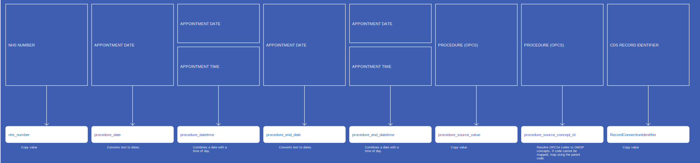
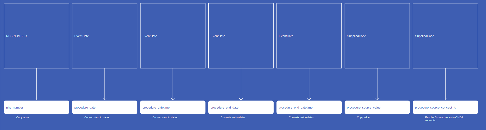

# ProcedureOccurrence
* [nhs_number]()
* [procedure_concept_id]()
* [procedure_date]()
* [procedure_datetime]()
* [procedure_end_date]()
* [procedure_end_datetime]()
* [procedure_type_concept_id]()
* [procedure_source_value]()
* [procedure_source_concept_id]()
* [RecordConnectionIdentifier]()
* [quantity]()

## SusOPProcedureOccurrence

[Comment or raise an issue for this mapping.](https://github.com/answerdigital/oxford-omop-data-mapper/issues/new?title=SusOPProcedureOccurrence%20mapping){: .btn }
## SusCCMDSProcedureOccurrence

[Comment or raise an issue for this mapping.](https://github.com/answerdigital/oxford-omop-data-mapper/issues/new?title=SusCCMDSProcedureOccurrence%20mapping){: .btn }
## SusAPCProcedureOccurrence

[Comment or raise an issue for this mapping.](https://github.com/answerdigital/oxford-omop-data-mapper/issues/new?title=SusAPCProcedureOccurrence%20mapping){: .btn }
## SusAEProcedureOccurrence

[Comment or raise an issue for this mapping.](https://github.com/answerdigital/oxford-omop-data-mapper/issues/new?title=SusAEProcedureOccurrence%20mapping){: .btn }
## RtdsProcedureOccurrence

[Comment or raise an issue for this mapping.](https://github.com/answerdigital/oxford-omop-data-mapper/issues/new?title=RtdsProcedureOccurrence%20mapping){: .btn }
## OxfordGPProcedureOccurrence

[Comment or raise an issue for this mapping.](https://github.com/answerdigital/oxford-omop-data-mapper/issues/new?title=OxfordGPProcedureOccurrence%20mapping){: .btn }
## CosdV9LungProcedureOccurrenceRelapseMethodOfDetection

[Comment or raise an issue for this mapping.](https://github.com/answerdigital/oxford-omop-data-mapper/issues/new?title=CosdV9LungProcedureOccurrenceRelapseMethodOfDetection%20mapping){: .btn }
## CosdV9LungProcedureOccurrenceProcedureOpcs

{: .important-title }
> Duplicates
>
> COSD data contains numerous duplicated records due to repeated submissions that include the same records.  The latest record may occasionally have a NULL field that was previously populated.  We observed this for address fields, date of birth and other personal details, but did not observe it for procedure data.
>
> In order to avoid true duplicates occurring in the data, we have included distinct records for  NHSNumber (person_id) , ProcedureOpcsCode(procedure_concept_id), ProcedureDate (procedure_date) and excluded all duplicates.  The tool will handle things a little differently, as each new submission will have to be dealt with as it arrives.
>

[Comment or raise an issue for this mapping.](https://github.com/answerdigital/oxford-omop-data-mapper/issues/new?title=CosdV9LungProcedureOccurrenceProcedureOpcs%20mapping){: .btn }
## CosdV9LungProcedureOccurrencePrimaryProcedureOpcs

{: .important-title }
> Duplicates
>
> COSD data contains numerous duplicated records due to repeated submissions that include the same records.  The latest record may occasionally have a NULL field that was previously populated.  We observed this for address fields, date of birth and other personal details, but did not observe it for procedure data.
>
> In order to avoid true duplicates occurring in the data, we have included distinct records for  NHSNumber (person_id) , PrimaryProcedureOpcs(procedure_concept_id), ProcedureDate (procedure_date) and excluded all duplicates.  The tool will handle things a little differently, as each new submission will have to be dealt with as it arrives.
>

[Comment or raise an issue for this mapping.](https://github.com/answerdigital/oxford-omop-data-mapper/issues/new?title=CosdV9LungProcedureOccurrencePrimaryProcedureOpcs%20mapping){: .btn }
## CosdV8LungProcedureOccurrenceRelapseMethodOfDetection

[Comment or raise an issue for this mapping.](https://github.com/answerdigital/oxford-omop-data-mapper/issues/new?title=CosdV8LungProcedureOccurrenceRelapseMethodOfDetection%20mapping){: .btn }
## CosdV8LungProcedureOccurrenceProcedureOpcs

{: .important-title }
> Duplicates
>
> COSD data contains numerous duplicated records due to repeated submissions that include the same records.  The latest record may occasionally have a NULL field that was previously populated.  We observed this for address fields, date of birth and other personal details, but did not observe it for procedure data.
>
> In order to avoid true duplicates occurring in the data, we have included distinct records for  NHSNumber (person_id) , ProcedureOpcsCode(procedure_concept_id), ProcedureDate (procedure_date) and excluded all duplicates.  The tool will handle things a little differently, as each new submission will have to be dealt with as it arrives.
>

[Comment or raise an issue for this mapping.](https://github.com/answerdigital/oxford-omop-data-mapper/issues/new?title=CosdV8LungProcedureOccurrenceProcedureOpcs%20mapping){: .btn }
## CosdV8LungProcedureOccurrencePrimaryProcedureOpcs

{: .important-title }
> Assumptions
>
> * Primary procedure OPCS codes from lung cancer treatment records
> * Procedure dates are taken as recorded in the clinical system
> * Duplicates are handled by selecting distinct records based on NHS Number, Procedure Date, and Primary Procedure OPCS

[Comment or raise an issue for this mapping.](https://github.com/answerdigital/oxford-omop-data-mapper/issues/new?title=CosdV8LungProcedureOccurrencePrimaryProcedureOpcs%20mapping){: .btn }
## CosdV9ProcedureOccurrenceProcedureOpcs

{: .important-title }
> Duplicates
>
> COSD data contains numerous duplicated records due to repeated submissions that include the same records.  The latest record may occasionally have a NULL field that was previously populated.  We observed this for address fields, date of birth and other personal details, but did not observe it for procedure data.
>
> In order to avoid true duplicates occurring in the data, we have included distinct records for  NHSNumber (person_id) , PrimaryProcedureOpcs(procedure_concept_id), ProcedureOpcs(procedure_concept_id), ProcedureDate (procedure_date) and excluded all duplicates.  The tool will handle things a little differently, as each new submission will have to be dealt with as it arrives.
>

[Comment or raise an issue for this mapping.](https://github.com/answerdigital/oxford-omop-data-mapper/issues/new?title=CosdV9ProcedureOccurrenceProcedureOpcs%20mapping){: .btn }
## CosdV9ProcedureOccurrencePrimaryProcedureOpcs

{: .important-title }
> Duplicates
>
> COSD data contains numerous duplicated records due to repeated submissions that include the same records.  The latest record may occasionally have a NULL field that was previously populated.  We observed this for address fields, date of birth and other personal details, but did not observe it for procedure data.
>
> In order to avoid true duplicates occurring in the data, we have included distinct records for  NHSNumber (person_id) , PrimaryProcedureOpcs(procedure_concept_id), ProcedureOpcs(procedure_concept_id), ProcedureDate (procedure_date) and excluded all duplicates.  The tool will handle things a little differently, as each new submission will have to be dealt with as it arrives.
>

[Comment or raise an issue for this mapping.](https://github.com/answerdigital/oxford-omop-data-mapper/issues/new?title=CosdV9ProcedureOccurrencePrimaryProcedureOpcs%20mapping){: .btn }
## CosdV8ProcedureOccurrenceProcedureOpcs

{: .important-title }
> Duplicates
>
> COSD data contains numerous duplicated records due to repeated submissions that include the same records.  The latest record may occasionally have a NULL field that was previously populated.  We observed this for address fields, date of birth and other personal details, but did not observe it for procedure data.
>
> In order to avoid true duplicates occurring in the data, we have included distinct records for  NHSNumber (person_id) , PrimaryProcedureOpcs(procedure_concept_id), ProcedureOpcs(procedure_concept_id), ProcedureDate (procedure_date) and excluded all duplicates.  The tool will handle things a little differently, as each new submission will have to be dealt with as it arrives.
>

[Comment or raise an issue for this mapping.](https://github.com/answerdigital/oxford-omop-data-mapper/issues/new?title=CosdV8ProcedureOccurrenceProcedureOpcs%20mapping){: .btn }
## CosdV8ProcedureOccurrencePrimaryProcedureOpcs

{: .important-title }
> Duplicates
>
> COSD data contains numerous duplicated records due to repeated submissions that include the same records.  The latest record may occasionally have a NULL field that was previously populated.  We observed this for address fields, date of birth and other personal details, but did not observe it for procedure data.
>
> In order to avoid true duplicates occurring in the data, we have included distinct records for  NHSNumber (person_id) , PrimaryProcedureOpcs(procedure_concept_id), ProcedureOpcs(procedure_concept_id), ProcedureDate (procedure_date) and excluded all duplicates.  The tool will handle things a little differently, as each new submission will have to be dealt with as it arrives.
>

[Comment or raise an issue for this mapping.](https://github.com/answerdigital/oxford-omop-data-mapper/issues/new?title=CosdV8ProcedureOccurrencePrimaryProcedureOpcs%20mapping){: .btn }
## CosdV9BreastProcedureOccurrenceProcedureOpcs

{: .important-title }
> Duplicates
>
> COSD data contains numerous duplicated records due to repeated submissions that include the same records.  The latest record may occasionally have a NULL field that was previously populated.  We observed this for address fields, date of birth and other personal details, but did not observe it for procedure data.
>
> In order to avoid true duplicates occurring in the data, we have included distinct records for  NHSNumber (person_id) , PrimaryProcedureOpcs(procedure_concept_id), ProcedureOpcs(procedure_concept_id), ProcedureDate (procedure_date) and excluded all duplicates.  The tool will handle things a little differently, as each new submission will have to be dealt with as it arrives.
>

[Comment or raise an issue for this mapping.](https://github.com/answerdigital/oxford-omop-data-mapper/issues/new?title=CosdV9BreastProcedureOccurrenceProcedureOpcs%20mapping){: .btn }
## CosdV9BreastProcedureOccurrencePrimaryProcedureOpcs

{: .important-title }
> Duplicates
>
> COSD data contains numerous duplicated records due to repeated submissions that include the same records.  The latest record may occasionally have a NULL field that was previously populated.  We observed this for address fields, date of birth and other personal details, but did not observe it for procedure data.
>
> In order to avoid true duplicates occurring in the data, we have included distinct records for  NHSNumber (person_id) , PrimaryProcedureOpcs(procedure_concept_id), ProcedureOpcs(procedure_concept_id), ProcedureDate (procedure_date) and excluded all duplicates.  The tool will handle things a little differently, as each new submission will have to be dealt with as it arrives.
>

[Comment or raise an issue for this mapping.](https://github.com/answerdigital/oxford-omop-data-mapper/issues/new?title=CosdV9BreastProcedureOccurrencePrimaryProcedureOpcs%20mapping){: .btn }
## CosdV8BreastProcedureOccurrenceProcedureOpcs

{: .important-title }
> Duplicates
>
> COSD data contains numerous duplicated records due to repeated submissions that include the same records.  The latest record may occasionally have a NULL field that was previously populated.  We observed this for address fields, date of birth and other personal details, but did not observe it for procedure data.
>
> In order to avoid true duplicates occurring in the data, we have included distinct records for  NHSNumber (person_id) , PrimaryProcedureOpcs(procedure_concept_id), ProcedureOpcs(procedure_concept_id), ProcedureDate (procedure_date) and excluded all duplicates.  The tool will handle things a little differently, as each new submission will have to be dealt with as it arrives.
>

[Comment or raise an issue for this mapping.](https://github.com/answerdigital/oxford-omop-data-mapper/issues/new?title=CosdV8BreastProcedureOccurrenceProcedureOpcs%20mapping){: .btn }
## CosdV8BreastProcedureOccurrencePrimaryProcedureOpcs

{: .important-title }
> Duplicates
>
> COSD data contains numerous duplicated records due to repeated submissions that include the same records.  The latest record may occasionally have a NULL field that was previously populated.  We observed this for address fields, date of birth and other personal details, but did not observe it for procedure data.
>
> In order to avoid true duplicates occurring in the data, we have included distinct records for  NHSNumber (person_id) , PrimaryProcedureOpcs(procedure_concept_id), ProcedureOpcs(procedure_concept_id), ProcedureDate (procedure_date) and excluded all duplicates.  The tool will handle things a little differently, as each new submission will have to be dealt with as it arrives.
>

[Comment or raise an issue for this mapping.](https://github.com/answerdigital/oxford-omop-data-mapper/issues/new?title=CosdV8BreastProcedureOccurrencePrimaryProcedureOpcs%20mapping){: .btn }
