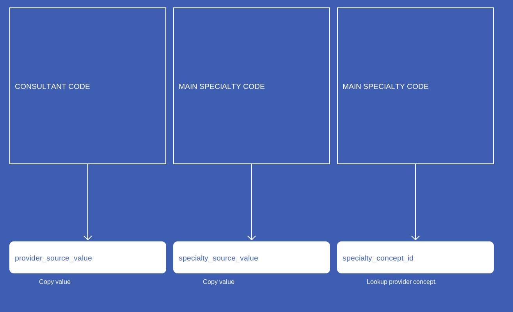

# Provider
* [provider_source_value]()
* [specialty_source_value]()
* [specialty_concept_id]()

## SusOPProvider

[Comment or raise an issue for this mapping.](https://github.com/answerdigital/oxford-omop-data-mapper/issues/new?title=SusOPProvider%20mapping){: .btn }
## SusAPCProvider

[Comment or raise an issue for this mapping.](https://github.com/answerdigital/oxford-omop-data-mapper/issues/new?title=SusAPCProvider%20mapping){: .btn }
