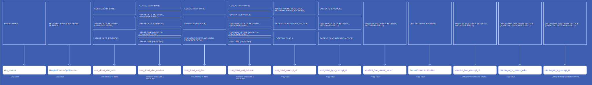

# VisitDetail
* [nhs_number]()
* [RecordConnectionIdentifier]()
* [HospitalProviderSpellNumber]()
* [visit_detail_start_date]()
* [visit_detail_start_datetime]()
* [visit_detail_end_date]()
* [visit_detail_end_datetime]()
* [visit_detail_concept_id]()
* [visit_detail_type_concept_id]()
* [admitted_from_concept_id]()
* [admitted_from_source_value]()
* [discharged_to_concept_id]()
* [discharged_to_source_value]()

## CdsVisitDetail

[Comment or raise an issue for this mapping.](https://github.com/answerdigital/oxford-omop-data-mapper/issues/new?title=CdsVisitDetail%20mapping){: .btn }
