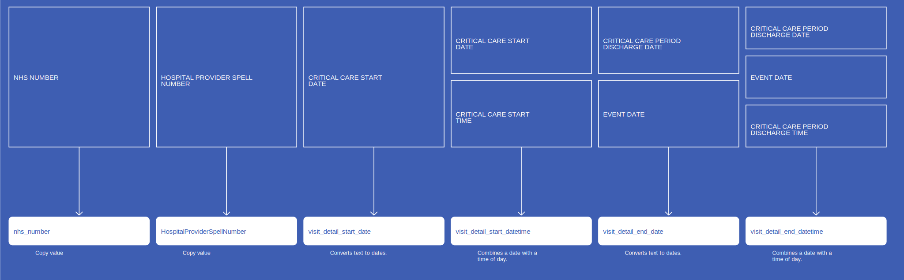
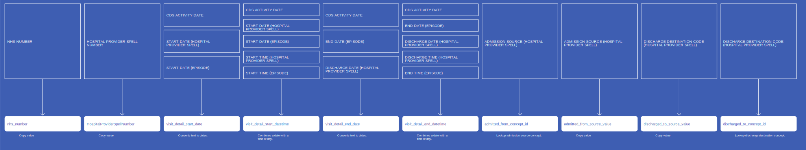
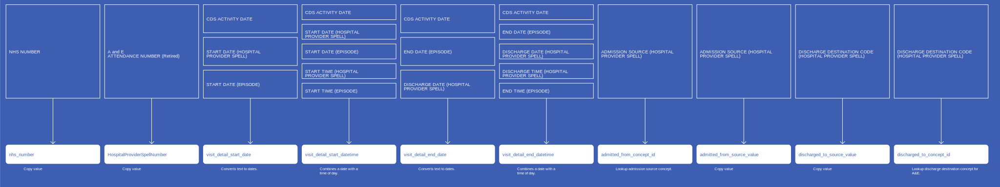
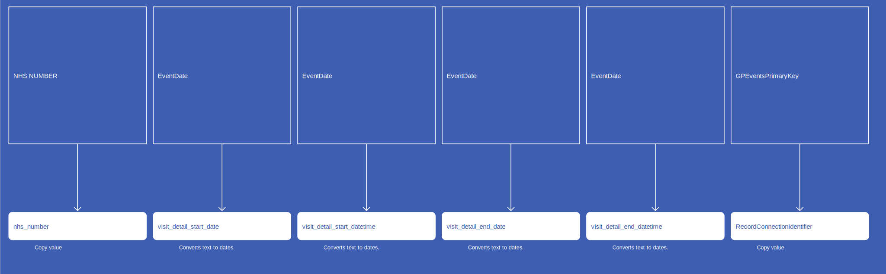

# VisitDetail
* [nhs_number]()
* [HospitalProviderSpellNumber]()
* [visit_detail_start_date]()
* [visit_detail_start_datetime]()
* [visit_detail_end_date]()
* [visit_detail_end_datetime]()
* [visit_detail_concept_id]()
* [visit_detail_type_concept_id]()
* [RecordConnectionIdentifier]()
* [admitted_from_concept_id]()
* [admitted_from_source_value]()
* [discharged_to_source_value]()
* [discharged_to_concept_id]()

## SusOPVisitDetail

{: .important-title }
> Assumptions
>
> * `Emergency` covers a visit to A&E within the given Hospital Provider, and hence covers Admission Code 21 and 24 only
> * `Location Class` ID 24 is a Consultant Clinic within the Health Care Provider.
> * `Patient Classification` ID 1 is the only entry that covers 24 hours or more with the use of a bed, and whilst others may be a day/night only, they will be discounted because they are less than 24 hours. Also, maternity is also not taken as an `Inpatient` visit.
> * No calculations to be made between Start and end visit date to try to calculate 24 hours, but instead the `Patient Classification` will be sufficient

[Comment or raise an issue for this mapping.](https://github.com/answerdigital/oxford-omop-data-mapper/issues/new?title=SusOPVisitDetail%20mapping){: .btn }
## SusCCMDSVisitDetail

[Comment or raise an issue for this mapping.](https://github.com/answerdigital/oxford-omop-data-mapper/issues/new?title=SusCCMDSVisitDetail%20mapping){: .btn }
## SusAPCVisitDetail

{: .important-title }
> Assumptions
>
> * `Emergency` covers a visit to A&E within the given Hospital Provider, and hence covers Admission Code 21 and 24 only
> * `Location Class` ID 24 is a Consultant Clinic within the Health Care Provider.
> * `Patient Classification` ID 1 is the only entry that covers 24 hours or more with the use of a bed, and whilst others may be a day/night only, they will be discounted because they are less than 24 hours. Also, maternity is also not taken as an `Inpatient` visit.
> * No calculations to be made between Start and end visit date to try to calculate 24 hours, but instead the `Patient Classification` will be sufficient

[Comment or raise an issue for this mapping.](https://github.com/answerdigital/oxford-omop-data-mapper/issues/new?title=SusAPCVisitDetail%20mapping){: .btn }
## SusAEVisitDetail

{: .important-title }
> Assumptions
>
> * `Emergency` covers a visit to A&E within the given Hospital Provider, and hence covers Admission Code 21 and 24 only

[Comment or raise an issue for this mapping.](https://github.com/answerdigital/oxford-omop-data-mapper/issues/new?title=SusAEVisitDetail%20mapping){: .btn }
## RtdsVisitDetail

{: .important-title }
> Assumptions
>
> * `Emergency` covers a visit to A&E within the given Hospital Provider, and hence covers Admission Code 21 and 24 only
> * `Location Class` ID 24 is a Consultant Clinic within the Health Care Provider.
> * `Patient Classification` ID 1 is the only entry that covers 24 hours or more with the use of a bed, and whilst others may be a day/night only, they will be discounted because they are less than 24 hours. Also, maternity is also not taken as an `Inpatient` visit.
> * No calculations to be made between Start and end visit date to try to calculate 24 hours, but instead the `Patient Classification` will be sufficient

[Comment or raise an issue for this mapping.](https://github.com/answerdigital/oxford-omop-data-mapper/issues/new?title=RtdsVisitDetail%20mapping){: .btn }
## OxfordGPVisitDetails

[Comment or raise an issue for this mapping.](https://github.com/answerdigital/oxford-omop-data-mapper/issues/new?title=OxfordGPVisitDetails%20mapping){: .btn }
