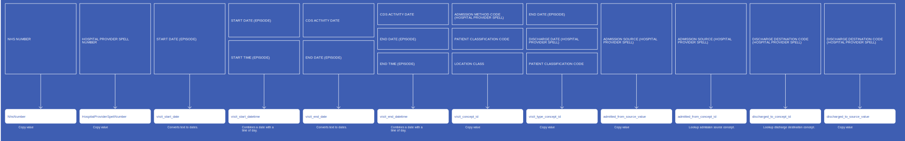
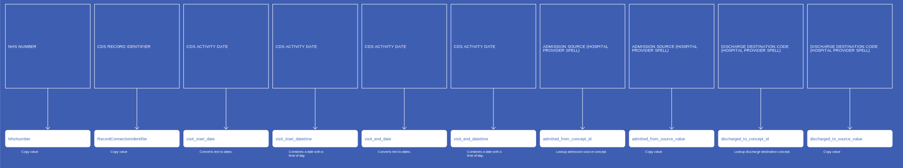

# VisitOccurrence
* [NhsNumber]()
* [HospitalProviderSpellNumber]()
* [visit_start_date]()
* [visit_start_datetime]()
* [visit_end_date]()
* [visit_end_datetime]()
* [visit_concept_id]()
* [visit_type_concept_id]()
* [admitted_from_concept_id]()
* [admitted_from_source_value]()
* [discharged_to_concept_id]()
* [discharged_to_source_value]()
* [RecordConnectionIdentifier]()

## CdsVisitOccurrenceWithSpell

[Comment or raise an issue for this mapping.](https://github.com/answerdigital/oxford-omop-data-mapper/issues/new?title=CdsVisitOccurrenceWithSpell%20mapping){: .btn }
## CdsVisitOccurrenceWithoutSpell

[Comment or raise an issue for this mapping.](https://github.com/answerdigital/oxford-omop-data-mapper/issues/new?title=CdsVisitOccurrenceWithoutSpell%20mapping){: .btn }
