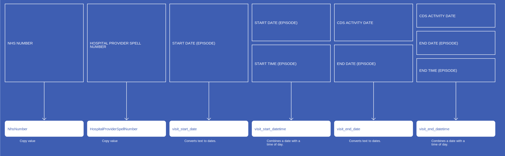
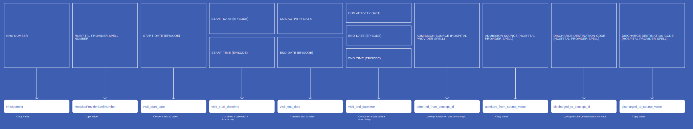

# VisitOccurrence
* [NhsNumber]()
* [HospitalProviderSpellNumber]()
* [visit_start_date]()
* [visit_start_datetime]()
* [visit_end_date]()
* [visit_end_datetime]()
* [visit_concept_id]()
* [visit_type_concept_id]()
* [admitted_from_concept_id]()
* [admitted_from_source_value]()
* [discharged_to_concept_id]()
* [discharged_to_source_value]()
* [RecordConnectionIdentifier]()

## SusOPVisitOccurrenceWithSpell

{: .important-title }
> Assumptions
>
> * `Emergency` covers a visit to A&E within the given Hospital Provider, and hence covers Admission Code 21 and 24 only
> * `Location Class` ID 24 is a Consultant Clinic within the Health Care Provider.
> * `Patient Classification` ID 1 is the only entry that covers 24 hours or more with the use of a bed, and whilst others may be a day/night only, they will be discounted because they are less than 24 hours.
> * No calculations to be made between Start and end visit date to try to calculate 24 hours, but instead the `Patient Classification` will be sufficient

[Comment or raise an issue for this mapping.](https://github.com/answerdigital/oxford-omop-data-mapper/issues/new?title=SusOPVisitOccurrenceWithSpell%20mapping){: .btn }
## SusAPCVisitOccurrenceWithSpell

{: .important-title }
> Assumptions
>
> * `Emergency` covers a visit to A&E within the given Hospital Provider, and hence covers Admission Code 21 and 24 only
> * `Location Class` ID 24 is a Consultant Clinic within the Health Care Provider.
> * `Patient Classification` ID 1 is the only entry that covers 24 hours or more with the use of a bed, and whilst others may be a day/night only, they will be discounted because they are less than 24 hours. Also, maternity is also not taken as an `Inpatient` visit.
> * No calculations to be made between Start and end visit date to try to calculate 24 hours, but instead the `Patient Classification` will be sufficient

[Comment or raise an issue for this mapping.](https://github.com/answerdigital/oxford-omop-data-mapper/issues/new?title=SusAPCVisitOccurrenceWithSpell%20mapping){: .btn }
## SusAEVisitOccurrenceWithSpell

{: .important-title }
> Assumptions
>
> * `Emergency` covers a visit to A&E within the given Hospital Provider, and hence covers Admission Code 21 and 24 only

[Comment or raise an issue for this mapping.](https://github.com/answerdigital/oxford-omop-data-mapper/issues/new?title=SusAEVisitOccurrenceWithSpell%20mapping){: .btn }
## SactVisitOccurrence

{: .important-title }
> Assumptions
>
> * SACT Data has the following definition for the Administration Timestamp:
> * i) For recording the date and time when the anti-cancer drug was administered to a patient (an infusion commenced)
> * ii) For recording continuous oral chemotherapy, the administration date will be the first day of the nominal cycle, or the date on which an oral drug was dispensed to the patient.
> * The assumption made is that all the drugs were administered in a Cancer clinic as we have no way of identifying if an oral drug was taken at home

[Comment or raise an issue for this mapping.](https://github.com/answerdigital/oxford-omop-data-mapper/issues/new?title=SactVisitOccurrence%20mapping){: .btn }
## RtdsVisitOccurrence

{: .important-title }
> Assumptions
>
> * `Emergency` covers a visit to A&E within the given Hospital Provider, and hence covers Admission Code 21 and 24 only
> * `Location Class` ID 24 is a Consultant Clinic within the Health Care Provider.
> * `Patient Classification` ID 1 is the only entry that covers 24 hours or more with the use of a bed, and whilst others may be a day/night only, they will be discounted because they are less than 24 hours. Also, maternity is also not taken as an `Inpatient` visit.
> * No calculations to be made between Start and end visit date to try to calculate 24 hours, but instead the `Patient Classification` will be sufficient

[Comment or raise an issue for this mapping.](https://github.com/answerdigital/oxford-omop-data-mapper/issues/new?title=RtdsVisitOccurrence%20mapping){: .btn }
## OxfordGPVisitOccurrence

[Comment or raise an issue for this mapping.](https://github.com/answerdigital/oxford-omop-data-mapper/issues/new?title=OxfordGPVisitOccurrence%20mapping){: .btn }
